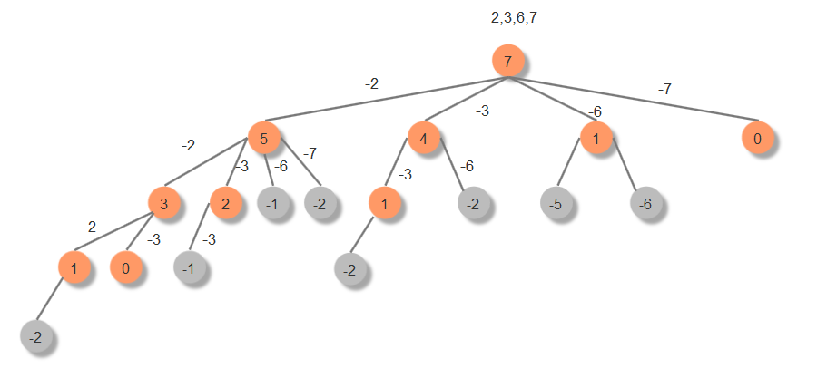
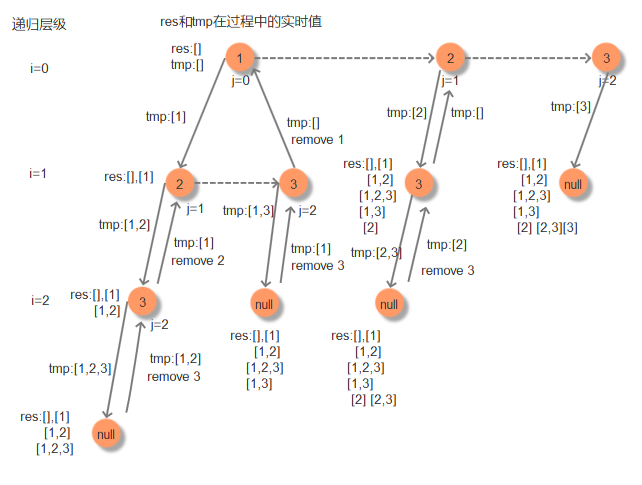
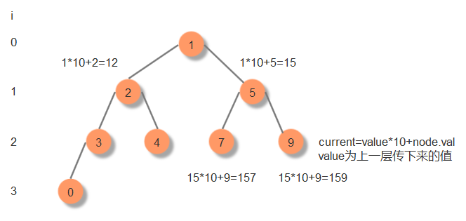

#### 39、组合总和
[leetCode]https://leetcode-cn.com/problems/combination-sum/  

```java
class Solution {
    public List<List<Integer>> combinationSum(int[] candidates, int target) {
        List<List<Integer>> response = new ArrayList<>();
        if(target<=0){
            return response;
        }
        track(candidates,target,0,new ArrayList<>(),response);
        return response; 
    }

  void track(int[] a,int current,int index,List<Integer> tmp,List<List<Integer>> result){
   if(current==0){//满足条件
      result.add(new ArrayList<>(tmp));
	  return;
   }
  if(current<0) return;//不满足条件递归终止
  //每次循环都要从上一层传来的index开始，否则会造成重复
   for(int i=index;i<a.length;i++){
    tmp.add(a[i]);
	  track(a,current-a[i],i,tmp,result);
	  tmp.remove(tmp.size()-1);//回归状态
   }
}
}
```
#### 40、组合总和II
[leetCode]https://leetcode-cn.com/problems/combination-sum-ii/
和上一题的区别是： 输入数组可以存在重复的元素，而每个数字在每个组合中只能使用一次，这两个要求都和上一题相反。    
要解决此问题需要考虑两点：  
因为元素不能重复选择，所以每次递归到下一层，index要加1；  
因为输入数组存在相同的元素，所以必须想要排序，然后在循环时判断a[i] == a[i - 1],如果相等就continue；如果不排序的话会出现如下错误：  
输入[1,5,1,4],目标值为6，那么如果不加第二步的限制的话会出现如下结果：  
[1,5][5,1]。如果先排序成[1,1,4,5]然后加a[i] == a[i - 1]判断就能避免重复的情况。 
```java
class Solution {
    public List<List<Integer>> combinationSum2(int[] candidates, int target) {
        List<List<Integer>> response = new ArrayList<>();
        if(target<=0){
            return response;
        }
        //candidates = Arrays.stream(candidates).distinct().toArray();
        Arrays.sort(candidates);
        track(candidates,target,0,new ArrayList<>(),response);
        //response = response.stream().distinct().collect(Collectors.toList());
        return response;
    }

    void track(int[] a,int current,int index,List<Integer> tmp,List<List<Integer>> result){
       if(current==0){//满足条件
           result.add(new ArrayList<>(tmp));
	       return;
        }
       //每次循环都要从上一层传来的index开始，否则会造成重复
       for(int i=index;i<a.length;i++){
        if(current-a[i]<0) break;//不满足条件递归终止
        // 小剪枝
        if (i > index && a[i] == a[i - 1]) {
                continue;
        }
         tmp.add(a[i]);
	     track(a,current-a[i],i+1,tmp,result);
	     tmp.remove(tmp.size()-1);//回归状态
       }
   }
}
```
####  78、 子集
[leetCode]https://leetcode-cn.com/problems/subsets/   
回溯过程中各个变量的实时值 

```java
class Solution {
    public List<List<Integer>> subsets(int[] nums) {
        List<List<Integer>> res = new ArrayList<>();
        backtrack(0, nums, res, new ArrayList<Integer>());
        return res;
    }
    private void backtrack(int i, int[] nums, List<List<Integer>> res, ArrayList<Integer> tmp) {
        res.add(new ArrayList<>(tmp));
        for (int j = i; j < nums.length; j++) {
            tmp.add(nums[j]);
            backtrack(j + 1, nums, res, tmp);
            tmp.remove(tmp.size() - 1);
        }
    }
}
```
#### 129、 求根到叶子节点数字之和  
[leetCode]https://leetcode-cn.com/problems/sum-root-to-leaf-numbers/
  
```java
class Solution {
    int sum;
    public int sumNumbers(TreeNode root) {
        if(root==null) return 0;
        sum=0;
        caculate(root,0);
        return sum;
    }
    public void caculate(TreeNode node,int value){
        int current = value*10 + node.val;
        if(node.left==null&&node.right==null){
            sum+=current;
            return;
        }
        if(node.left!=null){
            caculate(node.left,current);
        }
        if(node.right!=null){
            caculate(node.right,current);
        }
    }
}
```
