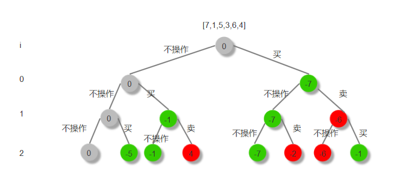
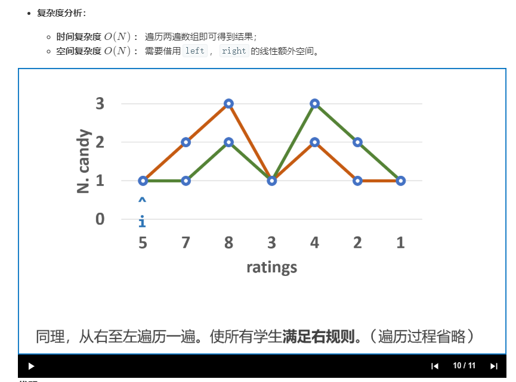

#### 39、组合总和
[组合总和](https://leetcode-cn.com/problems/combination-sum/) 

```java
class Solution {
    public List<List<Integer>> combinationSum(int[] candidates, int target) {
        List<List<Integer>> response = new ArrayList<>();
        if(target<=0){
            return response;
        }
        track(candidates,target,0,new ArrayList<>(),response);
        return response; 
    }

  void track(int[] a,int current,int index,List<Integer> tmp,List<List<Integer>> result){
   if(current==0){//满足条件
      result.add(new ArrayList<>(tmp));
	  return;
   }
  if(current<0) return;//不满足条件递归终止
  //每次循环都要从上一层传来的index开始，否则会造成重复
   for(int i=index;i<a.length;i++){
    tmp.add(a[i]);
	  track(a,current-a[i],i,tmp,result);
	  tmp.remove(tmp.size()-1);//回归状态
   }
}
}
```
#### 40、组合总和II
[组合总和II](https://leetcode-cn.com/problems/combination-sum-ii/)  
和上一题的区别是： 输入数组可以存在重复的元素，而每个数字在每个组合中只能使用一次，这两个要求都和上一题相反。    
要解决此问题需要考虑两点：  
因为元素不能重复选择，所以每次递归到下一层，index要加1；  
因为输入数组存在相同的元素，所以必须想要排序，然后在循环时判断a[i] == a[i - 1],如果相等就continue；如果不排序的话会出现如下错误：  
输入[1,5,1,4],目标值为6，那么如果不加第二步的限制的话会出现如下结果：  
[1,5][5,1]。如果先排序成[1,1,4,5]然后加a[i] == a[i - 1]判断就能避免重复的情况。 
```java
class Solution {
    public List<List<Integer>> combinationSum2(int[] candidates, int target) {
        List<List<Integer>> response = new ArrayList<>();
        if(target<=0){
            return response;
        }
        //candidates = Arrays.stream(candidates).distinct().toArray();
        Arrays.sort(candidates);
        track(candidates,target,0,new ArrayList<>(),response);
        //response = response.stream().distinct().collect(Collectors.toList());
        return response;
    }

    void track(int[] a,int current,int index,List<Integer> tmp,List<List<Integer>> result){
       if(current==0){//满足条件
           result.add(new ArrayList<>(tmp));
	       return;
        }
       //每次循环都要从上一层传来的index开始，否则会造成重复
       for(int i=index;i<a.length;i++){
        if(current-a[i]<0) break;//不满足条件递归终止
        // 小剪枝
        if (i > index && a[i] == a[i - 1]) {
                continue;
        }
         tmp.add(a[i]);
	     track(a,current-a[i],i+1,tmp,result);
	     tmp.remove(tmp.size()-1);//回归状态
       }
   }
}
```
#### 45、跳跃游戏II
[LeetCode](https://leetcode-cn.com/problems/jump-game-ii/)   
每次在可选范围内选择能跳的最远的下标，例如第一个元素2,它可选择的范围是蓝色的3,1。因为选择3它可以提到1+3=4的位置最远，所以选择3.  
选择3后，有1,1,4三种选择。因为选择4时能跳到最远，所以选择4依次类推。
  
```java
class Solution {
    public int jump(int[] nums) {
        int n = nums.length;
        if(n==0 || n==1) return 0;

        int step = 0;//记录步骤

        for(int i=0;i<n;){
            if(i+nums[i]>=n-1){//如果能直接跳到最后,则直接得到结果
               return step +1;
            } else{//选可以跳的范围内值最大的下标位置
              int index = i+1;
              int max = 0;
              for(int j=i+1;j<=i+nums[i];j++){
                  if(j+ nums[j]>=max){
                      max = j+ nums[j];
                      index = j;
                  }
              }
              i= index;//下次从index位置开始选择
            }
            step++;
        }
        return step;
    }
}
```
#### 46、全排列
[全排列](https://leetcode-cn.com/problems/permutations/submissions/)  
  
全排列有一个特点就是[1,2,3]和[2,1,3]虽然数字都相同，因为顺序不同，所以在全排列问题是属于不同的结果。如果第一个元素选择2，下一个元素是可以选择1的，所以用回溯法循环时i要从0开始，而不是常见的从父节点传下来的index或index+1开始，这是要非常注意的一点。又因为递归函数的循环i每次都是从0开始的，所以使用一个boolean[] visit数组来记录已经访问过的节点下标，一旦在循环判断i下标的节点已经访问过了，要用continue跳过该节点。  
```java
class Solution {
    public List<List<Integer>> permute(int[] nums) {
        List<List<Integer>> result = new ArrayList<>();
        if(nums.length==0) return result;
        boolean[] visit = new boolean[nums.length];
        track(nums,visit,new ArrayList<>(),result);
        return result;
    }

    public void track(int[] nums,boolean[] visit,List<Integer> tmp,List<List<Integer>> result){
        if(tmp.size()==nums.length){
            result.add(new ArrayList<>(tmp));
            return;
        }
        for(int i=0;i<nums.length;i++){
            if(visit[i]){
                continue;
            }
            tmp.add(nums[i]);
            visit[i] = true;//标注i下标已访问
            track(nums,visit,tmp,result);
            tmp.remove(tmp.size()-1);
            visit[i] = false;//回归状态
        }
    }

}
```
#### 47、全排列II
[全排列II](https://leetcode-cn.com/problems/permutations-ii/)  
  
和46题对比只有一个不同点在于输入数组存在重复的元素，所以为了避免得到带重复的结果，同一层值相同的节点只能选择一次，如图灰色的节点。所以程序中可以利用一个map以节点的值为key来记录同一层值相等的节点是否已经访问过，如果访问过则跳过。  
```java
class Solution {
    public List<List<Integer>> permuteUnique(int[] nums) {
        List<List<Integer>> result = new ArrayList<>();
        if(nums.length==0) return result;
        Arrays.sort(nums);//排序下可以更好理解为什么同一层相同的节点只能选择一次
        boolean[] visit = new boolean[nums.length];
        track(nums,visit,new ArrayList<>(),result);
        return result;
    }

    public void track(int[] nums,boolean[] visit,List<Integer> tmp,List<List<Integer>> result){
        if(tmp.size()==nums.length){//满足结果则添加到result中，然后结束递归
            result.add(new ArrayList<>(tmp));
            return;
        }
        Map<Integer,Boolean> visit2 = new HashMap<>();
        for(int i=0;i<nums.length;i++){
            if(visit[i]) continue;//已经访问过的节点忽略
            if(visit2.containsKey(nums[i])&&visit2.get(nums[i])) continue;//判断同一层值相同的点是否访问过，如果访问过则忽略
            visit2.put(nums[i],true);
            tmp.add(nums[i]);
            visit[i]=true;
            track(nums,visit,tmp,result);
            tmp.remove(tmp.size()-1);
            visit[i]=false;
        }
    }
}
```
#### 53、最大子序和
[LeetCode](https://leetcode-cn.com/problems/maximum-subarray/submissions/)  
比较简单的思路就是遍历每种情况，然后求出最大值。因为是连续的子序列，所以递归函数只有一次执行。
```java
1、回溯（暴力）
class Solution {
    int max;
    public int maxSubArray(int[] nums) {
        max = nums[0];
        for(int i=0;i<nums.length;i++){
            track(nums,i,0);
        }
        return max;
    }

    public void track(int[] nums,int index,int sum){
        if(index<nums.length){
            sum += nums[index];
            if(sum>max) max=sum;
            track(nums,index+1,sum);
            sum -= nums[index];
        }
    }
}  
```
2、动态规划
以dp[i]表示以nums[i]结尾的最大子序和  
dp[i]=max(dp[i-1]+nums[i],nums[i])  
dp[0]=nums[0]  

```java
class Solution {
    public int maxSubArray(int[] nums) {
      int[] dp = new int[nums.length];
      dp[0]=nums[0];
        int n = nums.length, maxSum = nums[0];
    for(int i = 1; i < n; ++i) {
      if (nums[i - 1] > 0) nums[i] += nums[i - 1];
      maxSum = Math.max(nums[i], maxSum);
    }
    return maxSum;
    }

}

```
#### 56、插入区间  
[LeetCode](https://leetcode-cn.com/problems/insert-interval/solution/cha-ru-qu-jian-by-leetcode/)  
算法如下图所示：  
先循环遍历找出所有左区间小于新输入左区间添加到output数组里，然后再依次和output数组最后一个元素比较，若有重叠就合并后添加到output。

```java
class Solution {
    public int[][] insert(int[][] intervals, int[] newInterval) {
        
        List<int[]> output = new ArrayList<>();
        int index=0;
        while(index<intervals.length && newInterval[0]>intervals[index][0]){
            output.add(intervals[index++]);
        }
        if(output.isEmpty()||output.get(output.size()-1)[1]<newInterval[0]){
            output.add(newInterval);
        }else{
             int[] last = output.remove(output.size()-1);//取出最后一个元素
             int[] tmp = new int[2];
            tmp[0] = Math.min(last[0],newInterval[0]);
            tmp[1] = Math.max(last[1],newInterval[1]);
            output.add(tmp);
        }
        
        while(index<intervals.length){
        int[] last = output.remove(output.size()-1);//取出最后一个元素
        int[] cur = intervals[index++];
            //有重叠
        if(last[1]>=cur[0] && last[0]<=cur[0]){
            int[] tmp = new int[2];
            tmp[0] = Math.min(last[0],cur[0]);
            tmp[1] = Math.max(last[1],cur[1]);
            output.add(tmp);
        }else{
            output.add(last);
            output.add(cur);
        }
        }
        //return output.toArray(new int[output.size()]);
        return output.toArray(new int[output.size()][2]);
    }
}
```
####  78、 子集
[子集](https://leetcode-cn.com/problems/subsets/)   
回溯过程中各个变量的实时值 

```java
class Solution {
    public List<List<Integer>> subsets(int[] nums) {
        List<List<Integer>> res = new ArrayList<>();
        backtrack(0, nums, res, new ArrayList<Integer>());
        return res;
    }
    private void backtrack(int i, int[] nums, List<List<Integer>> res, ArrayList<Integer> tmp) {
        res.add(new ArrayList<>(tmp));
        for (int j = i; j < nums.length; j++) {
            tmp.add(nums[j]);
            backtrack(j + 1, nums, res, tmp);
            tmp.remove(tmp.size() - 1);
        }
    }
}
```
#### 79、单词搜索
[LeetCode](https://leetcode-cn.com/problems/word-search/)  
典型回溯问题，关键是在于上下四个方向进行搜索为了避免节点重复访问，通过visit[][]标记当前访问的节点，然后传给子递归，这样子递归函数就知道当前节点已经访问过。一旦四个个方向都未找到，则记得visit[][]需要重置状态。回溯法最重要的一点就是当前递归结束时一定不能修改任何父节点传下来的值。  

```java
class Solution {
    public boolean exist(char[][] board, String word) {
        if(board.length==0|| word==null ||word.isEmpty()) return false;
        int h = board.length;//高度
        int w = board[0].length;//宽度

        boolean[][] visit = new boolean[h][w];
        for(int i=0;i<h;i++){
            for(int j=0;j<w;j++){
                //找到首字母然后进行递归寻找
                if(board[i][j]==word.charAt(0)){
                    if(track(board,word,i,j,0,visit)){//找到返回true
                        return true;
                    }
                }
            }
        }
        return false;//遍历所有情况未找到返回false

    }
    //cur记录访问word字符串的位置
    //visit记录board已访问过的点
    public boolean track(char[][] board,String word,int x,int y,int cur,boolean[][] visit){
        if(cur==word.length()) return true;//cur==word.size()则表示遍历完所有word的字符返回true
        if(x<0||x>=board.length||y<0||y>=board[0].length) return false;//坐标超出边界返回false
        if(visit[x][y]) return false;//该节点已经搜索过
        if(board[x][y]!=word.charAt(cur)) return false;//x,y坐标的字符和word.charAt(cur)不相同返回false
        //找到相同字符，进行下一层递归
        visit[x][y]=true;
        //往四个方向搜索
        if(track(board,word,x+1,y,cur+1,visit)||track(board,word,x-1,y,cur+1,visit)
        ||track(board,word,x,y+1,cur+1,visit)||track(board,word,x,y-1,cur+1,visit)){
            return true;
        }
        visit[x][y]=false;//回归状态
        return false;//未找到
    }
}
```

#### 90、 子集II
[子集II](https://leetcode-cn.com/problems/subsets-ii/)  
和78题相比区别在于输入数组存在相同的元素，为了避免得到重复的结果必须先排序，然后保证同一层相同值得节点只能被选择一次。  
```java
class Solution {
    public List<List<Integer>> subsetsWithDup(int[] nums) {
        List<List<Integer>> result = new ArrayList<>();
        Arrays.sort(nums);//此题为了避免得到重复的结果必须先排序
        track(nums,0,new ArrayList<>(),result);
        return result;
    }

    public void track(int[] nums,int index,List<Integer> tmp,List<List<Integer>> result){
        result.add(new ArrayList<>(tmp));
        //Map<Integer,Boolean> visit = new HashMap<>();
        for(int i=index;i<nums.length;i++){
            //if(visit.containsKey(nums[i]) && visit.get(nums[i])) continue;
            if((i-index)>0 && nums[i]==nums[i-1]) continue;//同一层相同的值得节点只能访问一次，先排序在用此判断可以实现，也可以使用map记录已经访问过的节点
            //visit.put(nums[i],true);
            tmp.add(nums[i]);
            track(nums,i+1,tmp,result);
            tmp.remove(tmp.size()-1);
        }
    }
}
```
#### 91、解码方法
[LeetCode](https://leetcode-cn.com/problems/decode-ways/)  

```java
class Solution {

    Map<Integer,Integer> tmp = new HashMap<>();//用来保存已经搜索过的结果
    public int numDecodings(String s) {
        return dfs(0,s);
    }

    int dfs(int index,String s){
        //超出长度结束递归为什么是1？例输入单字符'6'递归到底就是一种结果，可以输入一些简单字符串来判断结束递归的条件
        if(index>=s.length()){
            return 1;
        }
        //字符串以0开头，没有任何结果
        if(s.charAt(index)=='0'){
            return 0;
        }

        //(2)(2)6123,第一个遍历字符的时候已经6123这个子串结果计算出来了，那么进行第二个递归的时候(22)6123直接从tmp拿结果
        int m = tmp.getOrDefault(index, -1);
        if(m!=-1){
            return tmp.get(index);
        }

        int a = 0;
        int b = 0;
        
        a = dfs(index+1,s);//(2)26;
        //270111，最大值不能大于26，例如27大于26不符合条件
        if(index+1<s.length() && Integer.valueOf(s.substring(index,index+2))<=26){
            b = dfs(index+2,s);//(22)6
        }
        tmp.put(index,a+b);
        return a+b;
    }
}
```
动态规划  
用一个 dp 数组， dp [ i ] 代表字符串 s [ i, s.len-1 ]，也就是 s 从 i 开始到结尾的字符串的解码方式。
这样和递归完全一样的递推式。
如果 s [ i ] 和 s [ i + 1 ] 组成的数字小于等于 26，那么
dp [ i ] = dp[ i + 1 ] + dp [ i + 2 ]  
```java
class Solution {

    public int numDecodings(String s) {
        //dp[i]=dp[i+1]+dp[i+2]
        int n = s.length();
        int[] dp = new int[n+1];
        dp[n] = 1;//最后一个元素

        if(s.charAt(n-1)!='0'){
            dp[n-1] = 1;
        }

        for(int i=n-2;i>=0;i--){

            if(s.charAt(i)=='0'){
                continue;
            }
            int a = dp[i+1];
            int b = 0;
            if(((s.charAt(i)-'0')*10+s.charAt(i+1)-'0')<=26){
                b = dp[i+2];
            }
            dp[i] = a +  b;
        }

        return dp[0];
    }

}
```
#### 95、不同的二叉搜索树II
[LeetCode](https://leetcode-cn.com/problems/unique-binary-search-trees-ii/)  
```java
class Solution {
    public List<TreeNode> generateTrees(int n) {
         if (n == 0) {
            return new LinkedList<TreeNode>();
         }
        return dfs(1,n);
    }

    List<TreeNode> dfs(int start,int end){
        List<TreeNode> result = new ArrayList<>();

        if(start>end){//递归结束条件
            result.add(null);
            return result;
        }
        for(int i=start;i<=end;i++){
            List<TreeNode> left = dfs(start,i-1);//[start,i-1]种二叉搜索树
            List<TreeNode> right = dfs(i+1,end);//[i+1,end]种二叉搜索树
            for(TreeNode l:left){
                for(TreeNode r: right){
                    TreeNode cur = new TreeNode(i);
                    cur.left=l;
                    cur.right=r;
                    result.add(cur);//一种
                }
            }
        }
        return result;//返回[start,end]序列有多少种二叉树
    }
}
```
#### 96、不同的二叉搜索树
[LeetCode](https://leetcode-cn.com/problems/unique-binary-search-trees/submissions/)  
给定一个有序序列 1 ... n，为了根据序列构建一棵二叉搜索树。我们可以遍历每个数字 i，将该数字作为树根，1 ... (i-1) 序列将成为左子树，(i+1) ... n 序列将成为右子树。于是，我们可以递归地从子序列构建子树。  

```java
1.递归
class Solution {
    Map<Integer,Integer> tmp;
    public int numTrees(int n) {
        //以start和end确定一条序列
        tmp = new HashMap<>();
        return dfs(1, n);
    }

    int dfs(int start,int end){
        if(start>end){
            return 1;
        }
        int result=0;
        for(int i=start;i<=end;i++){
            int left = dfs(start,i-1);
            int right = dfs(i+1,end);
            result += left*right;
        }
        return result;
    }
}
```
  
举例而言以 3 为根的不同二叉搜索树个数。为了以 3 为根从序列 [1, 2, 3, 4, 5, 6, 7] 构建二叉搜索树，我们需要从左子序列 [1, 2] 构建左子树，从右子序列 [4, 5, 6, 7] 构建右子树，然后将它们组合(即笛卡尔积)。G(i)=G(i-1)*G(n-i);    
2.动态规划
```java
class Solution {

        public int numTrees(int n) {
        int[] G = new int[n + 1];
        G[0] = 1;
        G[1] = 1;

    for (int i = 2; i <= n; ++i) {//遍历以i为头结点的树
      for (int j = 1; j <= i; ++j) {
        G[i] += G[j - 1] * G[i - j];
      }
    }
    return G[n];
  }
}
```

#### 98 验证二叉搜索树  
[LeetCode]
```java
1、递归
//因为二叉搜索树中序遍历是递增的,所以我们可以中序遍历判断前一数是否小于后一个数.
class Solution {
    TreeNode pre = null;

    public boolean isValidBST(TreeNode root) {
        if (root == null) return true;
        if (!isValidBST(root.left)) return false;
        if (pre != null && pre.val >= root.val) return false;
        pre = root;
        return isValidBST(root.right);
    }
}
2、非递归中序遍历方法
class Solution {
    public boolean isValidBST(TreeNode root) {
        Deque<TreeNode> stack = new LinkedList<>();
        TreeNode p = root;
        TreeNode pre = null;
        while (p != null || !stack.isEmpty()) {
            while (p != null) {
                stack.push(p);
                p = p.left;
            }
            p = stack.pop();
            if (pre != null && pre.val >= p.val) return false;
            pre = p;
            p = p.right;
        }
        return true;
    }
  }
```
#### 108、 将有序数组转换为二叉搜索树
[LeetCode](https://leetcode-cn.com/problems/convert-sorted-array-to-binary-search-tree/)  
时间复杂度：O(N)，每个元素只访问一次。
空间复杂度：O(N)，二叉搜索树空间 O(N)，递归栈深度 O(logN)。
```java
class Solution {
    public TreeNode sortedArrayToBST(int[] nums) {
        //每次选择数组中间的值作为根节点，这样才能保证是平衡；如果题目的数组为排序，则需要先排序在递归
        return dfs(nums,0,nums.length-1);
    }

    public TreeNode dfs(int[] nums,int low,int high){
        if(low>high) return null;
        int p = (low+high)/;
        TreeNode root = new TreeNode(nums[p]);
        root.left=dfs(nums,low,p-1);
        root.right=dfs(nums,p+1,high);
        return root;
    }
}
```
#### 110、平衡二叉树
[平衡二叉树](https://leetcode-cn.com/problems/balanced-binary-tree/)  
1、自底向上
```java
class Solution {
    public boolean isBalanced(TreeNode root) {
        return recur(root) != -1;
    }
    private int recur(TreeNode root) {
        if (root == null) return 0;
        int left = recur(root.left);
        if(left == -1) return -1;
        int right = recur(root.right);
        if(right == -1) return -1;
        return Math.abs(left - right) < 2 ? Math.max(left, right) + 1 : -1;
    }
}
复杂度分析：
时间复杂度O(N)： N 为树的节点数；最差情况下，需要递归遍历树的所有节点。
空间复杂度O(N)： 最差情况下（树退化为链表时），系统递归需要使用 O(N) 的栈空间

2、自顶向上
class Solution {
    public boolean isBalanced(TreeNode root) {
        if (root == null) return true;
        return Math.abs(depth(root.left) - depth(root.right)) <= 1 && isBalanced(root.left) && isBalanced(root.right);
    }

    private int depth(TreeNode root) {
        if (root == null) return 0;
        return Math.max(depth(root.left), depth(root.right)) + 1;
    }
}
复杂度分析：
时间复杂度 O(Nlog 2 N)： 最差情况下， isBalanced(root) 遍历树所有节点，占用 O(N) ；判断每个节点的最大高度 depth(root) 需要遍历 各子树的所有节点 ，子树的节点数的复杂度为 O(log_2 N)  
空间复杂度 O(N)： 最差情况下（树退化为链表时），系统递归需要使用O(N) 的栈空间。  
```
#### 112、路径总和
[LeetCode](https://leetcode-cn.com/problems/path-sum/)  

```java
class Solution {
    public boolean hasPathSum(TreeNode root, int sum) {
        return dfs(root,0,sum);
    }

    boolean dfs(TreeNode node,int sum,int target){
        if(node==null){
            return false;
        }
        sum += node.val;
        if(node.left==null && node.right==null){//若当前节点时叶子节点，则必须结束递归
            if(sum == target){
                return true;
            }else{
                return false;
            }
        }
        //若当前不是叶子节点，则尝试搜索它的左子树和右子树
        return dfs(node.left,sum,target)|| dfs(node.right,sum,target);
    }
}
```

#### 113、路径总和II
[LeetCode](https://leetcode-cn.com/problems/path-sum-ii/submissions/)  
先序遍历二叉树，当前是叶子节点时判断累积的节点总和是否等于目标值，如果是的话添加到结果集中。递归过程中用tmp保存经过的每一个节点，所以结束递归的时候记得重置，否则会造成重复错误。因为sum是int类型的所以无需重置，若sum不是int类型的话，不仅tmp要重置状态，sum也要重置状态。这里所说的重置状态就是恢复父节点传下来的值(回溯思想)。  

```java
class Solution {
    public List<List<Integer>> pathSum(TreeNode root, int sum) {
        List<List<Integer>> result = new ArrayList<>();
        dfs(root,new ArrayList<>(),sum,result,0);
        return result;
    }

    public void dfs(TreeNode root,List<Integer> tmp,int target,List<List<Integer>> result,int sum){
        if(root!=null){
            sum += root.val;
            tmp.add(root.val);
            //当时叶子节点时判断sum是否等于目标值，如果是的话添加到结果集中，返回时主要把tmp进行状态重置
            if(root.left==null && root.right==null && sum==target){
                result.add(new ArrayList<>(tmp));
                tmp.remove(tmp.size()-1);//结束递归返回上一层前要回归状态(回溯思想)
                return;
            }
            dfs(root.left,tmp,target,result,sum);
            dfs(root.right,tmp,target,result,sum);
            tmp.remove(tmp.size()-1);
        }
    }
}
```
#### 114
[LeetCode]()  
1、用栈存储节点
```java
class Solution {
    public void flatten(TreeNode root) {
        Stack<TreeNode> stack = new Stack<>();
        dfs(root,stack);
        if(!stack.isEmpty()){
            TreeNode node = stack.pop();
            node.left = null;
            while(!stack.isEmpty()){
                TreeNode peek = stack.pop();
                peek.right = node;
                peek.left = null;
                node = peek;
            }
            root = node;
        }
    }

    void dfs(TreeNode node,Stack<TreeNode> stack){
        if(node!=null){
            stack.add(node);
            dfs(node.left,stack);
            dfs(node.right,stack);
        }
    }
}
2、后续遍历
```java
class Solution {
    TreeNode pre = null;
    public void flatten(TreeNode root) {
        dfs(root);
    }

    public void dfs(TreeNode node){
        if(node!=null){
            dfs(node.right);
            dfs(node.left,pre);
            node.left=null;
            node.right=pre;
            pre=node;
        }
    }
}
```
#### 116、填充每个节点的下一个右侧节点指针
[填充每个节点的下一个右侧节点指针](https://leetcode-cn.com/problems/populating-next-right-pointers-in-each-node/)  
按层次遍历树然后求解  

```java
1）按层次遍历
class Solution {
    public Node connect(Node root) {
        if(root==null) return null;
        //按层次遍历树
        Queue<Node> queue = new LinkedList<>();//队列
        queue.add(root);
        while(queue.size()>0){
            int size = queue.size();//每一层的节点数量
            int i=0;
            while(i<size){
                Node node = queue.poll();//出队
                if(i<size-1){
                    node.next = queue.peek();
                }
                i++;
                if(node.left!=null) queue.add(node.left);//如果有左子树
                if(node.right!=null) queue.add(node.right);//如果有右子树
            }
        }
        return root;
    }
}
2）递归解法：  
适用递归解法最大的特点就是每一个节点执行的操作是一样的。  
class Solution {
   public void dfs(Node left, Node right) {
        if (left == null || right == null) return;
        left.next = right;
        dfs(left.left, left.right);
        dfs(right.left, right.right);
        dfs(left.right, right.left);
    }
    
    public Node connect(Node root) {
        if (root == null) return null;
        dfs(root.left, root.right);
        return root;
    }
}
```
#### 122、买卖股票的最佳时期  
[LeetCode](https://leetcode-cn.com/problems/best-time-to-buy-and-sell-stock-ii/)  
1、暴力算法  
每遍历一个节点都只会两个动作，不操作和（买或卖），其中是买还是卖要看上一层的状态，如果上一层的状态是买的话，那么当前层的操作就只能是不操作和卖了，依次类推。节点的值是当前累积利润的实时值，当index==prices.length表示已经遍历所有节点。

```java
class Solution {
    int max;
    public int maxProfit(int[] prices) {
        max = 0;
        int status = 1;//1可买状态 -1可卖状态
        dfs(prices,0,1,0);
        return max;
    }

    public void dfs(int[] prices,int index,int status,int reprofit){
        if(index==prices.length){
            max = Math.max(max,reprofit);
            return;
        }
        dfs(prices,index+1,status,reprofit);//不操作,statsu状态直接传递下去
        if(status==1){//当前节点如果是可买的状态，那么传给子节点就是可卖状态。
            dfs(prices,index+1,-1,reprofit-prices[index]);
        }else{
            dfs(prices,index+1,1,reprofit+prices[index]);
        }
    }
}
```
2、贪心算法
Pn-P1=(Pn-Pn-1)+(Pn-1-Pn-2)...+(p2-p1)  
找到折线图中所有上升的阶段，把上升的差值累积起来即为最终的解。
  
```java
class Solution {
    public int maxProfit(int[] prices) {
           int maxProfit = 0;
           for(int i=1;i<prices.length;i++){
               int profit = prices[i]-prices[i-1];
               if(profit>0){
                   maxProfit+=profit;
               }
           }
           return maxProfit;
    }

}
```
3、动态规划  

状态 dp[i][j] 定义如下  
第一维 i 表示索引为 i 的那一天（具有前缀性质，即考虑了之前天数的收益）能获得的最大利润；  
第二维 j 表示索引为 i 的那一天是持有股票，还是持有现金。这里 0 表示持有现金（cash），1 表示持有股票  
动态规划等效于在暴力算法中找到最优解而不用遍历每个节点。以i=1时的-1节点和-7节点为例，俩节点时持有股票状态，那么对于操作下一个节点num[2]=5时不管是不操作还是卖，-1所有的子节点都是比-7的子节点值要大，所以对于同一层同一状态的节点而言只要选择值最大的节点遍历即可找到利润最大值。  
```java
public class Solution {
    public int maxProfit(int[] prices) {
        int len = prices.length;
        if (len < 2) {
            return 0;
        }
        // 0：持有现金
        // 1：持有股票
        // 状态转移：0 → 1 → 0 → 1 → 0 → 1 → 0
        int[][] dp = new int[len][2];

        dp[0][0] = 0;
        dp[0][1] = -prices[0];

        for (int i = 1; i < len; i++) {
            // 这两行调换顺序也是可以的
            dp[i][0] = Math.max(dp[i - 1][0], dp[i - 1][1] + prices[i]);
            dp[i][1] = Math.max(dp[i - 1][1], dp[i - 1][0] - prices[i]);
        }
        return dp[len - 1][0];
    }
}
```
#### 129、 求根到叶子节点数字之和  
[求根到叶子节点数字之和](https://leetcode-cn.com/problems/sum-root-to-leaf-numbers/)  
  
```java
class Solution {
    int sum;
    public int sumNumbers(TreeNode root) {
        if(root==null) return 0;
        sum=0;
        caculate(root,0);
        return sum;
    }
    public void caculate(TreeNode node,int value){
        int current = value*10 + node.val;
        if(node.left==null&&node.right==null){
            sum+=current;
            return;
        }
        if(node.left!=null){
            caculate(node.left,current);
        }
        if(node.right!=null){
            caculate(node.right,current);
        }
    }
}
```
#### 加油站
[LeetCode](https://leetcode-cn.com/problems/gas-station/)  
  
\*\*\*i\*\*\*\*j\*\*\*  
如果i最远只能达到j,那么i和j(包括j)之间所有的点都无法圆形环绕回到原点 
```java
class Solution {
    public int canCompleteCircuit(int[] gas, int[] cost) {
        int n = gas.length;
        for(int i=0;i<n;i++){
            int sum=gas[i];//汽车初始汽油容量
            for(int j=i;;){
                sum-=cost[j];//耗油
                if(sum<0){//油耗尽,最多到达j
                    if(j<i) return -1;//说明i和n之间的值都无法到达原点
                    i=j;//下一次从j+1开始遍历，一定要有上面j<i的判断，否则会造成死循环
                    break;
                }
                j=(j+1)%n;//油足够可以到大下一个地点
                sum+=gas[j]; 
                if(i==j) return j;//回到起点
            }
        }
        return -1;//未找到
    }
}
```
#### 135、分发糖果  
[LeetCode](https://leetcode-cn.com/problems/candy/)  
用left和right数组来保存两种规则： 
如果i的分数大于i-1,那么i的糖果比i-1加1，把结果存在left数组里面。  
如果i的分数大于i+1,那么i的糖果比i+1加1，把结果存在right数组里面。  
然后去两个数组同位置i的最大值即为该分配的糖果数。  

```java
class Solution {
    public int candy(int[] ratings) {
        int[] left = new int[ratings.length];
        int[] right = new int[ratings.length];

        Arrays.fill(left,1);
        Arrays.fill(right,1);

        for(int i=1;i<left.length;i++){
            if(ratings[i]>ratings[i-1]){//si>si-1
                left[i] = left[i-1] + 1;
            }
        }

        for(int i=right.length-2;i>=0;i--){
            if(ratings[i]>ratings[i+1]){//si>si+1
                right[i] = right[i+1] + 1;
            }
        }

        int sum = 0;
        for(int i=0;i<ratings.length;i++){
            sum += Math.max(left[i],right[i]);
        }
        return sum;
    }
}
```
#### 148 排序链表
[LeetCode](https://leetcode-cn.com/problems/sort-list/)  
算法时间复杂度要求O(nLogn),所以需要用归并排序。
用快慢指针方法找到链表中间位置的节点

```java
class Solution {
    public ListNode sortList(ListNode head) {
        if(head==null || head.next==null) return head;

        //快慢指针法找到链表的中间
        ListNode fast = head.next;
        ListNode slow = head;
        while(fast!=null && fast.next!=null){
            fast = fast.next.next;
            slow = slow.next;
        }
        //此时slow即为链表中间位置
        ListNode tmp = slow.next;//保存右链表
        slow.next = null;//从冲击断开链表
        ListNode left = sortList(head);//递归左链表
        ListNode right = sortList(tmp);//递归右链表

        //合并两个已经排序的链表
        ListNode l = new ListNode(0);//初始化新链表的头结点
        ListNode h = l;
        while(left!=null && right!=null){
            if(left.val<right.val){
                l.next = left;
                left = left.next;
            }else{
                l.next = right;
                right = right.next;
            }
            l = l.next;
        }
        if(left!=null){//right链表比较短，先到尾部，则直接把left剩下的节点连接到新链表的后边即可
            l.next = left;
        }
        if(right!=null){
            l.next = right;
        }
        return h.next;
    }
}
```
#### 164、最大间距

```java
private class Bucket {
    int min = Integer.MAX_VALUE;
    int max = Integer.MIN_VALUE;
}

public int maximumGap(int[] nums) {
    if (nums == null || nums.length < 2) {
        return 0;
    }
    
    int min = Integer.MAX_VALUE;
    int max = Integer.MIN_VALUE;
    //找出数组最大和最小值
    for (int i : nums) {
        min = Math.min(min, i);
        max = Math.max(max, i);
    }
    
    int bucketSize = Math.max(1, (max - min) / (nums.length - 1));
    Bucket[] buckets = new Bucket[(max - min) / bucketSize + 1];
    for (int i = 0; i < nums.length; ++i) {
        int loc = (nums[i] - min) / bucketSize;
        
        if (buckets[loc] == null) {
            buckets[loc] = new Bucket();
        }
        
        buckets[loc].min = Math.min(buckets[loc].min, nums[i]);
        buckets[loc].max = Math.max(buckets[loc].max, nums[i]);
    }
    
    int previousMax = Integer.MAX_VALUE; int maxGap = Integer.MIN_VALUE;
    for (int i = 0; i < buckets.length; ++i) {
        if (buckets[i] != null && previousMax != Integer.MAX_VALUE) {
            maxGap = Math.max(maxGap, buckets[i].min - previousMax);
        }
        
        if (buckets[i] != null) {
            previousMax = buckets[i].max;
            maxGap = Math.max(maxGap, buckets[i].max - buckets[i].min);
        }
    }
    
    return maxGap;
}
```
#### 179、最大数
[LeetCode](https://leetcode-cn.com/problems/largest-number/)  
先把输入数组转成字符串数组，然后两两进行比较如果b+a>a+b,那么交换a和b的位置"23 36"->"35 23"要熟悉数字转string的函数使用  
```java
class Solution {
    public String largestNumber(int[] nums) {

        //先排序,采用自定义比较器转成字符串
        //lambda比较器
        String[] input = Arrays.stream(nums).boxed().map(Object::toString).toArray(String[]::new);
        Arrays.sort(input,(x,y)->(y+x).compareTo(x+y));
        StringBuilder result = new StringBuilder();

        for (String s : input) {
            result.append(s);
        }
        return result.toString().startsWith("0") ? "0" : result.toString();
    }
}
```
#### 215 数组中的第K个最大值
[LeetCode](https://leetcode-cn.com/problems/kth-largest-element-in-an-array/)    
 注意应该构造小顶堆，小顶堆堆顶元素为最小元素，在一次遍历数组添加到堆时如果堆size大于k，
 会把堆顶移除，即堆内最小元素移除，这样保证当数组遍历结束，堆的堆顶元素才为第k个最大值。
```java
1、堆排序  
class Solution {
    public int findKthLargest(int[] nums, int k) {

        PriorityQueue<Integer> queue = new PriorityQueue<Integer>((n1, n2) -> n1 - n2);//小顶堆

        for(int n:nums){
            queue.add(n);
            if(queue.size()>k){
                queue.poll();//移除堆顶元素，因为是小顶堆所以移除的是堆内最小元素
            }
        }
        return queue.poll();
    }
}
时间复杂度 O(nlogk)
空间复杂度 O(K)
2、快速排序  
class Solution {
    public int findKthLargest(int[] nums, int k) {
        int n = nums.length;
        int p = select(nums,0,n-1,n-k);
        return nums[p];
    }

    public int select(int[] nums,int low,int high,int target){
        if(low<high){
            int privot = partition(nums,low,high);
            if(privot==target) return privot;//找到target返回
            else if(privot > target){
            return select(nums,low,privot-1,target);//搜索左边
            }else{
            return select(nums,privot+1,high,target);//搜索右边
            }
        }
        return low;
    }
    public int partition(int[] nums,int low,int high){
        int rand = (int)(Math.random()*(high-low+1)+low);//产生一个[low,hihg]的随机值
        //和low元素进行交换，目的是提高搜索效率
        int tmp = nums[rand];
        nums[rand] = nums[low];
        nums[low] = tmp;

        //双指针寻找，tmp必须等于nums[low]
        tmp = nums[low];
        while(low < high){
            while(low<high && nums[high]>=tmp) high--;
            if(low<high){
                nums[low++] = nums[high];
            }
            while(low<high && nums[low]<=tmp) low++;
            if(low<high){
                nums[high--] = nums[low];
            }
        }
        nums[low] = tmp;
        return low;//枢轴
    }
}
时间复杂度 O(n)最坏的情况O(N2)
空间复杂度 O(2)
```

#### 220. 存在重复元素III
[LeetCode](https://leetcode-cn.com/problems/contains-duplicate-iii/)  
```java
1、暴力算法
//注意2147483647和-1的特殊情况，两者相减的绝对值溢出为0导致结果报错，所以采用long型变量进行比较
class Solution {
    public boolean containsNearbyAlmostDuplicate(int[] nums, int k, int t) {
        int len = nums.length;
        long a;
        long b;

        for (int i = 0; i < len; i++) {
            for (int j = i + 1; j < len && j <= i + k; j++) {
                a = nums[i];
                b = nums[j];
                if (Math.abs(a - b) <= t) {
                    return true;
                }
            }
        }
        return false;
    }
}
```
2、滑动窗口  
  
题目要求在坐标区间[i,i+k]范围内是否存在|num[i]-nums[j]|<=t，则把它转成滑动窗口问题，滑动
窗口里面的数值采用TreeSet存储，TreeSet是二叉平衡搜索树，查找，添加，删除复杂度都是logn。
需要注意：[i,i+k]实际上有k+1个元素，所以滑动窗口的size最大只能为k。  
```java
class Solution {
    public boolean containsNearbyAlmostDuplicate(int[] nums, int k, int t) {
        TreeSet<Long> treeSet = new TreeSet<>();//二叉平衡搜索树
        for(int i=0;i<nums.length;i++){
            Long s = treeSet.ceiling((long)nums[i]);//大于等于nums[i]的最小值 int不能直接转Long，记得用long强转
            if(s!=null && (s-nums[i]) <=t) return true;//

            Long g = treeSet.floor((long)nums[i]);//小于等于nums[i]的最大值
            if(g!=null && (nums[i]-g) <=t) return true;
            
            treeSet.add((long)nums[i]);
            if(treeSet.size()>k){
                treeSet.remove((long)nums[i-k]);//删除复杂度Logn
            }
        } 
        return false;
    }
}
时间复杂度：O(nLog(min(n,k)))  //k是有可能大于数组的长度的
空间复杂度: O(min(n,k))
```
#### 242、有效的字母异位词
[LeetCode](https://leetcode-cn.com/problems/valid-anagram/)  
```java
class Solution {
    public boolean isAnagram(String s, String t) {

        if(s.length()!=t.length()) return false;

        char[] a = s.toCharArray();
        char[] b = t.toCharArray();

        Arrays.sort(a);
        Arrays.sort(b);
        
        return Arrays.equals(a,b);
    }
}
```
