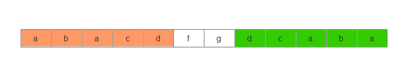

#### 1、两数之和 
[LeetCode](https://leetcode-cn.com/problems/two-sum/)  
```java
//暴力
class Solution {
    public int[] twoSum(int[] nums, int target) {
        int[] res = new int[2];
        for(int i=0;i<nums.length;i++){
            for(int j=i+1;j<nums.length;j++){
                if(nums[i]+nums[j]==target){
                    res[0] = i;
                    res[1] = j;
                    break;
                }
            }
        }
        return res;
    }
}
//hash表
class Solution {
    public int[] twoSum(int[] nums, int target){
        Map<Integer,Integer> tmp = new HashMap<>();

        for(int i=0;i<nums.length;i++){
            tmp.put(nums[i],i);
        }

        for(int i=0;i<nums.length;i++){
            int r = target-nums[i];
            if(tmp.containsKey(r) && i!=tmp.get(r)){
                return new int[]{i,tmp.get(r)};
            }
        }

         throw new IllegalArgumentException("No two sum solution");
    }

}
```
#### 两数相加  
[LeetCode](https://leetcode-cn.com/problems/add-two-numbers/)  
```java
class Solution {
    public ListNode addTwoNumbers(ListNode l1, ListNode l2) {
        int p = 0;//保留进位
        ListNode h = new ListNode(0);//头节点
        ListNode tmp = h;
        while(l1!=null && l2!=null){
            int v = (l1.val + l2.val + p)%10;//个位
            p = (l1.val + l2.val + p)/10;//进位
            tmp.next = new ListNode(v);
            tmp = tmp.next;
            l1 = l1.next;
            l2 = l2.next;
        }
        if(l1==null && l2==null){//两个链表长度一样
          if(p>0){//最后一位如果是0的话不用显示
              tmp.next = new ListNode(p);
          }
        }else{
            ListNode l = null;
            if(l1!=null){
                l = l1;
            }else{
                l = l2;
            }
            while(l!=null){//第一个个链表长度较长
            int v = (l.val + p)%10;
            p = (l.val + p)/10;
            tmp.next = new ListNode(v);
            tmp = tmp.next;
            l = l.next;
           }
           if(p>0){//最后一位如果是0的话不用显示
               tmp.next = new ListNode(p);
           }
        }
        return h.next;
    }
}
```
#### 3、无重复字符串
[LeetCode](https://leetcode-cn.com/problems/longest-substring-without-repeating-characters/submissions/)  
```java
1、暴力
class Solution {
    public int lengthOfLongestSubstring(String s) {
        int max = 0;
        int sum = 0;
        for(int i=0;i<s.length();i++){
             String tmp = "";
             sum = 0;
        for(int j=i;j<s.length();j++){
            if(!tmp.contains(s.substring(j,j+1))){
                sum += 1;
                tmp += s.substring(j,j+1);
                if(sum>max){
                    max = sum;
                }
            }else{
                break;
            }
          }
        }
        return max;
    }
}
2、动态规划
class Solution {
    public int lengthOfLongestSubstring(String s) {
        if(s.length()==0) return 0;
        //动态规划
        //设dp[i]以i结尾不重复的最大子串长度
        int[] dp = new int[s.length()];
        dp[0] = 1;
        int max = 1;
        String tmp = s.substring(0,1);
        for(int i=1;i<s.length();i++){
            String t = s.substring(i,i+1);
            if(tmp.contains(t)){//重复字符,例如此时tmp=abc,而t=a为当前字符
                int index = tmp.indexOf(t);//找出重复字符的位置,此时重复的a下标为0；找位置可以使用Map<String,Integer>空间换时间替代
                tmp = tmp + t;//执行完这操作，此时tmp=abca
                tmp = tmp.substring(index+1);//截取新的不重复的字符串，tmp=bca  
                dp[i] = tmp.length();
            }else{//若tmp不包含当前字符，则直接dp[i] = dp[i-1] + 1
                tmp = tmp + t;
                dp[i] = dp[i-1] + 1;
            }
            if(dp[i]>max){
                max = dp[i];
            }
        }
        return max;
    }
}
```
#### 4、寻找两个有序数组的中位数  
[LeetCode](https://leetcode-cn.com/problems/median-of-two-sorted-arrays/)    
```java

```
#### 5、最长回文子串
[LeetCode](https://leetcode-cn.com/problems/longest-palindromic-substring/solution/zui-chang-hui-wen-zi-chuan-by-leetcode/)  
1、最长公共子串  
反转S1,使之变成S2。找到s1和S2的最长公共子串。  
这是有缺陷的方法：  
例如s1="caba" ,s2="abac",那么最长公共子串aba刚好是正确答案，即是回文子串。  
例如s1="abacdfgdcaba",s2="abacdgfdcaba",那么公共子串为"abacd"显然不是回文子串。  
  
我们可以看到，当 S1 的其他部分中存在非回文子串的反向副本时，最长公共子串法就会失败。所谓的非回文子串的反向副本时即为上图绿色的部分。它和橙色的子串刚好成方向，只要字符串存在这样的现象，使用这样的算法就会出现错误。   
为了纠正这一点，每当我们找到最长的公共子串的候选项时，都需要检查子串的索引是否与反向子串的原始索引相同。如果相同，那么我们尝试更新目前为止找到的最长回文子串；如果不是，我们就跳过这个候选项并继续寻找下一个候选。这句话可由下图来描述。  
采用动态规划求最长公共子串时，dp[i][j]的定义：两个字符串最大公共子串在以s1字符串是以i结尾，在s2字符串是以j结尾的。所以算法执行完毕i和j的位置如图所示。如果最大公共子串是回文子串的话，那么j在原来正向字符串s1的位置j'加上最大公共子串长度-1必定等于i。非回文子串一定是不相等的。    

```java
public String longestPalindrome(String s) {
    if (s.equals(""))
        return "";
    String origin = s;
    String reverse = new StringBuffer(s).reverse().toString();
    int length = s.length();
    int[][] arr = new int[length][length];
    int maxLen = 0;
    int maxEnd = 0;
    for (int i = 0; i < length; i++)
        for (int j = 0; j < length; j++) {
            if (origin.charAt(i) == reverse.charAt(j)) {
                if (i == 0 || j == 0) {
                    arr[i][j] = 1;
                } else {
                    arr[i][j] = arr[i - 1][j - 1] + 1;
                }
            }
            /*****************************/
            if (arr[i][j] > maxLen) {
                int beforeRev = length - 1 - j;
                if (beforeRev + arr[i][j] - 1 == i) { //判断下标是否对应
                    maxLen = arr[i][j];
                    maxEnd = i;
                }
                /*************************************/
            }
        }
    return s.substring(maxEnd - maxLen + 1, maxEnd + 1);
}
```
2、直接动态规划法    
  
dp[i][j]定义表示子串s[i, j]是否为回文子串。  
当s[i]==s[j]时,dp[i,j]=dp[i + 1][j - 1];。当i==0或者j==0另外考虑  
```java
public class Solution {

    public String longestPalindrome(String s) {
        int len = s.length();
        if (len < 2) {
            return s;
        }

        boolean[][] dp = new boolean[len][len];

        // 初始化
        for (int i = 0; i < len; i++) {
            dp[i][i] = true;//对角线i==j，此时是单个字符串，必定是回文子串
        }

        int maxLen = 1;
        int start = 0;

        for (int j = 1; j < len; j++) {
            for (int i = 0; i < j; i++) {

                if (s.charAt(i) == s.charAt(j)) {
                    if (j - i < 3) {//例如aba,bb必定是回文
                        dp[i][j] = true;
                    } else {
                        dp[i][j] = dp[i + 1][j - 1];
                    }
                } else {
                    dp[i][j] = false;
                }

                // 只要 dp[i][j] == true 成立，就表示子串 s[i, j] 是回文，此时记录回文长度和起始位置
                if (dp[i][j]) {
                    int curLen = j - i + 1;
                    if (curLen > maxLen) {
                        maxLen = curLen;
                        start = i;//记录回文子串起点
                    }
                }
            }
        }
        return s.substring(start, start + maxLen);
    }
}
```
3、中心扩散法  
```java
public class Solution {

    public String longestPalindrome(String s) {
        int len = s.length();
        if (len < 2) {
            return s;
        }
        int maxLen = 1;
        String res = s.substring(0, 1);
        // 中心位置枚举到 len - 2 即可
        for (int i = 0; i < len - 1; i++) {
            String oddStr = centerSpread(s, i, i);
            String evenStr = centerSpread(s, i, i + 1);
            String maxLenStr = oddStr.length() > evenStr.length() ? oddStr : evenStr;
            if (maxLenStr.length() > maxLen) {
                maxLen = maxLenStr.length();
                res = maxLenStr;
            }
        }
        return res;
    }

    private String centerSpread(String s, int left, int right) {
        // left = right 的时候，此时回文中心是一个字符，回文串的长度是奇数
        // right = left + 1 的时候，此时回文中心是一个空隙，回文串的长度是偶数
        int len = s.length();
        int i = left;
        int j = right;
        while (i >= 0 && j < len) {
            if (s.charAt(i) == s.charAt(j)) {
                i--;
                j++;
            } else {
                break;
            }
        }
        // 这里要小心，跳出 while 循环时，恰好满足 s.charAt(i) != s.charAt(j)，因此不能取 i，不能取 j
        return s.substring(i + 1, j);
    }
}
```
#### 10 正则表达式
[LeetCode](https://leetcode-cn.com/problems/regular-expression-matching/)  
1 递归  
递归算法最重要的思想就是把问题规模缩小，而且不管是什么规模，它的解法都是一样的，此时就可以从规模最小里计算出答案然后最终逆推获取原始规模问题的答案。  
如果s第一个字符和p的第一个字符匹配，那么只要判断s.substring(1)和p.substring(1)就可以了。但是由于正则表达式*可以代表前面的字符出现0次或多次，所以这道题最关键的一点就是判断p的第二个字符是不是/*然后分多种情况讨论。  

```java
class Solution {
    public boolean isMatch(String s, String p) {

        if(p.isEmpty()) return s.isEmpty();
        
        boolean first_match = (s.length()>0 && p.length()>0)
                                    && (s.charAt(0)==p.charAt(0)||p.charAt(0)=='.');//判断s和p首字符是否相等
        //三种情况
        if(p.length()>1 && p.charAt(1)=='*'){ 
            //p的第二个字符是*
            //1 abcd和c*[abcd]，p直接加2,c出现0次的情况
            //2 a[abcd]和a*bcd，s直接加1
            return isMatch(s,p.substring(2))||first_match&&isMatch(s.substring(1),p);
        }else{//3 a[bcd]和a[xxx]，首个字符相等，且p的第二个字符不是*，两种都向后加1
            return first_match && isMatch(s.substring(1),p.substring(1));
        }
    }
}
```
2、动态规划  
自底向上时间复杂度O(SP)S为s的长度，P为的长度    
d[i,j]定义s[i,s.length-1]和s[j,p.length-1]是否匹配，那么dp[0][0]即为题目答案。
```java 
public boolean isMatch(String text, String pattern) {
    // 多一维的空间，因为求 dp[len - 1][j] 的时候需要知道 dp[len][j] 的情况，
    // 多一维的话，就可以把 对 dp[len - 1][j] 也写进循环了
    boolean[][] dp = new boolean[text.length() + 1][pattern.length() + 1];
    // dp[len][len] 代表两个空串是否匹配了，"" 和 "" ，当然是 true 了。
    dp[text.length()][pattern.length()] = true;

    // 从 len 开始减少
    for (int i = text.length(); i >= 0; i--) {
        for (int j = pattern.length(); j >= 0; j--) {
            // dp[text.length()][pattern.length()] 已经进行了初始化
            if(i==text.length()&&j==pattern.length()) continue;
            
            boolean first_match = (i < text.length() && j < pattern.length()
                                   && (pattern.charAt(j) == text.charAt(i) || pattern.charAt(j) == '.'));
            if (j + 1 < pattern.length() && pattern.charAt(j + 1) == '*') {
                dp[i][j] = dp[i][j + 2] || first_match && dp[i + 1][j];
            } else {
                dp[i][j] = first_match && dp[i + 1][j + 1];
            }
        }
    }
    return dp[0][0];
}
```
#### 11 盛最多的水
[LeetCode](https://leetcode-cn.com/problems/container-with-most-water/solution/sheng-zui-duo-shui-de-rong-qi-by-leetcode/)  
  
双指针法  
```java
class Solution {
    public int maxArea(int[] height) {
        int maxArea = 0;
        int i=0;
        int j = height.length-1;
        while(i<j){
            maxArea = Math.max(maxArea,(j-i)*Math.min(height[i],height[j]));
            //往高度比较高的方向移动
            if(height[i]<height[j]){
                i++;
            }else{
                j--;
            }
        }
        return maxArea;
    }
}
```
#### 12 整数转罗马数字
```java
public class Solution {

    public String intToRoman(int num) {
        // 把阿拉伯数字与罗马数字可能出现的所有情况和对应关系，放在两个数组中
        // 并且按照阿拉伯数字的大小降序排列，这是贪心选择思想
        int[] nums = {1000, 900, 500, 400, 100, 90, 50, 40, 10, 9, 5, 4, 1};
        String[] romans = {"M", "CM", "D", "CD", "C", "XC", "L", "XL", "X", "IX", "V", "IV", "I"};

        StringBuilder stringBuilder = new StringBuilder();
        int index = 0;
        while (index < 13) {
            // 特别注意：这里是等号
            while (num >= nums[index]) {
                // 注意：这里是等于号，表示尽量使用大的"面值"
                stringBuilder.append(romans[index]);
                num -= nums[index];
            }
            index++;
        }
        return stringBuilder.toString();
    }
}
```
#### 14、最长公共前缀
[LeetCode]
```java
1、循环
class Solution {
public static String longestCommonPrefix(String[] strs) {
        if (strs.length == 0) return "";
        String prefix = strs[0];
        for (int i = 1; i < strs.length; i++)
            while (strs[i].indexOf(prefix) != 0) {
                prefix = prefix.substring(0, prefix.length() - 1);
                if (prefix.isEmpty()) return "";
            }
        return prefix;
   }
 }
2、分治  
class Solution {
    public String longestCommonPrefix(String[] strs) {
        if(strs.length==0) return "";
        return dfs(strs,0,strs.length-1);
    }

    public String dfs(String[] strs,int low,int high){
        if(low<high){
            int mid = (low+high)/2;
            String left = dfs(strs,low,mid);
            if(left.isEmpty()) return "";//左序列没有公共前缀，直接方法空
            String right = dfs(strs,mid+1,high);
            if(right.isEmpty()) return "";//右序列没有公共前缀，直接方法空
            return commonPrefix(left,right);
        }
        return strs[low];
    }

    public String commonPrefix(String left,String right) {
    int min = Math.min(left.length(), right.length());       
    for (int i = 0; i < min; i++) {
        if ( left.charAt(i) != right.charAt(i) )
            return left.substring(0, i);
    }
    return left.substring(0, min);
}
}

```
#### 15 三数之和  
[LeetCode]()
```java
1、回溯
class Solution {
    public List<List<Integer>> threeSum(int[] nums) {
        Arrays.sort(nums);//先排序，否则不好去重，如果不排序例如[-1,0,1]和[0,1,-1]很难再遍历过程中去重
        List<List<Integer>> res = new ArrayList<>();
        dfs(nums,0,new ArrayList<>(),res,0,3);
        return res;
    }

    void dfs(int[] nums,int index,List<Integer> tmp,List<List<Integer>> res,int sum,int n){
        if(tmp.size()==n){
            if(sum==0){
                res.add(new ArrayList<>(tmp));
            }
            return;
        }
        List<Integer> visit = new ArrayList<>();
        for(int i=index;i<nums.length;i++){
            if(visit.contains(nums[i])) continue;
            visit.add(nums[i]);
            sum += nums[i];
            tmp.add(nums[i]);
            dfs(nums,i+1,tmp,res,sum,n);
            tmp.remove(tmp.size()-1);
            sum -= nums[i];
        }
    }
}
```
2 双头指针法  

```java
class Solution {
    public List<List<Integer>> threeSum(int[] nums) {
        List<List<Integer>> res = new ArrayList<>();
        if(nums.length<3) return res;
        Arrays.sort(nums);//先排序
       for(int i=0;i<nums.length;i++){
           if(nums[i]>0) break;//因为排序，所以i后边的元素都大于，不可能和等于0的情况
           if(i> 0 && nums[i]==nums[i-1]) continue;//和前面元素相等跳过，否则出现重复
           int l = i+1;
           int r = nums.length-1;
           while(l<r){
               int sum = nums[i] + nums[l] + nums[r];
               if(sum==0){
                   List<Integer> tmp = new ArrayList<>();
                   tmp.add(nums[i]);
                   tmp.add(nums[l]);
                   tmp.add(nums[r]);
                   res.add(tmp);
                   while(l<r&&nums[l]==nums[l+1]) l++;//去重
                   while(l<r&&nums[r]==nums[r-1]) r--;//去重
                   l++;//左指针后移
                   r--;//右指针前移
               }
               else if(sum<0){
                   l++;
               }else{
                   r--;
               }
               
           }
       }
       return res;
    }
}
```
#### 16 最接近的三数之和
[LeetCode](https://leetcode-cn.com/problems/3sum-closest/)  
```java
class Solution {
    public static int threeSumClosest(int[] nums, int target) {
        Arrays.sort(nums);//先排序
        int maxClose = nums[0] + nums[1] + nums[2];//初始值
        for(int i=0;i<nums.length;i++){
            if(i> 0 && nums[i]==nums[i-1]) continue;//和前面元素相等跳过，否则出现重复
            int l = i+1;
            int r = nums.length-1;
            while(l<r){
                int sum = nums[i] + nums[l] + nums[r];//xxx----target----xxx
                if(sum==target) return sum;
                if(Math.abs(sum-target)< Math.abs(maxClose-target)){
                    maxClose = sum;
                    while(l<r&&nums[l]==nums[l+1]) l++;//去重
                    while(l<r&&nums[r]==nums[r-1]) r--;//去重
                }
                if(sum<target){
                    l++;
                }else{
                    r--;
                }
            }
        }
        return maxClose;
    }
}
```
#### 17、电话号码的字母组合  
[LeetCode](https://leetcode-cn.com/problems/letter-combinations-of-a-phone-number/)  
//经典回溯问题  
```java
class Solution {
    public List<String> letterCombinations(String digits) {
        List<String> result = new ArrayList<>();
        if(digits.isEmpty()){
            return result;
        }
        String[] number = new String[10];
        number[2] = "abc";
        number[3] = "def";
        number[4] = "ghi";
        number[5] = "jkl";
        number[6] = "mno";
        number[7] = "pqrs";
        number[8] = "tuv";
        number[9] = "wxyz";
        
        track(digits,number,0,new StringBuilder(),result);
        return result;
    }

    //index为输入字符串digits的下标
    public void track(String digits,String[] number,int index,StringBuilder str,List<String> result){
        if(index==digits.length()) {
            result.add(str.toString());
            return;//递归到底结束
        }
        char a = digits.charAt(index);//下标对应的数字字符
        String letter = number[a-'0'];//数字对应的字母 不能直接Integer.valueOf('1'),会返回'i'的ascii值
        for(int i=0;i<letter.length();i++){
            str.append(letter.charAt(i));
            track(digits,number,index+1,str,result);
            str.deleteCharAt(str.length()-1);
        }
    }
}
```
#### 19、删除链表的倒数第n个节点
[LeetCode](https://leetcode-cn.com/problems/remove-nth-node-from-end-of-list/submissions/)  
快慢指针  
```java
class Solution {
    public ListNode removeNthFromEnd(ListNode head, int n) {
        ListNode pre = null;
        ListNode slow = head;//慢指针
        ListNode fast = head;//快指针
        int i = 0;
        while(fast!=null&& i<n){//先让快指针走n步
            i++;
            fast = fast.next;
        }
        while(fast!=null){//然后快慢指针一起走，fast走到终点时slow即为倒数第n个节点位置
            fast = fast.next;
            pre = slow;
            slow = slow.next;
        }
        if(pre!=null){
            pre.next = slow.next;
        }else{
            //此时删除的是第一个节点
            head = head.next;
        }
        return head;
    }
}
```
#### 20 有效括号
[LeetCode](https://leetcode-cn.com/problems/valid-parentheses/submissions/)  
```java
class Solution {
    public boolean isValid(String s) {
        Stack<Character> stack = new Stack<>();
        for(int i=0;i<s.length();i++){
            char cur = s.charAt(i);
            if(cur==')' || cur=='}' || cur==']'){
                if(stack.isEmpty()) return false;
                char top = stack.pop();
                if(cur==')' && top!='(') return false;
                if(cur=='}' && top!='{') return false;
                if(cur==']' && top!='[') return false;
            }else{
                stack.push(cur);
            }
        }
        return stack.isEmpty();
    }
}
```
#### 21、合并两个有序链表
[LeetCode](https://leetcode-cn.com/problems/merge-two-sorted-lists/solution/he-bing-liang-ge-you-xu-lian-biao-by-leetcode/)  
```java
class Solution {
    public ListNode mergeTwoLists(ListNode l1, ListNode l2) {
        if (l1 == null) {
            return l2;
        }
        else if (l2 == null) {
            return l1;
        }
        else if (l1.val < l2.val) {
            l1.next = mergeTwoLists(l1.next, l2);
            return l1;
        }
        else {
            l2.next = mergeTwoLists(l1, l2.next);
            return l2;
        }

    }
}
class Solution {
    public ListNode mergeTwoLists(ListNode l1, ListNode l2) {
        ListNode h = new ListNode(0);
        ListNode p = h;
        while(l1!=null&&l2!=null){
            if(l1.val<l2.val){
                h.next = l1;
                l1 = l1.next;
            }else{
                h.next = l2;
                l2 = l2.next;
            }
            h = h.next;
        }
        if(l1!=null){
            h.next = l1;
        }else{
            h.next =l2;
        }
        return p.next;
    }
}
```
#### 22、括号生成  
[LeetCode](https://leetcode-cn.com/problems/generate-parentheses/submissions/)  

```java
1、回溯  
class Solution {
    public List<String> generateParenthesis(int n) {
        List<String> res = new ArrayList<>();
        track("",0,0,n,res);
        return res;
    }

    public void track(String cur,int open,int close,int n,List<String> res){
        if(cur.length()==2*n){
            res.add(cur);
            return;
        }
        if(open<n){//左括号不能大于n
            track(cur+"(",open+1,close,n,res);//选择"("
        }
        if(open>close){//右括号不能大于左括号
            track(cur+")",open,close+1,n,res);//选择")"
        }
    }
}
```
#### 23、合并K个排序链表
利用归并方法两两合并两个链表，直到全部有序。  
```java
class Solution {
    public ListNode mergeKLists(ListNode[] lists) {
        if(lists.length==0) return null;
        return dfs(lists,0,lists.length-1);
    }

    public ListNode dfs(ListNode[] lists,int low,int high){
        if(low < high){
            int p = (low+high)/2;
            ListNode left = dfs(lists,low,p);//归并左边序列
            ListNode right = dfs(lists,p+1,high);//归并右边序列
            return merge(left,right);
        }
        return lists[low];//low==high
    }

    public ListNode merge(ListNode left,ListNode right){
        ListNode p = new ListNode(0);//新链表头节点
        ListNode head = p;
        while(left!=null && right!=null){
            if(left.val<right.val){
                p.next = left;
                left = left.next;
            }else{
                p.next = right;
                right = right.next;
            }
            p = p.next;
        }

        if(left!=null){//如果left链表还有剩余
            p.next = left;
        }
         if(right!=null){//如果right链表还有剩余
            p.next = right;
        }
        return head.next;//返回合并链表头节点
    }
}
复杂度为O(knlogk)
```
#### 24 两两交换链表中的节点
[LeetCode](https://leetcode-cn.com/problems/swap-nodes-in-pairs/)   

要注意边界条件
```java
class Solution {
    public ListNode swapPairs(ListNode head) {
        if(head==null) return head;
        ListNode l1 = head;
        ListNode l2 = head.next;
        ListNode pre = null;
        ListNode t1;
        ListNode t2;
        while(l2!=null){
            t1 = l1;
            t2 = l2;
            l1 = l2.next;
            if(l2.next!=null && l2.next.next!=null){//边界条件
                l2 = l2.next.next;
            }else{
                l2 = null;
            }

            if(pre==null){//此时是链表的头两个节点进行交换
                t1.next = t2.next;
                t2.next = t1;
                head = t2;
            }else{
                t1.next = t2.next;
                t2.next = t1;
                pre.next = t2;
            }
            pre = t1;
        }
        return head;
    }
}
```
#### 25 K 个一组翻转链表
[LeetCode](https://leetcode-cn.com/problems/reverse-nodes-in-k-group/solution/di-gui-java-by-reedfan-2/)  

```java
class Solution {
    public ListNode reverseKGroup(ListNode head, int k) {
        int c = 0;
        ListNode h = head;
        ListNode pretail = null;
        ListNode res = null;
        while(h!=null){
            c++;
            ListNode tmp = h.next;
            if(c==k){
                c=0;
                h.next = null;
                ListNode curhead = reverse(head);//翻转
                if(pretail!=null){
                    pretail.next = curhead;
                }else{
                    res = curhead;//pretail为null,说明是整个链表的第一组k节点集合
                }
                pretail = head;//翻转后头结点变成尾节点
                pretail.next = tmp;
                head = tmp;//下一组的头结点
            }
            h = tmp;
        }
        return res;
    }

    //翻转链表
    public ListNode reverse(ListNode node){
        ListNode pre = null;
        while(node!=null){
            ListNode t = node.next;
            node.next = pre;
            pre = node;
            node = t;
        }
        return pre;
    }
}
```
#### 26 删除排序数组中的重复项
[LeetCode](https://leetcode-cn.com/problems/remove-duplicates-from-sorted-array/)  
双指针，i始终指向新数组最后一个元素
```java
public int removeDuplicates(int[] nums) {
    if (nums.length == 0) return 0;
    int i = 0;
    for (int j = 1; j < nums.length; j++) {
        if (nums[j] != nums[i]) {
            i++;
            nums[i] = nums[j];
        }
    }
    return i + 1;
}
class Solution {
    public int removeDuplicates(int[] nums) {
        //双指针，index始终指向新数组最后一个元素
        int index=1;
        for(int i=1;i<nums.length;i++){
            while(i<nums.length&&nums[i]==nums[i-1]) i++;
            if(i<nums.length){
                nums[index++] = nums[i];
            }
        }
        return index;
    }
}
```
#### 27 移除元素
[LeetCode](https://leetcode-cn.com/problems/remove-element/)  
```java
class Solution {
    public int removeElement(int[] nums, int val) {
        int j =0;
        int l = 0;
        for(int i=0;i<nums.length;i++){
            if(nums[i]!=val && l>0){//在第一个后边的不等于val的元素依次覆盖
                nums[j++] = nums[i];
            }
            if(nums[i]==val){
                if(l==0){//找到第一次出现val的下标
                    j = i;
                }
                l++;
            }
        }
        return nums.length-l;
    }

}
//双指针
public int removeElement(int[] nums, int val) {
    int i = 0;
    for (int j = 0; j < nums.length; j++) {
        if (nums[j] != val) {
            nums[i] = nums[j];
            i++;
        }
    }
    return i;
}

```
#### 29 两数相除
[LeetCode](https://leetcode-cn.com/problems/divide-two-integers/)  
```java
public static int divide(int dividend, int divisor) {
        boolean sign = (dividend > 0) ^ (divisor > 0);//判断是否符号相同
        int result = 0;
        if(dividend>0) {//统一转成负数
            dividend = -dividend;
        }
        if(divisor>0) divisor = -divisor;
        while(dividend <= divisor) {
            int temp_result = -1;
            int temp_divisor = divisor;
            while(dividend <= (temp_divisor << 1)) {
                if(temp_divisor <= (Integer.MIN_VALUE >> 1))break;
                temp_result = temp_result << 1;
                temp_divisor = temp_divisor << 1;
            }
            dividend = dividend - temp_divisor;
            result += temp_result;
        }
        if(!sign) {//除数被除数符号不同
            if(result <= Integer.MIN_VALUE) return Integer.MAX_VALUE;
            result = - result;
        }
        return result;
    }
```
#### 30 串联所有单词的子串
[LeetCode](https://leetcode-cn.com/problems/substring-with-concatenation-of-all-words/solution/chuan-lian-suo-you-dan-ci-de-zi-chuan-by-powcai/)  

```java
1、暴力
public List<Integer> findSubstring(String s, String[] words) {
    List<Integer> res = new ArrayList<Integer>();
    int wordNum = words.length;
    if (wordNum == 0) {
        return res;
    }
    int wordLen = words[0].length();
    //HashMap1 存所有单词
    HashMap<String, Integer> allWords = new HashMap<String, Integer>();
    for (String w : words) {
        int value = allWords.getOrDefault(w, 0);
        allWords.put(w, value + 1);
    }
    //遍历所有子串
    for (int i = 0; i < s.length() - wordNum * wordLen + 1; i++) {
        //HashMap2 存当前扫描的字符串含有的单词
        HashMap<String, Integer> hasWords = new HashMap<String, Integer>();
        int num = 0;
        //判断该子串是否符合
        while (num < wordNum) {
            String word = s.substring(i + num * wordLen, i + (num + 1) * wordLen);
            //判断该单词在 HashMap1 中
            if (allWords.containsKey(word)) {
                int value = hasWords.getOrDefault(word, 0);
                hasWords.put(word, value + 1);
                //判断当前单词的 value 和 HashMap1 中该单词的 value
                if (hasWords.get(word) > allWords.get(word)) {
                    break;
                }
            } else {
                break;
            }
            num++;
        }
        //判断是不是所有的单词都符合条件
        if (num == wordNum) {
            res.add(i);
        }
    }
    return res;
}

2、滑动窗口
class Solution {
    public List<Integer> findSubstring(String s, String[] words) {
        List<Integer> res = new ArrayList<>();
        if (s == null || s.length() == 0 || words == null || words.length == 0) return res;
        HashMap<String, Integer> map = new HashMap<>();
        int one_word = words[0].length();
        int word_num = words.length;
        int all_len = one_word * word_num;
        for (String word : words) {
            map.put(word, map.getOrDefault(word, 0) + 1);
        }
        for (int i = 0; i < one_word; i++) {
            int left = i, right = i, count = 0;
            HashMap<String, Integer> tmp_map = new HashMap<>();
            while (right + one_word <= s.length()) {
                String w = s.substring(right, right + one_word);
                tmp_map.put(w, tmp_map.getOrDefault(w, 0) + 1);
                right += one_word;
                count++;
                while (tmp_map.getOrDefault(w, 0) > map.getOrDefault(w, 0)) {
                    String t_w = s.substring(left, left + one_word);
                    count--;
                    tmp_map.put(t_w, tmp_map.getOrDefault(t_w, 0) - 1);
                    left += one_word;
                }
                if (count == word_num) res.add(left);

            }
        }

        return res;
    }
}
3、优化版滑动窗口
public static List<Integer> solution2(String s, String[] words) {
        List<Integer> res = new ArrayList<>();
        Map<String, Integer> wordsMap = new HashMap<>();
        if (s.length() == 0 || words.length == 0) return res;
        for (String word: words) {
            // 主串s中没有这个单词，直接返回空
            if (s.indexOf(word) < 0) return res;
            // map中保存每个单词，和它出现的次数
            wordsMap.put(word, wordsMap.getOrDefault(word, 0) + 1);
        }
        // 每个单词的长度， 总长度
        int oneLen = words[0].length(), wordsLen = oneLen * words.length;
        // 主串s长度小于单词总和，返回空
        if (wordsLen > s.length()) return res;
        // 只讨论从0，1，...， oneLen-1 开始的子串情况，
        // 每次进行匹配的窗口大小为 wordsLen，每次后移一个单词长度，由左右窗口维持当前窗口位置
        for (int i = 0; i < oneLen; ++i) {
            // 左右窗口
            int left = i, right = i, count = 0;
            // 统计每个符合要求的word
            Map<String, Integer> subMap = new HashMap<>();
            // 右窗口不能超出主串长度
            while (right + oneLen <= s.length()) {
                // 得到一个单词
                String word = s.substring(right, right + oneLen);
                // 有窗口右移
                right += oneLen;
                // words[]中没有这个单词，那么当前窗口肯定匹配失败，直接右移到这个单词后面
                if (!wordsMap.containsKey(word)) {
                    left = right;
                    // 窗口内单词统计map清空，重新统计
                    subMap.clear();
                    // 符合要求的单词数清0
                    count = 0;
                } else {
                    // 统计当前子串中这个单词出现的次数
                    subMap.put(word, subMap.getOrDefault(word, 0) + 1);
                    ++count;
                    // 如果这个单词出现的次数大于words[]中它对应的次数，又由于每次匹配和words长度相等的子串
                    // 如 ["foo","bar","foo","the"]  "| foobarfoobar| foothe"
                    // 第二个bar虽然是words[]中的单词，但是次数抄了，那么右移一个单词长度后 "|barfoobarfoo|the"
                    // bar还是不符合，所以直接从这个不符合的bar之后开始匹配，也就是将这个不符合的bar和它之前的单词(串)全移出去
                    while (subMap.getOrDefault(word, 0) > wordsMap.getOrDefault(word, 0)) {
                        // 从当前窗口字符统计map中删除从左窗口开始到数量超限的所有单词(次数减一)
                        String w = s.substring(left, left + oneLen);
                        subMap.put(w, subMap.getOrDefault(w, 0) - 1);
                        // 符合的单词数减一
                        --count;
                        // 左窗口位置右移
                        left += oneLen;
                    }
                    // 当前窗口字符串满足要求
                    if (count == words.length) res.add(left);
                }
            }
        }
        return res;
    }
```

#### 39、组合总和
[组合总和](https://leetcode-cn.com/problems/combination-sum/) 

```java
class Solution {
    public List<List<Integer>> combinationSum(int[] candidates, int target) {
        List<List<Integer>> response = new ArrayList<>();
        if(target<=0){
            return response;
        }
        track(candidates,target,0,new ArrayList<>(),response);
        return response; 
    }

  void track(int[] a,int current,int index,List<Integer> tmp,List<List<Integer>> result){
   if(current==0){//满足条件
      result.add(new ArrayList<>(tmp));
	  return;
   }
  if(current<0) return;//不满足条件递归终止
  //每次循环都要从上一层传来的index开始，否则会造成重复
   for(int i=index;i<a.length;i++){
    tmp.add(a[i]);
	  track(a,current-a[i],i,tmp,result);
	  tmp.remove(tmp.size()-1);//回归状态
   }
}
}
```
#### 34、排序
```java
int binary_search(int[] nums, int target) {
    int left = 0, right = nums.length - 1; 
    while(left <= right) {
        int mid = left + (right - left) / 2;
        if (nums[mid] < target) {
            left = mid + 1;
        } else if (nums[mid] > target) {
            right = mid - 1; 
        } else if(nums[mid] == target) {
            // 直接返回
            return mid;
        }
    }
    // 直接返回
    return -1;
}

int left_bound(int[] nums, int target) {
    int left = 0, right = nums.length - 1;
    while (left <= right) {
        int mid = left + (right - left) / 2;
        if (nums[mid] < target) {
            left = mid + 1;
        } else if (nums[mid] > target) {
            right = mid - 1;
        } else if (nums[mid] == target) {
            // 别返回，收缩左侧边界
            right = mid - 1;
        }
    }
    // 最后要检查 left 越界的情况
    if (left >= nums.length || nums[left] != target)
        return -1;
    return left;
}


int right_bound(int[] nums, int target) {
    int left = 0, right = nums.length - 1;
    while (left <= right) {
        int mid = left + (right - left) / 2;
        if (nums[mid] < target) {
            left = mid + 1;
        } else if (nums[mid] > target) {
            right = mid - 1;
        } else if (nums[mid] == target) {
            // 别返回，收缩右侧边界
            left = mid + 1;
        }
    }
    // 最后要检查 right 越界的情况
    if (right < 0 || nums[right] != target)
        return -1;
    return right;
}
```
#### 40、组合总和II
[组合总和II](https://leetcode-cn.com/problems/combination-sum-ii/)  
和上一题的区别是： 输入数组可以存在重复的元素，而每个数字在每个组合中只能使用一次，这两个要求都和上一题相反。    
要解决此问题需要考虑两点：  
因为元素不能重复选择，所以每次递归到下一层，index要加1；  
因为输入数组存在相同的元素，所以必须想要排序，然后在循环时判断a[i] == a[i - 1],如果相等就continue；如果不排序的话会出现如下错误：  
输入[1,5,1,4],目标值为6，那么如果不加第二步的限制的话会出现如下结果：  
[1,5][5,1]。如果先排序成[1,1,4,5]然后加a[i] == a[i - 1]判断就能避免重复的情况。 
```java
class Solution {
    public List<List<Integer>> combinationSum2(int[] candidates, int target) {
        List<List<Integer>> response = new ArrayList<>();
        if(target<=0){
            return response;
        }
        //candidates = Arrays.stream(candidates).distinct().toArray();
        Arrays.sort(candidates);
        track(candidates,target,0,new ArrayList<>(),response);
        //response = response.stream().distinct().collect(Collectors.toList());
        return response;
    }

    void track(int[] a,int current,int index,List<Integer> tmp,List<List<Integer>> result){
       if(current==0){//满足条件
           result.add(new ArrayList<>(tmp));
	       return;
        }
       //每次循环都要从上一层传来的index开始，否则会造成重复
       for(int i=index;i<a.length;i++){
        if(current-a[i]<0) break;//不满足条件递归终止
        // 小剪枝
        if (i > index && a[i] == a[i - 1]) {
                continue;
        }
         tmp.add(a[i]);
	     track(a,current-a[i],i+1,tmp,result);
	     tmp.remove(tmp.size()-1);//回归状态
       }
   }
}
```
#### 45、跳跃游戏II
[LeetCode](https://leetcode-cn.com/problems/jump-game-ii/)   
每次在可选范围内选择能跳的最远的下标，例如第一个元素2,它可选择的范围是蓝色的3,1。因为选择3它可以提到1+3=4的位置最远，所以选择3.  
选择3后，有1,1,4三种选择。因为选择4时能跳到最远，所以选择4依次类推。
  
```java
class Solution {
    public int jump(int[] nums) {
        int n = nums.length;
        if(n==0 || n==1) return 0;

        int step = 0;//记录步骤

        for(int i=0;i<n;){
            if(i+nums[i]>=n-1){//如果能直接跳到最后,则直接得到结果
               return step +1;
            } else{//选可以跳的范围内值最大的下标位置
              int index = i+1;
              int max = 0;
              for(int j=i+1;j<=i+nums[i];j++){
                  if(j+ nums[j]>=max){
                      max = j+ nums[j];
                      index = j;
                  }
              }
              i= index;//下次从index位置开始选择
            }
            step++;
        }
        return step;
    }
}
class Solution {
    public int jump(int[] nums) {
        int length = nums.length;
        int end = 0;
        int maxPosition = 0; 
        int steps = 0;
        for (int i = 0; i < length - 1; i++) {
            maxPosition = Math.max(maxPosition, i + nums[i]); 
            if (i == end) {
                end = maxPosition;
                steps++;
            }
        }
        return steps;
    }
}
```
#### 46、全排列
[全排列](https://leetcode-cn.com/problems/permutations/submissions/)  
  
全排列有一个特点就是[1,2,3]和[2,1,3]虽然数字都相同，因为顺序不同，所以在全排列问题是属于不同的结果。如果第一个元素选择2，下一个元素是可以选择1的，所以用回溯法循环时i要从0开始，而不是常见的从父节点传下来的index或index+1开始，这是要非常注意的一点。又因为递归函数的循环i每次都是从0开始的，所以使用一个boolean[] visit数组来记录已经访问过的节点下标，一旦在循环判断i下标的节点已经访问过了，要用continue跳过该节点。  
```java
class Solution {
    public List<List<Integer>> permute(int[] nums) {
        List<List<Integer>> result = new ArrayList<>();
        if(nums.length==0) return result;
        boolean[] visit = new boolean[nums.length];
        track(nums,visit,new ArrayList<>(),result);
        return result;
    }

    public void track(int[] nums,boolean[] visit,List<Integer> tmp,List<List<Integer>> result){
        if(tmp.size()==nums.length){
            result.add(new ArrayList<>(tmp));
            return;
        }
        for(int i=0;i<nums.length;i++){
            if(visit[i]){
                continue;
            }
            tmp.add(nums[i]);
            visit[i] = true;//标注i下标已访问
            track(nums,visit,tmp,result);
            tmp.remove(tmp.size()-1);
            visit[i] = false;//回归状态
        }
    }

}
```
#### 47、全排列II
[全排列II](https://leetcode-cn.com/problems/permutations-ii/)  
  
和46题对比只有一个不同点在于输入数组存在重复的元素，所以为了避免得到带重复的结果，同一层值相同的节点只能选择一次，如图灰色的节点。所以程序中可以利用一个map以节点的值为key来记录同一层值相等的节点是否已经访问过，如果访问过则跳过。  
```java
class Solution {
    public List<List<Integer>> permuteUnique(int[] nums) {
        List<List<Integer>> result = new ArrayList<>();
        if(nums.length==0) return result;
        Arrays.sort(nums);//排序下可以更好理解为什么同一层相同的节点只能选择一次
        boolean[] visit = new boolean[nums.length];
        track(nums,visit,new ArrayList<>(),result);
        return result;
    }

    public void track(int[] nums,boolean[] visit,List<Integer> tmp,List<List<Integer>> result){
        if(tmp.size()==nums.length){//满足结果则添加到result中，然后结束递归
            result.add(new ArrayList<>(tmp));
            return;
        }
        Map<Integer,Boolean> visit2 = new HashMap<>();
        for(int i=0;i<nums.length;i++){
            if(visit[i]) continue;//已经访问过的节点忽略
            if(visit2.containsKey(nums[i])&&visit2.get(nums[i])) continue;//判断同一层值相同的点是否访问过，如果访问过则忽略
            visit2.put(nums[i],true);
            tmp.add(nums[i]);
            visit[i]=true;
            track(nums,visit,tmp,result);
            tmp.remove(tmp.size()-1);
            visit[i]=false;
        }
    }
}
```
#### 50、跳跃游戏
[LeetCode](https://leetcode-cn.com/problems/jump-game/)  
```java
1、回溯
增加visit数组记录已经访问过的下标，提升效率  
class Solution {
    public boolean canJump(int[] nums) {
        boolean [] visit = new boolean[nums.length];
        return track(nums,0,visit);
    }

    public boolean track(int[] nums,int i,boolean[] visit){
       if(i>=nums.length-1) return true;//已经跳到最后
       if(nums[i]==0 && i<nums.length) return false;//到最后位置之前遇到0，则不会跳到最后
       if(i+nums[i]>=nums.length-1) return true;//

       for(int j=i+1;j<=i+nums[i] && j< nums.length;j++){
           if(visit[j]) {
               continue;//已经访问过
           }
            if(track(nums,j,visit)){//
                return true;//
            }
            visit[j] = true;
       }
       return false;//下标i所有nums[i]种选择都已经试过，返回失败
    }
}
2、动态规划

```
#### 51、N皇后
[LeetCode](https://leetcode-cn.com/problems/n-queens/)  
 
```java
class Solution {
  // 用于标记是否被列方向的皇后被攻击
  int rows[];
  // 用于标记是否被主对角线方向的皇后攻击
  int hills[];
  // 用于标记是否被主对角线方向的皇后攻击
  int dales[];
  int n;
  // output
  List<List<String>> output = new ArrayList();
  // 皇后位置
  int queens[];

  //对于所有的主对角线有 行号 + 列号 = 常数，对于所有的次对角线有 行号 - 列号 = 常数”
  public boolean isNotUnderAttack(int row, int col) {
    int res = rows[col] + hills[row - col + n - 1] + dales[row + col];
    return (res == 0) ? true : false;
  }

  public void placeQueen(int row, int col) {
    queens[row] = col;//记录皇后的位置
    rows[col] = 1;
    hills[row - col + n-1] = 1;  // "hill" diagonals
    dales[row + col] = 1;   //"dale" diagonals
  }

  public void removeQueen(int row, int col) {
    queens[row] = 0;
    rows[col] = 0;
    hills[row - col + n-1] = 0;
    dales[row + col] = 0;
  }

  public void addSolution() {
    List<String> solution = new ArrayList<String>();
    for (int i = 0; i < n; ++i) {
      int col = queens[i];
      StringBuilder sb = new StringBuilder();
      for(int j = 0; j < col; ++j) sb.append(".");
      sb.append("Q");
      for(int j = 0; j < n - col - 1; ++j) sb.append(".");
      solution.add(sb.toString());
    }
    output.add(solution);
  }

  public void backtrack(int row) {
    if (row == n) {
        addSolution();
        return;
    }
    for (int col = 0; col < n; col++) {
      if (isNotUnderAttack(row, col)) {
        placeQueen(row, col);
        backtrack(row + 1);
        // backtrack
        removeQueen(row, col);
      }
    }
  }

  public List<List<String>> solveNQueens(int n) {
    this.n = n;
    rows = new int[n];
    hills = new int[2 * n - 1];
    dales = new int[2 * n - 1];
    queens = new int[n];

    backtrack(0);
    return output;
  }
}
```
#### 53、最大子序和
[LeetCode](https://leetcode-cn.com/problems/maximum-subarray/submissions/)  
比较简单的思路就是遍历每种情况，然后求出最大值。因为是连续的子序列，所以递归函数只有一次执行。
```java
1、回溯（暴力）
class Solution {
    int max;
    public int maxSubArray(int[] nums) {
        max = nums[0];
        for(int i=0;i<nums.length;i++){
            track(nums,i,0);
        }
        return max;
    }

    public void track(int[] nums,int index,int sum){
        if(index<nums.length){
            sum += nums[index];
            if(sum>max) max=sum;
            track(nums,index+1,sum);
            sum -= nums[index];
        }
    }
}  
```
2、动态规划
以dp[i]表示以nums[i]结尾的最大子序和  
dp[i]=max(dp[i-1]+nums[i],nums[i])  
dp[0]=nums[0]  

```java
class Solution {
    public int maxSubArray(int[] nums) {
      int[] dp = new int[nums.length];
      dp[0]=nums[0];
        int n = nums.length, maxSum = nums[0];
    for(int i = 1; i < n; ++i) {
      if (nums[i - 1] > 0) nums[i] += nums[i - 1];
      maxSum = Math.max(nums[i], maxSum);
    }
    return maxSum;
    }

}

```
#### 56、合并区间
[LeetCode](https://leetcode-cn.com/problems/merge-intervals/)  
先按成员左区间排序，然后判断若有重叠则进行合并处理  

```java
class Solution {
    public int[][] merge(int[][] intervals) {
 
        List<int[]> output = new ArrayList<>();
        
        //先按左区间排序
        Arrays.sort(intervals,(x,y)->x[0]-y[0]);//二维数组可以成员是对象，可以直接使用stream

        for(int i=0;i<intervals.length;i++){
            if(i==0){
                output.add(intervals[i]);//第一个元素直接添加
            }else{
                int[] pre = output.get(output.size()-1);
                int[] cur = intervals[i];
                //有重叠
                if(cur[0]<=pre[1] && cur[1]>= pre[0]){
                    pre[0] = Math.min(cur[0],pre[0]);
                    pre[1] = Math.max(cur[1],pre[1]);
                }else{
                    output.add(cur);
                }
            }
        }
        return output.toArray(new int[output.size()][2]);
        //return output.toArray(new int[intervals.length][2]);

    }
}
时间复杂度：主要是排序的复杂度O(nlogn)  
空间复杂度：O(1)  
```
#### 57、插入区间  
[LeetCode](https://leetcode-cn.com/problems/insert-interval/solution/cha-ru-qu-jian-by-leetcode/)  
算法如下图所示：  
先循环遍历找出所有左区间小于新输入左区间添加到output数组里，然后再依次和output数组最后一个元素比较，若有重叠就合并后添加到output。

```java
class Solution {
    public int[][] insert(int[][] intervals, int[] newInterval) {
        
        List<int[]> output = new ArrayList<>();
        int index=0;
        while(index<intervals.length && newInterval[0]>intervals[index][0]){
            output.add(intervals[index++]);
        }
        if(output.isEmpty()||output.get(output.size()-1)[1]<newInterval[0]){
            output.add(newInterval);
        }else{
             int[] last = output.remove(output.size()-1);//取出最后一个元素
             int[] tmp = new int[2];
            tmp[0] = Math.min(last[0],newInterval[0]);
            tmp[1] = Math.max(last[1],newInterval[1]);
            output.add(tmp);
        }
        
        while(index<intervals.length){
        int[] last = output.remove(output.size()-1);//取出最后一个元素
        int[] cur = intervals[index++];
            //有重叠
        if(last[1]>=cur[0] && last[0]<=cur[0]){
            int[] tmp = new int[2];
            tmp[0] = Math.min(last[0],cur[0]);
            tmp[1] = Math.max(last[1],cur[1]);
            output.add(tmp);
        }else{
            output.add(last);
            output.add(cur);
        }
        }
        //return output.toArray(new int[output.size()]);
        return output.toArray(new int[output.size()][2]);
    }
}
```
#### 75、颜色分类
[LeetCode](https://leetcode-cn.com/problems/sort-colors/solution/yan-se-fen-lei-by-leetcode/)  
三路快排  
```java
class Solution {
    public void sortColors(int[] nums) {
         int p0=0;
         int cur=0;
         int p2=nums.length-1;
         while(cur<=p2){
             if(nums[cur]==0){//等于0的和p0交换，是因为坐标的数字都扫描过了,所以p0和cur都++，
                 int tmp = nums[p0];
                 nums[p0++]=nums[cur];
                 nums[cur++] =tmp;
             }else if(nums[cur]==2){//等于2的和p2交换，p2--,因为和p2交换过来的数字还未扫描，故cur不能变
                 int tmp = nums[p2];
                 nums[p2--]=nums[cur];
                 nums[cur] =tmp;
             }else{
                 cur++;
             }
         }
    }
}
```
#### 77、组合 
[LeetCode](https://leetcode-cn.com/problems/combinations/  )
```java
class Solution {
    public List<List<Integer>> combine(int n, int k) {
        List<List<Integer>> result = new ArrayList<>();

        track(n,k,1,result,new ArrayList<>());
        return result;
    }

    public void track(int n,int k,int index,List<List<Integer>> result,List<Integer> tmp){
        if(tmp.size()==k){
            result.add(new ArrayList<>(tmp));
            return;
        }
        for(int i=index;i<=n;i++){
            tmp.add(i);
            track(n,k,i+1,result,tmp);
            tmp.remove(tmp.size()-1);
        }
    }

}
```
####  78、 子集
[子集](https://leetcode-cn.com/problems/subsets/)   
回溯过程中各个变量的实时值 

```java
class Solution {
    public List<List<Integer>> subsets(int[] nums) {
        List<List<Integer>> res = new ArrayList<>();
        backtrack(0, nums, res, new ArrayList<Integer>());
        return res;
    }
    private void backtrack(int i, int[] nums, List<List<Integer>> res, ArrayList<Integer> tmp) {
        res.add(new ArrayList<>(tmp));
        for (int j = i; j < nums.length; j++) {
            tmp.add(nums[j]);
            backtrack(j + 1, nums, res, tmp);
            tmp.remove(tmp.size() - 1);
        }
    }
}
```
#### 79、单词搜索
[LeetCode](https://leetcode-cn.com/problems/word-search/)  
典型回溯问题，关键是在于上下四个方向进行搜索为了避免节点重复访问，通过visit[][]标记当前访问的节点，然后传给子递归，这样子递归函数就知道当前节点已经访问过。一旦四个个方向都未找到，则记得visit[][]需要重置状态。回溯法最重要的一点就是当前递归结束时一定不能修改任何父节点传下来的值。  

```java
class Solution {
    public boolean exist(char[][] board, String word) {
        if(board.length==0|| word==null ||word.isEmpty()) return false;
        int h = board.length;//高度
        int w = board[0].length;//宽度

        boolean[][] visit = new boolean[h][w];
        for(int i=0;i<h;i++){
            for(int j=0;j<w;j++){
                //找到首字母然后进行递归寻找
                if(board[i][j]==word.charAt(0)){
                    if(track(board,word,i,j,0,visit)){//找到返回true
                        return true;
                    }
                }
            }
        }
        return false;//遍历所有情况未找到返回false

    }
    //cur记录访问word字符串的位置
    //visit记录board已访问过的点
    public boolean track(char[][] board,String word,int x,int y,int cur,boolean[][] visit){
        if(cur==word.length()) return true;//cur==word.size()则表示遍历完所有word的字符返回true
        if(x<0||x>=board.length||y<0||y>=board[0].length) return false;//坐标超出边界返回false
        if(visit[x][y]) return false;//该节点已经搜索过
        if(board[x][y]!=word.charAt(cur)) return false;//x,y坐标的字符和word.charAt(cur)不相同返回false
        //找到相同字符，进行下一层递归
        visit[x][y]=true;
        //往四个方向搜索
        if(track(board,word,x+1,y,cur+1,visit)||track(board,word,x-1,y,cur+1,visit)
        ||track(board,word,x,y+1,cur+1,visit)||track(board,word,x,y-1,cur+1,visit)){
            return true;
        }
        visit[x][y]=false;//回归状态
        return false;//未找到
    }
}
```

#### 90、 子集II
[子集II](https://leetcode-cn.com/problems/subsets-ii/)  
和78题相比区别在于输入数组存在相同的元素，为了避免得到重复的结果必须先排序，然后保证同一层相同值得节点只能被选择一次。  
```java
class Solution {
    public List<List<Integer>> subsetsWithDup(int[] nums) {
        List<List<Integer>> result = new ArrayList<>();
        Arrays.sort(nums);//此题为了避免得到重复的结果必须先排序
        track(nums,0,new ArrayList<>(),result);
        return result;
    }

    public void track(int[] nums,int index,List<Integer> tmp,List<List<Integer>> result){
        result.add(new ArrayList<>(tmp));
        //Map<Integer,Boolean> visit = new HashMap<>();
        for(int i=index;i<nums.length;i++){
            //if(visit.containsKey(nums[i]) && visit.get(nums[i])) continue;
            if((i-index)>0 && nums[i]==nums[i-1]) continue;//同一层相同的值得节点只能访问一次，先排序在用此判断可以实现，也可以使用map记录已经访问过的节点
            //visit.put(nums[i],true);
            tmp.add(nums[i]);
            track(nums,i+1,tmp,result);
            tmp.remove(tmp.size()-1);
        }
    }
}
```
#### 91、解码方法
[LeetCode](https://leetcode-cn.com/problems/decode-ways/)  

```java
class Solution {

    Map<Integer,Integer> tmp = new HashMap<>();//用来保存已经搜索过的结果
    public int numDecodings(String s) {
        return dfs(0,s);
    }

    int dfs(int index,String s){
        //超出长度结束递归为什么是1？例输入单字符'6'递归到底就是一种结果，可以输入一些简单字符串来判断结束递归的条件
        if(index>=s.length()){
            return 1;
        }
        //字符串以0开头，没有任何结果
        if(s.charAt(index)=='0'){
            return 0;
        }

        //(2)(2)6123,第一个遍历字符的时候已经6123这个子串结果计算出来了，那么进行第二个递归的时候(22)6123直接从tmp拿结果
        int m = tmp.getOrDefault(index, -1);
        if(m!=-1){
            return tmp.get(index);
        }

        int a = 0;
        int b = 0;
        
        a = dfs(index+1,s);//(2)26;
        //270111，最大值不能大于26，例如27大于26不符合条件
        if(index+1<s.length() && Integer.valueOf(s.substring(index,index+2))<=26){
            b = dfs(index+2,s);//(22)6
        }
        tmp.put(index,a+b);
        return a+b;
    }
}
```
动态规划  
用一个 dp 数组， dp [ i ] 代表字符串 s [ i, s.len-1 ]，也就是 s 从 i 开始到结尾的字符串的解码方式。
这样和递归完全一样的递推式。
如果 s [ i ] 和 s [ i + 1 ] 组成的数字小于等于 26，那么
dp [ i ] = dp[ i + 1 ] + dp [ i + 2 ]  
```java
class Solution {

    public int numDecodings(String s) {
        //dp[i]=dp[i+1]+dp[i+2]
        int n = s.length();
        int[] dp = new int[n+1];
        dp[n] = 1;//最后一个元素

        if(s.charAt(n-1)!='0'){
            dp[n-1] = 1;
        }

        for(int i=n-2;i>=0;i--){

            if(s.charAt(i)=='0'){
                continue;
            }
            int a = dp[i+1];
            int b = 0;
            if(((s.charAt(i)-'0')*10+s.charAt(i+1)-'0')<=26){
                b = dp[i+2];
            }
            dp[i] = a +  b;
        }

        return dp[0];
    }

}
```
#### 95、不同的二叉搜索树II
[LeetCode](https://leetcode-cn.com/problems/unique-binary-search-trees-ii/)  
```java
class Solution {
    public List<TreeNode> generateTrees(int n) {
         if (n == 0) {
            return new LinkedList<TreeNode>();
         }
        return dfs(1,n);
    }

    List<TreeNode> dfs(int start,int end){
        List<TreeNode> result = new ArrayList<>();

        if(start>end){//递归结束条件
            result.add(null);
            return result;
        }
        for(int i=start;i<=end;i++){
            List<TreeNode> left = dfs(start,i-1);//[start,i-1]种二叉搜索树
            List<TreeNode> right = dfs(i+1,end);//[i+1,end]种二叉搜索树
            for(TreeNode l:left){
                for(TreeNode r: right){
                    TreeNode cur = new TreeNode(i);
                    cur.left=l;
                    cur.right=r;
                    result.add(cur);//一种
                }
            }
        }
        return result;//返回[start,end]序列有多少种二叉树
    }
}
```
#### 96、不同的二叉搜索树
[LeetCode](https://leetcode-cn.com/problems/unique-binary-search-trees/submissions/)  
给定一个有序序列 1 ... n，为了根据序列构建一棵二叉搜索树。我们可以遍历每个数字 i，将该数字作为树根，1 ... (i-1) 序列将成为左子树，(i+1) ... n 序列将成为右子树。于是，我们可以递归地从子序列构建子树。  

```java
1.递归
class Solution {
    Map<Integer,Integer> tmp;
    public int numTrees(int n) {
        //以start和end确定一条序列
        tmp = new HashMap<>();
        return dfs(1, n);
    }

    int dfs(int start,int end){
        if(start>end){
            return 1;
        }
        int result=0;
        for(int i=start;i<=end;i++){
            int left = dfs(start,i-1);
            int right = dfs(i+1,end);
            result += left*right;
        }
        return result;
    }
}
```
  
举例而言以 3 为根的不同二叉搜索树个数。为了以 3 为根从序列 [1, 2, 3, 4, 5, 6, 7] 构建二叉搜索树，我们需要从左子序列 [1, 2] 构建左子树，从右子序列 [4, 5, 6, 7] 构建右子树，然后将它们组合(即笛卡尔积)。G(i)=G(i-1)*G(n-i);    
2.动态规划
```java
class Solution {

        public int numTrees(int n) {
        int[] G = new int[n + 1];
        G[0] = 1;
        G[1] = 1;

    for (int i = 2; i <= n; ++i) {//遍历以i为头结点的树
      for (int j = 1; j <= i; ++j) {
        G[i] += G[j - 1] * G[i - j];
      }
    }
    return G[n];
  }
}
```

#### 98 验证二叉搜索树  
[LeetCode]
```java
1、递归
//因为二叉搜索树中序遍历是递增的,所以我们可以中序遍历判断前一数是否小于后一个数.
class Solution {
    TreeNode pre = null;

    public boolean isValidBST(TreeNode root) {
        if (root == null) return true;
        if (!isValidBST(root.left)) return false;
        if (pre != null && pre.val >= root.val) return false;
        pre = root;
        return isValidBST(root.right);
    }
}
2、非递归中序遍历方法
class Solution {
    public boolean isValidBST(TreeNode root) {
        Deque<TreeNode> stack = new LinkedList<>();
        TreeNode p = root;
        TreeNode pre = null;
        while (p != null || !stack.isEmpty()) {
            while (p != null) {
                stack.push(p);
                p = p.left;
            }
            p = stack.pop();
            if (pre != null && pre.val >= p.val) return false;
            pre = p;
            p = p.right;
        }
        return true;
    }
  }
```
#### 108、 将有序数组转换为二叉搜索树
[LeetCode](https://leetcode-cn.com/problems/convert-sorted-array-to-binary-search-tree/)  
时间复杂度：O(N)，每个元素只访问一次。
空间复杂度：O(N)，二叉搜索树空间 O(N)，递归栈深度 O(logN)。
```java
class Solution {
    public TreeNode sortedArrayToBST(int[] nums) {
        //每次选择数组中间的值作为根节点，这样才能保证是平衡；如果题目的数组为排序，则需要先排序在递归
        return dfs(nums,0,nums.length-1);
    }

    public TreeNode dfs(int[] nums,int low,int high){
        if(low>high) return null;
        int p = (low+high)/;
        TreeNode root = new TreeNode(nums[p]);
        root.left=dfs(nums,low,p-1);
        root.right=dfs(nums,p+1,high);
        return root;
    }
}
```
#### 110、平衡二叉树
[平衡二叉树](https://leetcode-cn.com/problems/balanced-binary-tree/)  
1、自底向上
```java
class Solution {
    public boolean isBalanced(TreeNode root) {
        return recur(root) != -1;
    }
    private int recur(TreeNode root) {
        if (root == null) return 0;
        int left = recur(root.left);
        if(left == -1) return -1;
        int right = recur(root.right);
        if(right == -1) return -1;
        return Math.abs(left - right) < 2 ? Math.max(left, right) + 1 : -1;
    }
}
复杂度分析：
时间复杂度O(N)： N 为树的节点数；最差情况下，需要递归遍历树的所有节点。
空间复杂度O(N)： 最差情况下（树退化为链表时），系统递归需要使用 O(N) 的栈空间

2、自顶向上
class Solution {
    public boolean isBalanced(TreeNode root) {
        if (root == null) return true;
        return Math.abs(depth(root.left) - depth(root.right)) <= 1 && isBalanced(root.left) && isBalanced(root.right);
    }

    private int depth(TreeNode root) {
        if (root == null) return 0;
        return Math.max(depth(root.left), depth(root.right)) + 1;
    }
}
复杂度分析：
时间复杂度 O(Nlog 2 N)： 最差情况下， isBalanced(root) 遍历树所有节点，占用 O(N) ；判断每个节点的最大高度 depth(root) 需要遍历 各子树的所有节点 ，子树的节点数的复杂度为 O(log_2 N)  
空间复杂度 O(N)： 最差情况下（树退化为链表时），系统递归需要使用O(N) 的栈空间。  
```
#### 112、路径总和
[LeetCode](https://leetcode-cn.com/problems/path-sum/)  

```java
class Solution {
    public boolean hasPathSum(TreeNode root, int sum) {
        return dfs(root,0,sum);
    }

    boolean dfs(TreeNode node,int sum,int target){
        if(node==null){
            return false;
        }
        sum += node.val;
        if(node.left==null && node.right==null){//若当前节点时叶子节点，则必须结束递归
            if(sum == target){
                return true;
            }else{
                return false;
            }
        }
        //若当前不是叶子节点，则尝试搜索它的左子树和右子树
        return dfs(node.left,sum,target)|| dfs(node.right,sum,target);
    }
}
```

#### 113、路径总和II
[LeetCode](https://leetcode-cn.com/problems/path-sum-ii/submissions/)  
先序遍历二叉树，当前是叶子节点时判断累积的节点总和是否等于目标值，如果是的话添加到结果集中。递归过程中用tmp保存经过的每一个节点，所以结束递归的时候记得重置，否则会造成重复错误。因为sum是int类型的所以无需重置，若sum不是int类型的话，不仅tmp要重置状态，sum也要重置状态。这里所说的重置状态就是恢复父节点传下来的值(回溯思想)。  

```java
class Solution {
    public List<List<Integer>> pathSum(TreeNode root, int sum) {
        List<List<Integer>> result = new ArrayList<>();
        dfs(root,new ArrayList<>(),sum,result,0);
        return result;
    }

    public void dfs(TreeNode root,List<Integer> tmp,int target,List<List<Integer>> result,int sum){
        if(root!=null){
            sum += root.val;
            tmp.add(root.val);
            //当时叶子节点时判断sum是否等于目标值，如果是的话添加到结果集中，返回时主要把tmp进行状态重置
            if(root.left==null && root.right==null && sum==target){
                result.add(new ArrayList<>(tmp));
                tmp.remove(tmp.size()-1);//结束递归返回上一层前要回归状态(回溯思想)
                return;
            }
            dfs(root.left,tmp,target,result,sum);
            dfs(root.right,tmp,target,result,sum);
            tmp.remove(tmp.size()-1);
        }
    }
}
```
#### 114
[LeetCode]()  
1、用栈存储节点
```java
class Solution {
    public void flatten(TreeNode root) {
        Stack<TreeNode> stack = new Stack<>();
        dfs(root,stack);
        if(!stack.isEmpty()){
            TreeNode node = stack.pop();
            node.left = null;
            while(!stack.isEmpty()){
                TreeNode peek = stack.pop();
                peek.right = node;
                peek.left = null;
                node = peek;
            }
            root = node;
        }
    }

    void dfs(TreeNode node,Stack<TreeNode> stack){
        if(node!=null){
            stack.add(node);
            dfs(node.left,stack);
            dfs(node.right,stack);
        }
    }
}
2、后续遍历
```java
class Solution {
    TreeNode pre = null;
    public void flatten(TreeNode root) {
        dfs(root);
    }

    public void dfs(TreeNode node){
        if(node!=null){
            dfs(node.right);
            dfs(node.left,pre);
            node.left=null;
            node.right=pre;
            pre=node;
        }
    }
}
```
#### 116、填充每个节点的下一个右侧节点指针
[填充每个节点的下一个右侧节点指针](https://leetcode-cn.com/problems/populating-next-right-pointers-in-each-node/)  
按层次遍历树然后求解  

```java
1）按层次遍历
class Solution {
    public Node connect(Node root) {
        if(root==null) return null;
        //按层次遍历树
        Queue<Node> queue = new LinkedList<>();//队列
        queue.add(root);
        while(queue.size()>0){
            int size = queue.size();//每一层的节点数量
            int i=0;
            while(i<size){
                Node node = queue.poll();//出队
                if(i<size-1){
                    node.next = queue.peek();
                }
                i++;
                if(node.left!=null) queue.add(node.left);//如果有左子树
                if(node.right!=null) queue.add(node.right);//如果有右子树
            }
        }
        return root;
    }
}
2）递归解法：  
适用递归解法最大的特点就是每一个节点执行的操作是一样的。  
class Solution {
   public void dfs(Node left, Node right) {
        if (left == null || right == null) return;
        left.next = right;
        dfs(left.left, left.right);
        dfs(right.left, right.right);
        dfs(left.right, right.left);
    }
    
    public Node connect(Node root) {
        if (root == null) return null;
        dfs(root.left, root.right);
        return root;
    }
}
```
#### 122、买卖股票的最佳时期  
[LeetCode](https://leetcode-cn.com/problems/best-time-to-buy-and-sell-stock-ii/)  
1、暴力算法  
每遍历一个节点都只会两个动作，不操作和（买或卖），其中是买还是卖要看上一层的状态，如果上一层的状态是买的话，那么当前层的操作就只能是不操作和卖了，依次类推。节点的值是当前累积利润的实时值，当index==prices.length表示已经遍历所有节点。

```java
class Solution {
    int max;
    public int maxProfit(int[] prices) {
        max = 0;
        int status = 1;//1可买状态 -1可卖状态
        dfs(prices,0,1,0);
        return max;
    }

    public void dfs(int[] prices,int index,int status,int reprofit){
        if(index==prices.length){
            max = Math.max(max,reprofit);
            return;
        }
        dfs(prices,index+1,status,reprofit);//不操作,statsu状态直接传递下去
        if(status==1){//当前节点如果是可买的状态，那么传给子节点就是可卖状态。
            dfs(prices,index+1,-1,reprofit-prices[index]);
        }else{
            dfs(prices,index+1,1,reprofit+prices[index]);
        }
    }
}
```
2、贪心算法
Pn-P1=(Pn-Pn-1)+(Pn-1-Pn-2)...+(p2-p1)  
找到折线图中所有上升的阶段，把上升的差值累积起来即为最终的解。
  
```java
class Solution {
    public int maxProfit(int[] prices) {
           int maxProfit = 0;
           for(int i=1;i<prices.length;i++){
               int profit = prices[i]-prices[i-1];
               if(profit>0){
                   maxProfit+=profit;
               }
           }
           return maxProfit;
    }

}
```
3、动态规划  

状态 dp[i][j] 定义如下  
第一维 i 表示索引为 i 的那一天（具有前缀性质，即考虑了之前天数的收益）能获得的最大利润；  
第二维 j 表示索引为 i 的那一天是持有股票，还是持有现金。这里 0 表示持有现金（cash），1 表示持有股票  
动态规划等效于在暴力算法中找到最优解而不用遍历每个节点。以i=1时的-1节点和-7节点为例，俩节点时持有股票状态，那么对于操作下一个节点num[2]=5时不管是不操作还是卖，-1所有的子节点都是比-7的子节点值要大，所以对于同一层同一状态的节点而言只要选择值最大的节点遍历即可找到利润最大值。  
```java
public class Solution {
    public int maxProfit(int[] prices) {
        int len = prices.length;
        if (len < 2) {
            return 0;
        }
        // 0：持有现金
        // 1：持有股票
        // 状态转移：0 → 1 → 0 → 1 → 0 → 1 → 0
        int[][] dp = new int[len][2];

        dp[0][0] = 0;
        dp[0][1] = -prices[0];

        for (int i = 1; i < len; i++) {
            // 这两行调换顺序也是可以的
            dp[i][0] = Math.max(dp[i - 1][0], dp[i - 1][1] + prices[i]);
            dp[i][1] = Math.max(dp[i - 1][1], dp[i - 1][0] - prices[i]);
        }
        return dp[len - 1][0];
    }
}
```
#### 129、 求根到叶子节点数字之和  
[求根到叶子节点数字之和](https://leetcode-cn.com/problems/sum-root-to-leaf-numbers/)  
  
```java
class Solution {
    int sum;
    public int sumNumbers(TreeNode root) {
        if(root==null) return 0;
        sum=0;
        caculate(root,0);
        return sum;
    }
    public void caculate(TreeNode node,int value){
        int current = value*10 + node.val;
        if(node.left==null&&node.right==null){
            sum+=current;
            return;
        }
        if(node.left!=null){
            caculate(node.left,current);
        }
        if(node.right!=null){
            caculate(node.right,current);
        }
    }
}
```
#### 加油站
[LeetCode](https://leetcode-cn.com/problems/gas-station/)  
  
\*\*\*i\*\*\*\*j\*\*\*  
如果i最远只能达到j,那么i和j(包括j)之间所有的点都无法圆形环绕回到原点 
```java
class Solution {
    public int canCompleteCircuit(int[] gas, int[] cost) {
        int n = gas.length;
        for(int i=0;i<n;i++){
            int sum=gas[i];//汽车初始汽油容量
            for(int j=i;;){
                sum-=cost[j];//耗油
                if(sum<0){//油耗尽,最多到达j
                    if(j<i) return -1;//说明i和n之间的值都无法到达原点
                    i=j;//下一次从j+1开始遍历，一定要有上面j<i的判断，否则会造成死循环
                    break;
                }
                j=(j+1)%n;//油足够可以到大下一个地点
                sum+=gas[j]; 
                if(i==j) return j;//回到起点
            }
        }
        return -1;//未找到
    }
}
```
#### 135、分发糖果  
[LeetCode](https://leetcode-cn.com/problems/candy/)  
用left和right数组来保存两种规则： 
如果i的分数大于i-1,那么i的糖果比i-1加1，把结果存在left数组里面。  
如果i的分数大于i+1,那么i的糖果比i+1加1，把结果存在right数组里面。  
然后去两个数组同位置i的最大值即为该分配的糖果数。  

```java
class Solution {
    public int candy(int[] ratings) {
        int[] left = new int[ratings.length];
        int[] right = new int[ratings.length];

        Arrays.fill(left,1);
        Arrays.fill(right,1);

        for(int i=1;i<left.length;i++){
            if(ratings[i]>ratings[i-1]){//si>si-1
                left[i] = left[i-1] + 1;
            }
        }

        for(int i=right.length-2;i>=0;i--){
            if(ratings[i]>ratings[i+1]){//si>si+1
                right[i] = right[i+1] + 1;
            }
        }

        int sum = 0;
        for(int i=0;i<ratings.length;i++){
            sum += Math.max(left[i],right[i]);
        }
        return sum;
    }
}
```
#### 148 排序链表
[LeetCode](https://leetcode-cn.com/problems/sort-list/)  
算法时间复杂度要求O(nLogn),所以需要用归并排序。
用快慢指针方法找到链表中间位置的节点

```java
class Solution {
    public ListNode sortList(ListNode head) {
        if(head==null || head.next==null) return head;

        //快慢指针法找到链表的中间
        ListNode fast = head.next;
        ListNode slow = head;
        while(fast!=null && fast.next!=null){
            fast = fast.next.next;
            slow = slow.next;
        }
        //此时slow即为链表中间位置
        ListNode tmp = slow.next;//保存右链表
        slow.next = null;//从冲击断开链表
        ListNode left = sortList(head);//递归左链表
        ListNode right = sortList(tmp);//递归右链表

        //合并两个已经排序的链表
        ListNode l = new ListNode(0);//初始化新链表的头结点
        ListNode h = l;
        while(left!=null && right!=null){
            if(left.val<right.val){
                l.next = left;
                left = left.next;
            }else{
                l.next = right;
                right = right.next;
            }
            l = l.next;
        }
        if(left!=null){//right链表比较短，先到尾部，则直接把left剩下的节点连接到新链表的后边即可
            l.next = left;
        }
        if(right!=null){
            l.next = right;
        }
        return h.next;
    }
}
```
#### 164、最大间距

```java
private class Bucket {
    int min = Integer.MAX_VALUE;
    int max = Integer.MIN_VALUE;
}

public int maximumGap(int[] nums) {
    if (nums == null || nums.length < 2) {
        return 0;
    }
    
    int min = Integer.MAX_VALUE;
    int max = Integer.MIN_VALUE;
    //找出数组最大和最小值
    for (int i : nums) {
        min = Math.min(min, i);
        max = Math.max(max, i);
    }
    
    int bucketSize = Math.max(1, (max - min) / (nums.length - 1));
    Bucket[] buckets = new Bucket[(max - min) / bucketSize + 1];
    for (int i = 0; i < nums.length; ++i) {
        int loc = (nums[i] - min) / bucketSize;
        
        if (buckets[loc] == null) {
            buckets[loc] = new Bucket();
        }
        
        buckets[loc].min = Math.min(buckets[loc].min, nums[i]);
        buckets[loc].max = Math.max(buckets[loc].max, nums[i]);
    }
    
    int previousMax = Integer.MAX_VALUE; int maxGap = Integer.MIN_VALUE;
    for (int i = 0; i < buckets.length; ++i) {
        if (buckets[i] != null && previousMax != Integer.MAX_VALUE) {
            maxGap = Math.max(maxGap, buckets[i].min - previousMax);
        }
        
        if (buckets[i] != null) {
            previousMax = buckets[i].max;
            maxGap = Math.max(maxGap, buckets[i].max - buckets[i].min);
        }
    }
    
    return maxGap;
}
```
#### 179、最大数
[LeetCode](https://leetcode-cn.com/problems/largest-number/)  
先把输入数组转成字符串数组，然后两两进行比较如果b+a>a+b,那么交换a和b的位置"23 36"->"35 23"要熟悉数字转string的函数使用  
```java
class Solution {
    public String largestNumber(int[] nums) {

        //先排序,采用自定义比较器转成字符串
        //lambda比较器
        String[] input = Arrays.stream(nums).boxed().map(Object::toString).toArray(String[]::new);
        Arrays.sort(input,(x,y)->(y+x).compareTo(x+y));
        StringBuilder result = new StringBuilder();

        for (String s : input) {
            result.append(s);
        }
        return result.toString().startsWith("0") ? "0" : result.toString();
    }
}
```
#### 215 数组中的第K个最大值
[LeetCode](https://leetcode-cn.com/problems/kth-largest-element-in-an-array/)    
 注意应该构造小顶堆，小顶堆堆顶元素为最小元素，在一次遍历数组添加到堆时如果堆size大于k，
 会把堆顶移除，即堆内最小元素移除，这样保证当数组遍历结束，堆的堆顶元素才为第k个最大值。
```java
1、堆排序  
class Solution {
    public int findKthLargest(int[] nums, int k) {

        PriorityQueue<Integer> queue = new PriorityQueue<Integer>((n1, n2) -> n1 - n2);//小顶堆

        for(int n:nums){
            queue.add(n);
            if(queue.size()>k){
                queue.poll();//移除堆顶元素，因为是小顶堆所以移除的是堆内最小元素
            }
        }
        return queue.poll();
    }
}
时间复杂度 O(nlogk)
空间复杂度 O(K)
2、快速排序  
class Solution {
    public int findKthLargest(int[] nums, int k) {
        int n = nums.length;
        int p = select(nums,0,n-1,n-k);
        return nums[p];
    }

    public int select(int[] nums,int low,int high,int target){
        if(low<high){
            int privot = partition(nums,low,high);
            if(privot==target) return privot;//找到target返回
            else if(privot > target){
            return select(nums,low,privot-1,target);//搜索左边
            }else{
            return select(nums,privot+1,high,target);//搜索右边
            }
        }
        return low;
    }
    public int partition(int[] nums,int low,int high){
        int rand = (int)(Math.random()*(high-low+1)+low);//产生一个[low,hihg]的随机值
        //和low元素进行交换，目的是提高搜索效率
        int tmp = nums[rand];
        nums[rand] = nums[low];
        nums[low] = tmp;

        //双指针寻找，tmp必须等于nums[low]
        tmp = nums[low];
        while(low < high){
            while(low<high && nums[high]>=tmp) high--;
            if(low<high){
                nums[low++] = nums[high];
            }
            while(low<high && nums[low]<=tmp) low++;
            if(low<high){
                nums[high--] = nums[low];
            }
        }
        nums[low] = tmp;
        return low;//枢轴
    }
}
时间复杂度 O(n)最坏的情况O(N2)
空间复杂度 O(2)
```

#### 220. 存在重复元素III
[LeetCode](https://leetcode-cn.com/problems/contains-duplicate-iii/)  
```java
1、暴力算法
//注意2147483647和-1的特殊情况，两者相减的绝对值溢出为0导致结果报错，所以采用long型变量进行比较
class Solution {
    public boolean containsNearbyAlmostDuplicate(int[] nums, int k, int t) {
        int len = nums.length;
        long a;
        long b;

        for (int i = 0; i < len; i++) {
            for (int j = i + 1; j < len && j <= i + k; j++) {
                a = nums[i];
                b = nums[j];
                if (Math.abs(a - b) <= t) {
                    return true;
                }
            }
        }
        return false;
    }
}
```
2、滑动窗口  
  
题目要求在坐标区间[i,i+k]范围内是否存在|num[i]-nums[j]|<=t，则把它转成滑动窗口问题，滑动
窗口里面的数值采用TreeSet存储，TreeSet是二叉平衡搜索树，查找，添加，删除复杂度都是logn。
需要注意：[i,i+k]实际上有k+1个元素，所以滑动窗口的size最大只能为k。  
```java
class Solution {
    public boolean containsNearbyAlmostDuplicate(int[] nums, int k, int t) {
        TreeSet<Long> treeSet = new TreeSet<>();//二叉平衡搜索树
        for(int i=0;i<nums.length;i++){
            Long s = treeSet.ceiling((long)nums[i]);//大于等于nums[i]的最小值 int不能直接转Long，记得用long强转
            if(s!=null && (s-nums[i]) <=t) return true;//

            Long g = treeSet.floor((long)nums[i]);//小于等于nums[i]的最大值
            if(g!=null && (nums[i]-g) <=t) return true;
            
            treeSet.add((long)nums[i]);
            if(treeSet.size()>k){
                treeSet.remove((long)nums[i-k]);//删除复杂度Logn
            }
        } 
        return false;
    }
}
时间复杂度：O(nLog(min(n,k)))  //k是有可能大于数组的长度的
空间复杂度: O(min(n,k))
```
#### 242、有效的字母异位词
[LeetCode](https://leetcode-cn.com/problems/valid-anagram/)  
```java
class Solution {
    public boolean isAnagram(String s, String t) {

        if(s.length()!=t.length()) return false;

        char[] a = s.toCharArray();
        char[] b = t.toCharArray();

        Arrays.sort(a);
        Arrays.sort(b);
        
        return Arrays.equals(a,b);
    }
}
```
