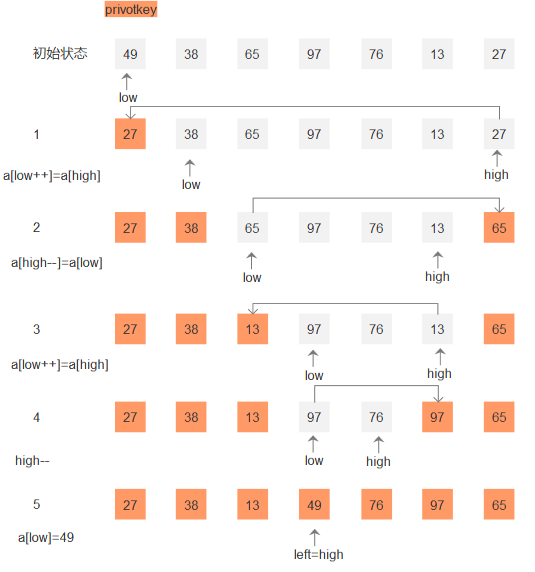
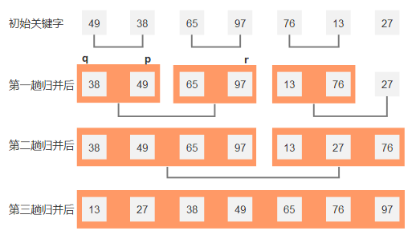
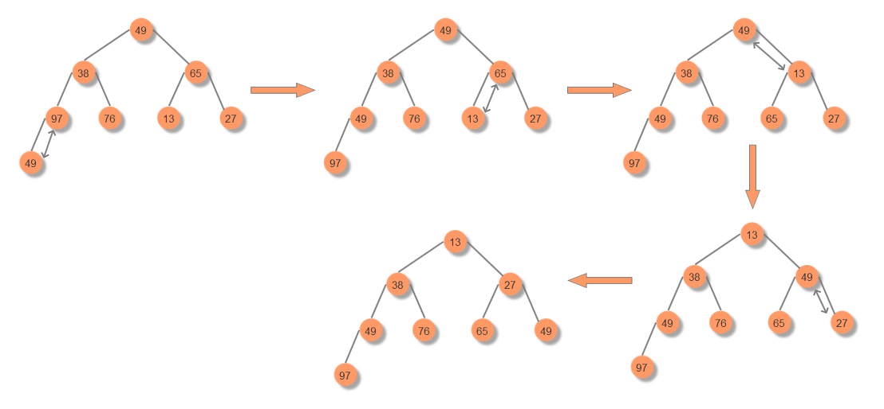
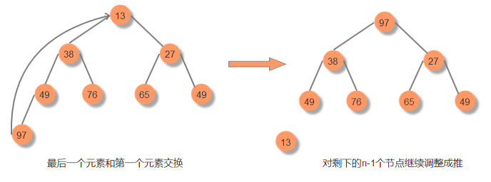

### 快速排序
一趟排序过程：  
  
对于给定记录通过一趟排序后，将记录分成两部分，其中前一部分的所有数据都小于后一部分，递归该过程直到序列中所有的记录均为有序序列为止.具体做法是设两个下标low和high,设枢轴为low下标的值pivotkey，然后从high所在的元素开始搜索，查找到第一个小于pivotkey然后互换位置，然后从low向后搜索找到第一个大于pivotkey的值和high交换位置，直到low=high时第一趟排序结束，依次再对pivotket左右两个序列进行递归排序。  
```java
public void quickSort(int[] a){
  quickSelect(a,0,a.length-1);
}

public void quickSelect(int[] a,int low,int high){
    if(low<high){
	   int p = partition(a,low,high);
		 quickSelect(a,low,p-1);//递归左边
		 quickSelect(a,p+1,high)//递归右边
	  }
}

public int partition(int[] a,int low,int high){
   int tmp = a[low];//枢轴
   while(low < high){
      while(low<high&&a[high]>=tmp) high--;//从右边开始搜索找到小于枢轴的下标
	  if(low<high) a[low++]=a[high];
	  while(low<high&&a[low]<=tmp) low++;//从左边开始搜索找到大于枢轴的下标
	  if(low<high) a[high--]=a[low];
  }
  a[low]=tmp;//最终当low=high时的位置为枢轴的位置
}
```
### 归并排序
 
对于给定记录，首先将相邻的长度为1子序列进行归并，得到n/2个长度为2或1的有序子序列，接着相邻的子序列在进行归并以此重复执行，当记录只有一个子序列时排序结束。  
```java
void stackSort(int[] a){
   Msort(a,0,a.length-1);
}
void Msort(int[] a,int low,int high){
   if(low < high){
     int p = (high-low)/2;
     Msort(a,low,p);
     Msort(a,p+1,high);
     merge(a,low,p,high);
   }
}
void merge(int[] a,int q,int p,int r){
   //归并数组a的两个有序子序列
   int n = p-q+1;//左边序列的长度
   int m = r-p;//右边序列的长度
   int[] L = new int[n];
   int[] R = new int[m];
   
   int i,j,k;
   //向左右子序列赋值
   for(i=q,k=0;i<=r;i++){
       if(i<=p){
	     L[k++]=a[i];
		 if(i==p) k=0;
	   }else{
	     R[k++]=a[i];
	   }
   }
   //合并两个有序子序列
   i=j=k=0;
   while(i<n&&j<m){
     if(L[i]<R[j]){
	   a[k++]=L[i++];
	 }else{
	   a[k++]=R[j++];
	 }
   }//当i==n或j==m时退出
   
   while(i<n){
     a[k++]=a[i++];
   }
   while(j<m){
     a[k++]=a[j++];
   } 
}
```
### 堆排序
堆是一种数型结构，当r(i)>=r(2i)且r(i)>=r(2i+1)，而且它的子节点也满足相同的条件，那么此树为大顶堆，此时根节点最大。反之称之为小顶堆，此时根节点最小。  
下面是小顶堆得构造过程(降序)，如果需要升序的话需要构造大顶堆  
实现堆排序需两个步骤：  
1）把一个无序列构建成一个堆  
  
2）最后一个元素和堆顶元素交换位置后调整成一个新的堆

