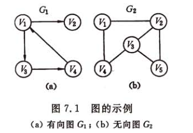
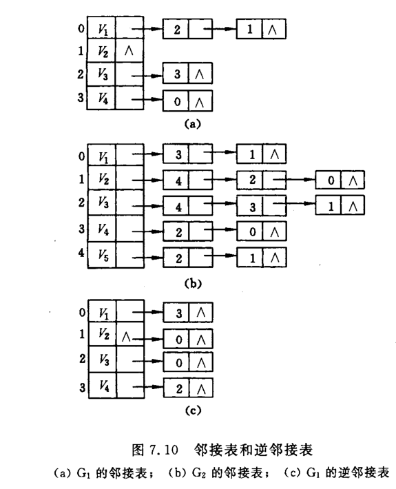
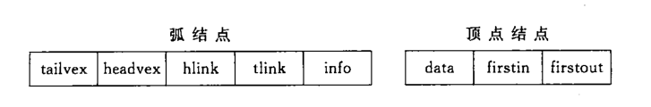
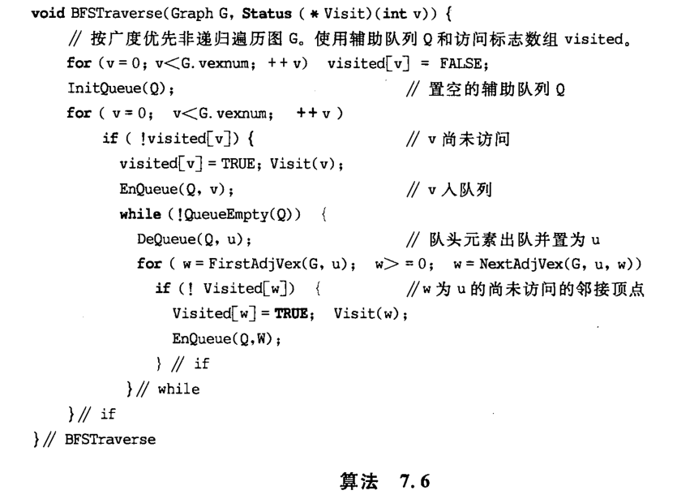
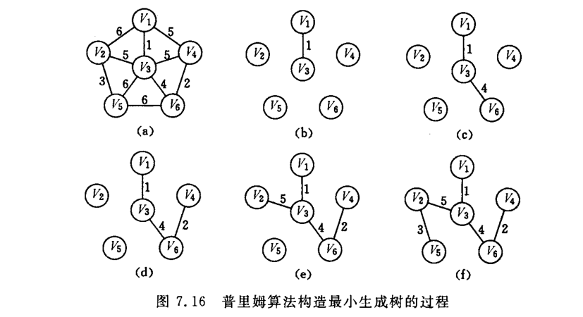
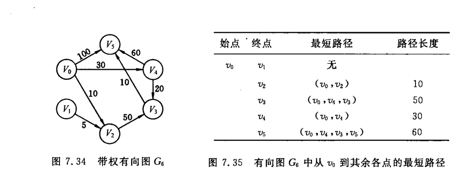
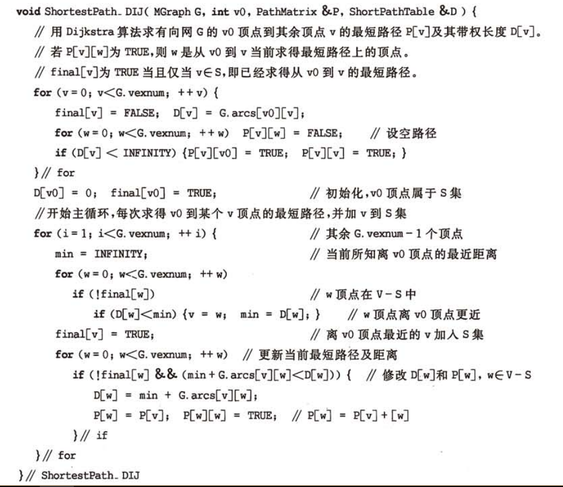
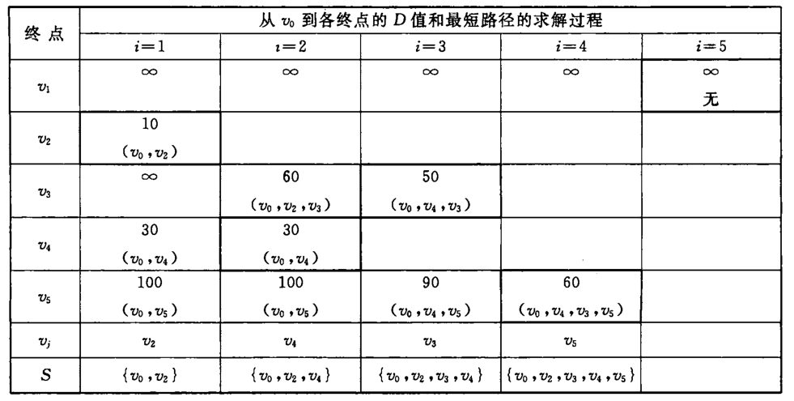

## 图



图分为有向图和无向图，若<v,w>表示从v到w的一条弧，且称v为弧尾或初始点，w为弧头或终端点。若为无向图，<v,w>称为边。
n个结点的图如果是无向图最多有n(n-1)/2,对于有向图而言具有n(n-1)个结点
顶点v是和v相关联的边的数目。对于有向图以v为尾的弧的数目称为v的出度，以v为头的弧的数目称为入度。如果图中任意两个节点都是连通的，则称为连通图。连通分量是指无向图中极大的连通子图。如果为有向图，则对应称为强连通图和强连通分量。


一个连通图的生成树是一个极小连通子图，它包含图中所有顶点但只有n-1条边


### 图的存储结构
#### 邻接表  
在邻接表中为每一个顶点建立一个单链表，第i个单链表表示依赖于顶点vi的边。每个结点由三个域组成，adjvex表示与顶点vi邻接的点在图中的位置，nextarc表示下一条边或弧的加点，数据域表示存储和边相关的信息。每个


```java
#define MAX_VERTEX_NUM 20

typedef struct ArcNode{
  int adjvex;
  struct ArcNode *nextarc;
  Infotype *info;
}ArcNode;//弧结点

typedef struct VNode{
  Vertextype data;//顶点信息
  ArcNode *firstarc;//指向第一个顶点
}VNode,AdjList[MAX_VERTEX_NUM];

typedef struct{
  AdjList vertices;
  int verxnum,arcnum;
  int kind;
}ALGraph;//图
```

在无向图邻接表中，顶点vi的度恰为第i个链表中的结点树；而在有向图中第i个链表中的节点数只是vi结点的出度，为求入度必须便利整个邻接表。有时为了便于确定顶点的入度，对每个vi顶点建立一个连接以vi为头的弧的表，称之为逆邻接点。

### 十字链表


弧结点有5个域，其中尾域和头域分别指向弧尾和弧头的顶点在图中的位置，hlink指向弧头相同的下一条弧，tlink指向弧尾相同的下一条弧。头结点由3个域组成，其中data域存储节点信息，firstin和firstout为两个链域分别指向以该顶点为弧头或弧尾的第一个弧结点。


```java
#define MAX_VERTEX_NUM 20

typedef struct ArcBox{
  int tailvex,headvex;
  struct ArcBox *hlnk,*tlink;
  Infotype *info;
}ArcBox;

typedef struct VexNode{
  VertexType data;
  ArcBox *firstin,*firstout;
}VexNode;

typedef struct {
  VexMpde xlist[MAX_VERTEX_NUM];//表头向量
  int vexnum,arcnum;//顶点树和弧树
}OLGraph;
```
十字链表构造图


### 深度优先搜索
类似于树的先根遍历，是一个递归过程。


### 广度优先搜索
类似于树的层次遍历，需要用到队列。



### 最小生成树
一个结点树为n的连通图其生成树有n-1个结点，如果图的边有权值，那么在众多生成树里面权值最小的生成树即为最小生成树。构造生成树的算法通常都是利用其MST性质：若<u,v>是一条具有最小权值的边，其中u属于U,v属于V-U，则比存在一颗包含边(u,v)的最小生成树。代表算法有普里姆(Prim)算法和克鲁斯卡尔(Kruskal)算法。  
普里姆算法：



普里姆算法：


### 最短路径
顶点A到顶点B边数最少只需要做广度优先搜索，遇到顶点B结束，则从根结点A到B节点的边数及为最少的边数。如果边是有权值的，那么就要考虑最短路径问题。  



迪杰斯特拉算法： 
 




```java
package test;

import java.util.*;

public class Graph<T> {
    private int kind;//图的种类
    private List<T> vertices;
    private int arcnum;
    private int vexnum;

    public Graph() {
        vertices = new ArrayList<>();
    }

    public static void main(String[] args) {
        Graph<TNode> graph = Graph.initGraph();
        //BFSTraverse(graph);
        DIJ(graph, 0);
    }

    public static Graph<TNode> initGraph() {
        Graph<TNode> graph = new Graph<>();
        Scanner scanner = new Scanner(System.in);
        System.out.println("Input graph arcNum:");
        graph.arcnum = scanner.nextInt();
        System.out.println("Input graph vexNum");
        graph.vexnum = scanner.nextInt();
        for (int i = 0; i < graph.vexnum; i++) {
            TNode tNode = new TNode();
            tNode.index = i;
            tNode.data = i;
            tNode.firstIn = null;
            tNode.firstOut = null;
            graph.vertices.add(tNode);
        }
        for (int k = 0; k < graph.arcnum; k++) {
            System.out.println("Input arc v1:");
            int v1 = scanner.nextInt();
            System.out.println("Input arc v2:");
            int v2 = scanner.nextInt();
            TArcNode p = new TArcNode();
            p.tailVex = v1;
            p.headVex = v2;
            System.out.println("Input arc data:");
            p.data = scanner.nextInt();
            if (graph.vertices.get(v1).firstOut == null) {
                graph.vertices.get(v1).firstOut = p;
            } else {
                TArcNode t = graph.vertices.get(v1).firstOut;
                while (t.tailNode != null) {
                    t = t.tailNode;
                }
                t.tailNode = p;
            }
            if (graph.vertices.get(v2).firstIn == null) {
                graph.vertices.get(v2).firstIn = p;
            } else {
                TArcNode t = graph.vertices.get(v2).firstIn;
                while (t.headNode != null) {
                    t = t.headNode;
                }
                t.headNode = p;
            }
        }
        return graph;
    }

    //深度遍历
    public static void DFSTraverse(Graph<TNode> graph) {
        Boolean[] visit = new Boolean[graph.vexnum];
        for (int i = 0; i < graph.vexnum; i++) {
            visit[i] = false;
        }
        for (int i = 0; i < graph.vexnum; i++) {
            if (!visit[i]) DFS(graph, i, visit);
        }
    }

    private static void DFS(Graph<TNode> graph, int i, Boolean[] visit) {
        visit[i] = true;
        System.out.println(graph.vertices.get(i).data);
        TArcNode w = graph.vertices.get(i).firstOut;
        while (w != null) {
            if (!visit[w.headVex]) {
                DFS(graph, w.headVex, visit);
            }
            w = w.tailNode;
        }
    }

    //广度遍历
    public static void BFSTraverse(Graph<TNode> graph) {
        Boolean[] visit = new Boolean[graph.vexnum];
        Queue<TNode> queue = new LinkedList<>();
        for (int i = 0; i < graph.vexnum; i++) {
            visit[i] = false;
        }
        for (int i = 0; i < graph.vexnum; i++) {
            if (!visit[i]) {
                visit[i] = true;
                System.out.println(graph.vertices.get(i).data);
                queue.add(graph.vertices.get(i));
                while (!queue.isEmpty()) {
                    TNode u = queue.poll();
                    TArcNode w = u.firstOut;
                    while (w != null) {
                        if (!visit[w.headVex]) {
                            visit[w.headVex] = true;
                            System.out.println(graph.vertices.get(w.headVex).data);
                            queue.add(graph.vertices.get(w.headVex));
                        }
                        w = w.tailNode;
                    }
                }
            }
        }
    }

    //最小生成树
    public void MiniSprnTree(Graph<TNode> graph, int k) {
        List<CloseEdge> closeEdges = new ArrayList<>();
        for (int i = 0; i < graph.vexnum; i++) {
            CloseEdge closeEdge = new CloseEdge();
            closeEdge.index = k;
            if (k == i) {
                closeEdge.lowCost = 0;
            } else {
                closeEdge.lowCost = -1;//-1表示无穷
            }
            closeEdges.add(closeEdge);
        }
        TArcNode t = graph.vertices.get(k).firstOut;
        while (t != null) {
            closeEdges.get(t.headVex).lowCost = t.data;
            t = t.tailNode;
        }
        for (int i = 1; i < graph.vexnum; i++) {
            //获取closeEdges[i].lowCost的最小值,0表示以加入集合，-1表示无穷大
            int miniKey = 0;
            int minCost;
            while (closeEdges.get(miniKey).lowCost <= 0) miniKey++;//找到第一个lowCost大于等于0的位置;
            minCost = closeEdges.get(miniKey).lowCost;
            for (int j = 1 + miniKey; j < closeEdges.size(); j++) {
                if (closeEdges.get(j).lowCost == 0) {//已加入集合，无需在比较
                    continue;
                }
                if (closeEdges.get(j).lowCost < minCost && closeEdges.get(j).lowCost != -1) {
                    minCost = closeEdges.get(j).lowCost;
                    miniKey = j;
                }
            }
            System.out.println("最小生成树节点：" + miniKey);
            closeEdges.get(miniKey).lowCost = 0;
            //更新最短距离，只需和敢加入集合的结点进行比较即可
            TArcNode m = graph.vertices.get(miniKey).firstOut;
            while (m != null) {
                int index = m.headVex;
                if (m.data < closeEdges.get(index).lowCost) {//miniKey-i < closeEdges[i]
                    closeEdges.get(index).lowCost = m.data;
                    closeEdges.get(index).index = miniKey;
                }
                m = m.tailNode;
            }
        }
    }

    public class CloseEdge {
        int index;//最短距离的顶点
        int lowCost;//最短距离
    }

    //迪杰斯特拉算法
    public static void DIJ(Graph<TNode> graph, int v) {
        Boolean[] S = new Boolean[graph.vexnum];//表示S集合
        int[] D = new int[graph.vexnum];//v到各顶点的最短距离
        Map<Integer, List<Integer>> P = new LinkedHashMap<>();//v到各顶点最短距离经过的顶点集合
        for (int i = 0; i < graph.vexnum; i++) {
            S[i] = false;
            D[i] = Integer.MAX_VALUE;//表示无穷
            for (int j = 0; j < graph.vexnum; j++) {
                P.put(i, new LinkedList<>());//设置空路径
            }
        }
        TArcNode t = graph.vertices.get(v).firstOut;
        while (t != null) {
            D[t.headVex] = t.data;//和v有边的顶点距离更新
            List<Integer> list = P.get(t.headVex);
            list.add(v);
            list.add(t.headVex);
            P.put(t.headVex, list);
            t = t.tailNode;
        }
        D[v] = 0;
        S[v] = true;//初始化v顶点在S集合
        //开始循环，每次找到v到某个顶点m的最短路径，并加m到S集合
        for (int i = 1; i < graph.vexnum; i++) {
            int min = Integer.MAX_VALUE;
            int k = 0;
            for (int j = 0; j < graph.vexnum; j++) {
                if (!S[j]) {
                    if (D[j] < min) {
                        k = j;
                        min = D[j];
                    }
                }
            }
            S[k] = true;//找到最短路径顶点，加入集合
            for (int w = 0; w < graph.vexnum; w++) {
                int kw = Integer.MAX_VALUE;//找到k到w的距离
                TArcNode p = graph.vertices.get(k).firstOut;
                while (p != null) {
                    if (w == p.headVex) {//找到k和w的边
                        kw = p.data;
                        break;
                    }
                    p = p.tailNode;
                }
                if (kw == Integer.MAX_VALUE) {//kw无边，无需再比较
                    continue;
                }
                if (!S[w] && (min + kw) < D[w]) {
                    D[w] = min + kw;
                    List<Integer> list = new LinkedList<>(P.get(k));
                    list.add(w);
                    P.put(w, list);
                }
            }
        }
        for (Map.Entry<Integer, List<Integer>> entry : P.entrySet()) {
            if (entry.getKey() != v) {
                System.out.println("起点：" + v + " 终点：" + entry.getKey() + " 最短路径：" + entry.getValue().toString());
            }
        }
    }
}

//邻接表
class ArcNode {
    int adjvex;
    ArcNode nextarc;
    int data;//边长
}

class VNode {
    int index;//顶点信息
    ArcNode firstArc;//指向的第一条边
}

//十字链表法
class TArcNode {
    int tailVex;//尾结点
    int headVex;//头结点
    TArcNode tailNode;
    TArcNode headNode;
    int data;
}

class TNode {
    int index;
    int data;
    TArcNode firstIn;
    TArcNode firstOut;
}

```
