## 栈
栈是一种特殊的线性表，遵循后进先出(last in first out)LIFO原理，如图

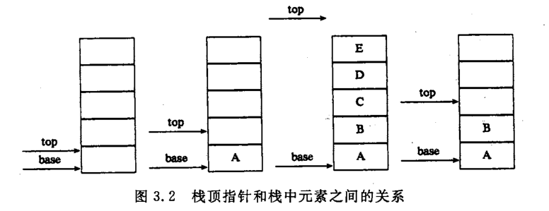

栈的数据结构需要三个元素，栈顶、栈底和总长度

### 栈的应用举例
数制转换  
例如(1348)<sub>10</sub>=(2504)<sub>8</sub>
```c
void conversion(){
  InitStack(S);//初始化栈
  sacnf("%d",N);
  while(N){
    Push(S,N%8);
    N = N / 8;
  }
  while(!StackEmpty(S)){
    POP(S,e);
    printf("%d",e);
  }
}
```
括号匹配的检验  

行编辑器  

迷宫求解  

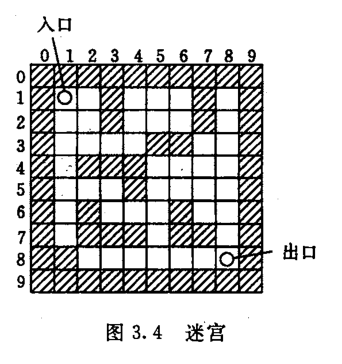

迷宫入口到出口的算法可以简单描述  
```java
do{
  若当前位置可通，
  则{
       将当前位置插入栈顶
       若该位置是出口，则结束
       否则切换当前位置的东邻方块为新的当前位置；
  }
  否则{
       若栈不空且占地位置尚有其他方向未经探索，
         则设定新的当前位置为沿顺时针方向旋转找到栈顶位置的下一个邻块；
       若栈不空但栈顶位置的四周均不可同，
         则{
            删去栈顶位置；
            若栈不空，则重新测试新的栈顶位置，
              直至找到一个可通的相邻块或出栈至栈空；
         }
     }
}while(栈不空);
```
在此说明的是所谓当前位置可通，指的是未曾走到过的通道快，即要求该方块的位置不仅是通道块，而且既不在当前路径上（否则不是简单路径，也不是曾纳入过路径的通道块（进入死合同）。

表达式求值  

例如要求算术表达式
4+2*3-10/5
首先了解算术运算规则  
* 先乘除后加减
- 从左往右
+ 先括号内后括号外  

下标定义了运算符之间的优先关系

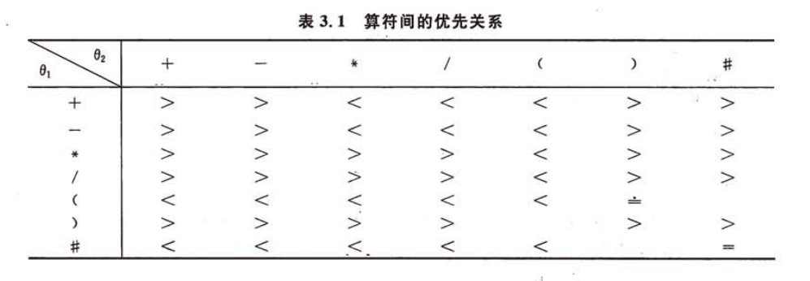

当出现"("=")"时表示括号内的运算已完成，但"#"="#"表示整个表达式运算完毕。  
实现该算法需要用到两个栈。一个栈称作OPTR用以寄存运算符，另一个为OPND用以寄存操作数和运算结果。算法基本思想：  
(1) OPND初始化为空栈，ONTR初始化后添加第一个元素"#"表示运算开始  
(2) 一次读入表达式的每个字符，若是操作数进OPND栈，若是运算符则需和OPTR栈顶元素比较优先级后作相应的操作，直到当前读入的字符和OPTR栈顶字符都为"#"表示运算结束，此时OPND栈顶的元素即为运算结果  

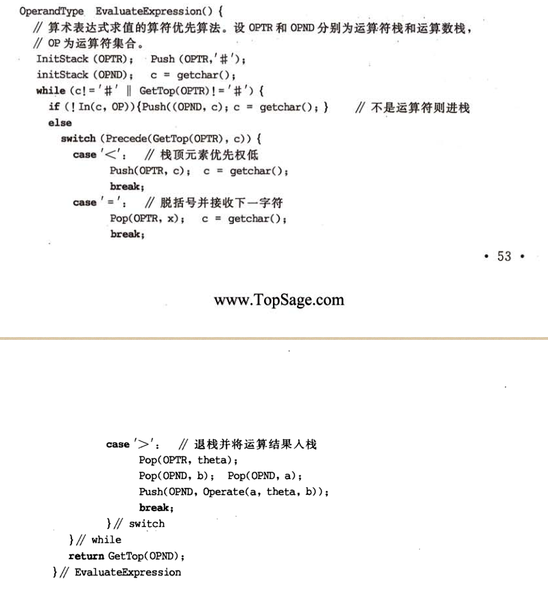

### 栈与递归
递归在数学中比较常见的运用例如计算阶乘  

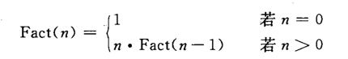

汉诺塔：

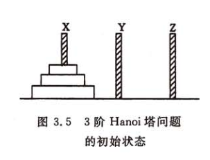

移动规则：
* 每次只能移动一个圆盘
* 圆盘可以插在X,Y和Z中的任一塔座上
* 任何时刻都不能把大的圆盘压在较小的圆盘之上

```java
void hanoi(int n,char x,char y,char z)
{
  if(n==1)
    move(x,1,z);//将编号为1的圆盘从x移动到z
  else{
    hanoi(n-1,x,z,y);//将x上的编号为1至(n-1)的圆盘移动到y,z作辅助塔
    move(x,n,z);//将编号为n的圆盘从x移动到z
    hanoi(n-1,y,x,z);//将y上编号为1至n-1的圆盘移动到z,x作辅助塔
  }
}
```
## 队列
队列是一种先进先出的线性表

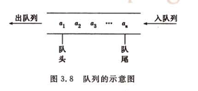

链队列
下图是有头指针的链表来表示队列，头指针的next元素才是队头

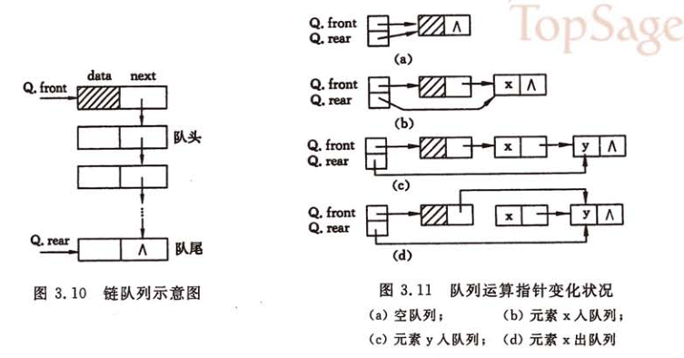

在上述模块需要注意的是出队时的特殊情况，当队列中的最后一个元素出队时，队尾指向空指针，此时需要重新赋值让其指向头结点

顺序队列
在连续的存储空间来表示队列时，通常约定当front=rear=0表示队列为空，后每插入一个元素rear加1，每当出队时front减一

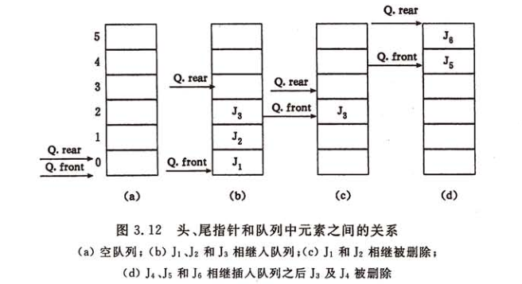

循环队列

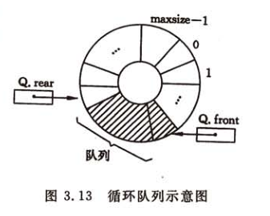

循环队列中当from=rear是无法判断该队列是空还是满，如下图所示。可有两种方法处理：
* 另设一个标志位区别是空还是满
* 少用一个空间元素，约定队尾指针的下一个位置为队头时表示队满

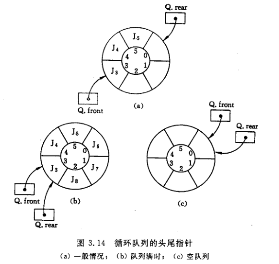

```java
class Queue{
  static int maxSize = 100;
  int base[];
  int front;
  int rear;
}
void initQueue(Queue q){
  q.base = new int[Queue.maxSize];\
  q.front = q.rear = 0;
}
int queueLength(Queue q){
  return (q.rear-q.front + Queue.maxSize) % Queue.maxSize
}
void enQueue(Queue a,int e){
  if((q.rear + 1)% Queue.maxSize == q.front){
    throw new Exception();//队满
  }
  q.base(q.rear) = e;
  q.rear = (q.rear + 1) % Queue.maxSize;
}
void deQueue(Queue q,int e){
  if(q.front = q.rear) throw new Exception();
  e = q.base[q.front];
  q.front = (q.front + 1) % Queue.maxSize;
}
```
