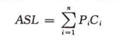
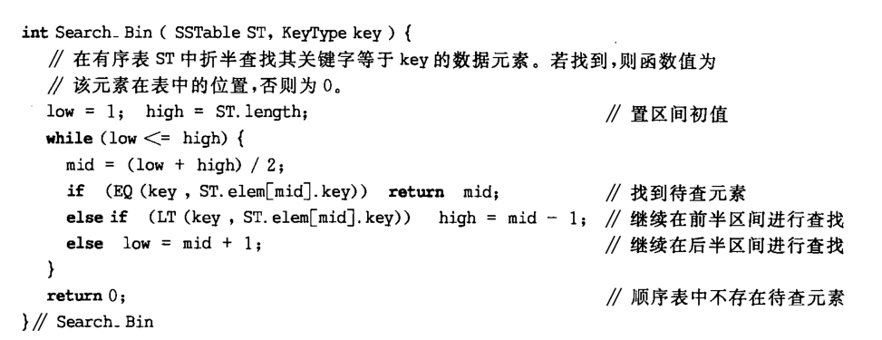
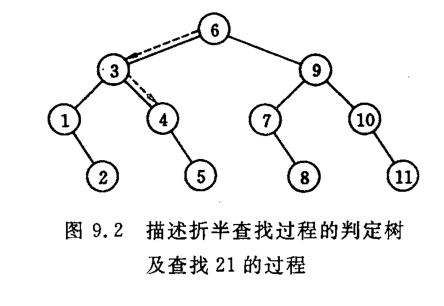
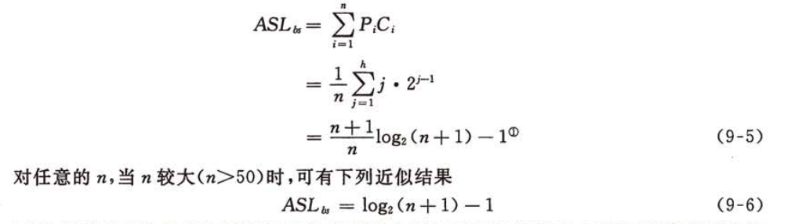
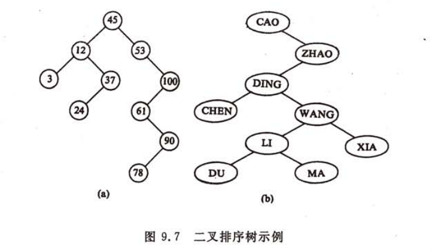
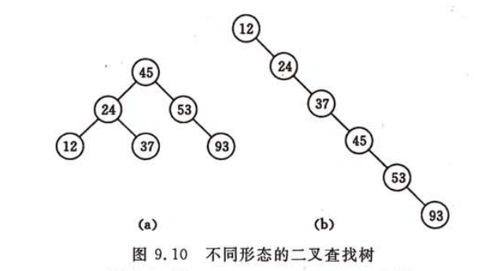

## 静态查找
平均查找长度  


Pi为查找第i个记录的概率，Ci为找到第i个记录比较的次数
### 有序表查找
折半查找



折半性能分析  



查找的次数为从更结点到结点的路径层数，而具有n个结点的判定树深度为[log<sub>2</sub>n]+1,故折半查找最多的次数不超过[log<sub>2</sub>n]。  
折半查找平均长度：  



## 动态查找
### 二叉排序树
二叉排序树具有下列的性质：它的左子树的结点均小于根节点，右子树的结点值均大于根节点，同样他的左，右子树叶满足同样的性质。  



```java
package test;

public class SortSearchTree {
    private SortTreeNode T;//根节点
    private volatile SortTreeNode p;//查找成功指向该结点，不成功指向最后一个结点
    private volatile SortTreeNode f;//保存查找过程中当前结点的父结点

    public static void main(String[] args) {
        SortSearchTree tree = new SortSearchTree();
        InsertNode(tree, 45);
        InsertNode(tree, 53);
        InsertNode(tree, 12);
        InsertNode(tree, 3);
        InsertNode(tree, 37);
        InsertNode(tree, 20);

        DeleteNode(tree, 20);
        inOrder(tree.T);
    }

    private static Boolean SearchBST(SortTreeNode T, int key, SortTreeNode f, SortSearchTree tree) {
        if (T == null) {
            tree.p = f;
            return false;
        } else if (T.data == key) {
            tree.p = T;
            tree.f = f;
            return true;
        } else if (key < T.data) {
            return SearchBST(T.left, key, T, tree);
        } else return SearchBST(T.right, key, T, tree);
    }

    private static Boolean InsertNode(SortSearchTree Tree, int key) {
        if (!SearchBST(Tree.T, key, null, Tree)) {//未查找到
            SortTreeNode s = new SortTreeNode();
            s.data = key;
            if (Tree.p == null) {//树为空时
                Tree.T = s;
            } else if (key < Tree.p.data) Tree.p.left = s;
            else Tree.p.right = s;
            System.out.println("插入成功：" + key);
            return true;//插入成功
        }
        System.out.println("已存在key=" + key + "插入失败");
        return false;//已经存在key,插入失败
    }

    private static Boolean DeleteNode(SortSearchTree tree, int key) {
        if (SearchBST(tree.T, key, null, tree)) {//查找成功，tree.p指向删除结点
            if (tree.p.right == null) {//右子树为空
                if (tree.f == null) {//要删除的结点为根结点
                    tree.T = tree.p.left;
                } else {
                    if (tree.f.left!=null && tree.f.left == tree.p) {//当前结点为父结点的左子树
                        tree.f.left = tree.p.left;
                    } else {
                        tree.f.right = tree.p.left;
                    }
                }
            } else if (tree.p.left == null) {//左子树为空
                if (tree.f == null) {//要删除的结点为根结点
                    tree.T = tree.p.right;
                } else {
                    if (tree.f.left!=null && tree.f.left == tree.p) {//当前结点为父结点的左子树
                        tree.f.left = tree.p.right;
                    } else {
                        tree.f.right = tree.p.right;
                    }
                }
            } else {//左右子树不为空,找到该结点的前驱,即它的左子树最右边的结点
                SortTreeNode s = tree.p.left;
                SortTreeNode q = tree.p;//q来保存s的父结点
                while (s.right != null) {
                    q = s;
                    s = s.right;
                }
                tree.p.data = s.data;
                if (q != tree.p) {//前驱不是它左子树根结点
                    q.right = s.left;
                } else {//前驱是它左子树根结点
                    q.left = s.left;
                }
            }
            System.out.println("删除成功：" + key);
            return true;
        }
        return false;
    }

    public static void inOrder(SortTreeNode head) {
        if (head != null) {
            inOrder(head.left);
            System.out.println(head.data);
            inOrder(head.right);
        }
    }
}

class SortTreeNode {
    public int data;
    public SortTreeNode left;
    public SortTreeNode right;
}
```

### 二叉平衡树（AVL树）
平衡因子为只能为-1，0，1的二叉树为二叉平衡树。


