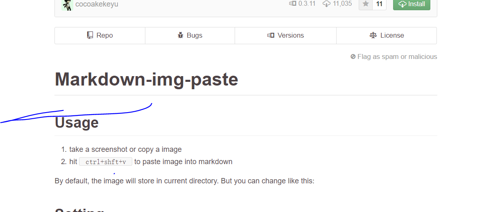

# 一级标题
a

段落的前后要有空行，所谓的空行是指没有文字内容。若想在段内强
制换行的方式是使用两个以上空格加上回车（引用中换行省略回车）


c

a
~~这是加删除线的文字~~
```java
class test {
  public void public static void main(String[] args) {
    System.out.System.out.println("");
  }
}
```
b
```java
class test1 {
 public static void public static void main(String[] args) {

 }
}
```
![kk] (kk.jpg)

+ 列表内容
+ 列表内容
+ 列表内容
1. Red
2. Green
3. Blue


[GitHub](http://github.com)

| 一个普通标题 | 一个普通标题 |
| ------ | ------ |
| 短文本 | 中等文本 |
| 稍微长一点的文本 |

| name | age |
| ------ | ------ |
| ffff | ff  |
| ff   | ff  |


*斜体* ，_斜体_
**加粗**，__粗体__
4<sup>x</sup>


