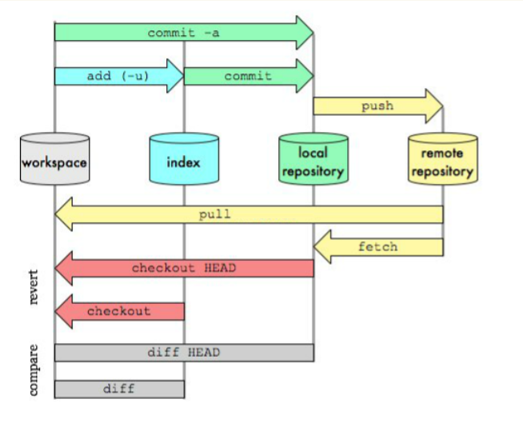
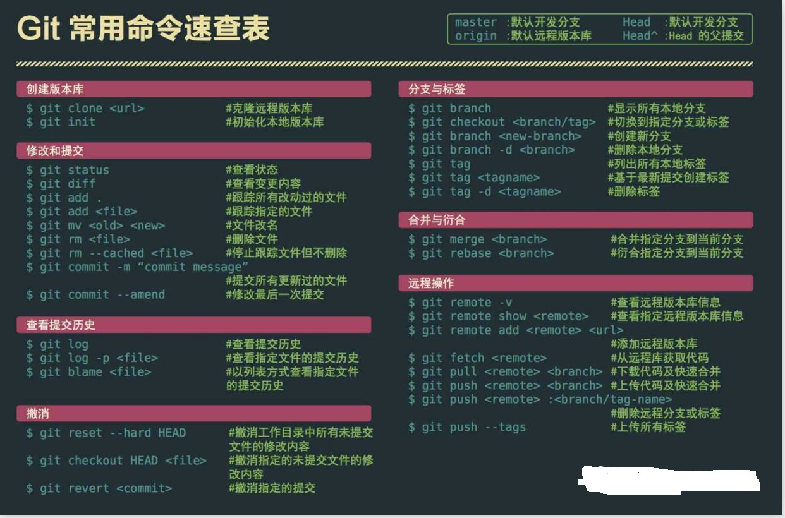
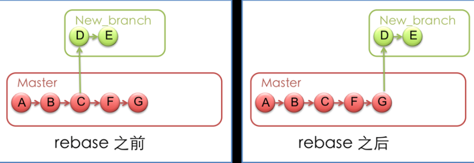

## git常用命令
* 工作区：就是你在电脑里能看到的目录
* 暂存区：英文叫stage, 或index。一般存放在 ".git目录下" 下的index文件（.git/index）中，所以我们把暂存区有时也叫作索引（index）
* Repository：仓库区（或本地仓库）
* Remote

#### git diff  
git diff 显示暂存区和工作区的差异  
git diff --cached 暂存区和上次commit的差异  
git diff HEAD  显示工作区与当前分支最新commit之间的差异  
#### git commit 
git commit -m 'message' 提交到本地仓库  
git commit --amend 
#### git reset
git reset HEAD  add进去但未commit的内容撤销，工作区不影响  
git reset --hard HEAD 暂存区和工作区改动都会消失  
git reset --hard commit_id 回到某个commit
#### git revert
git revert HEAD: 撤销最近的一个提交
#### git rm
git rm --cached file 直接从暂存区删除文件，工作区则不做出改变  
git rm file  删除文件 
#### git clean 
git clean是从工作目录中移除没有track的文件
#### git checkout
git checkout -b 新建分支并切换  
git checkout -- filename 清除工作区中未添加到暂存区的改动   
git checkout test 切换到test分支  
git checkout -b dev --track origin/dev 
#### git branch
git branch -d 删除分支  
git branch xxx 新建分支  
git branch -a 列出所有分支 
#### git remote  
git remote: 列出remote name  
git remote add [name] [url]: 添加一个新的remote repo  
git remote rm [name]: 删除一个存在的remote alias  
git remote set-url [name] [url]:更新url  
git remote rename [old-name] [new-name]: 重命名  
#### git rebase
<<<<<<< HEAD
rebase命令执行后，实际上是将分支点从C移到了G，这样分支也就具有了从C到G的功能  
https://git-scm.com/book/zh/v2/Git-%E5%88%86%E6%94%AF-%E5%8F%98%E5%9F%BA
=======
rebase命令执行后，实际上是将分支点从C移到了G，这样分支也就具有了从C到G的功能
>>>>>>> 02aba6c2bfd3f2efba886564155b554b53e6a722

#### git stash
git stash 把当前的工作隐藏起来 等以后恢复现场后继续工作  
git stash list 查看所有被隐藏的文件列表  
git stash apply 恢复被隐藏的文件，但是内容不删除  
git stash drop 删除文件  
git stash pop 恢复文件的同时 也删除文件
