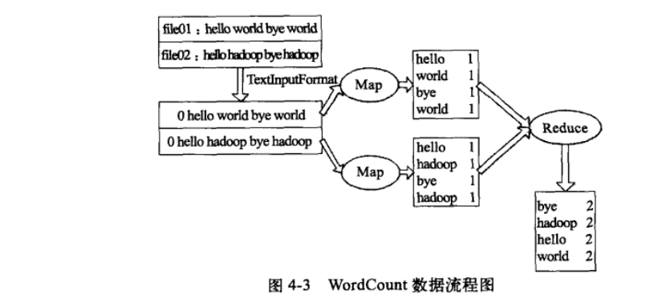

### hadoop安装
1.1 配置SSH免密码登录  
ssh-keygen -t dsa -P '' -f ~/.ssh/id_dsa  
该命令会在.ssh文件夹创建id_dsa及id_dsa.pub两个文件，这是ssh的一对公钥私钥  
cat ~/.ssh/id_dsa.pub >> ~/.ssh/authorized_keys  

1.2伪分布式安装  
指定JDK安装位置  
vi {hadoop_home}/conf/Hadoop-env.sh  
export JAVA_HOME=/usr/lib/jdk-1.8  
conf/core-site.xml  
配置hdfs的地址及端口  
\<configuration\>  
&ensp;&ensp;\<property\>
```
<configuration>  
  <property>  
    <nam>fs.default.name</name>  
    <value>hdfs://localhost:9000</value>  
  </property>  
</configuration>
```
配置副本
conf/hdfs-site.xml
```
<configuration>  
  <property>  
    <nam>dfs.replicaton</name>  
    <value>1</value>  
  </property>  
</configuration>  
```  
配置mapreduce ,配置jobtracker地址和端口     
conf/mapred-site.xml  
```<configuration>  
  <property>  
    <nam>mapred.job.tracker</name>  
    <value>locahost:9001</value>  
  </property>  
</configuration>  
```
bin/hadoop namenode -format  
bin/start-all.sh  
http://localhost:50030 mapreduce页面  
http://localhost:50070 hdfs页面  

### 运行mapreduce
编译java  
javac -classpath  hadoop-core-1.0.1.jar:lib/commons-cli-1.2.jar -d firstJar src/examples/org/apache/hadoop/examples/WordCount.java  
把生成的.class文件打包  
jar -cvf wordcount.jar -F firstJar/ .  
在hdfs创建目录，并拷贝输入文件  
bin/hadoop fs -mkdir input  
bin/hadoop fs -put input01 input/input01  
运行程序  
bin/hadoop jar  wordCount.jar org.apache.hadoop.examples.WordCount input output2  


```
package org.apache.hadoop.examples;

import java.io.IOException;
import java.util.StringTokenizer;

import org.apache.hadoop.conf.Configuration;
import org.apache.hadoop.fs.Path;
import org.apache.hadoop.io.IntWritable;
import org.apache.hadoop.io.Text;
import org.apache.hadoop.mapreduce.Job;
import org.apache.hadoop.mapreduce.Mapper;
import org.apache.hadoop.mapreduce.Reducer;
import org.apache.hadoop.mapreduce.lib.input.FileInputFormat;
import org.apache.hadoop.mapreduce.lib.output.FileOutputFormat;
import org.apache.hadoop.util.GenericOptionsParser;

public class WordCount {

  public static class TokenizerMapper 
       extends Mapper<Object, Text, Text, IntWritable>{
    
    private final static IntWritable one = new IntWritable(1);
    private Text word = new Text();
      
    public void map(Object key, Text value, Context context
                    ) throws IOException, InterruptedException {
      StringTokenizer itr = new StringTokenizer(value.toString());
      while (itr.hasMoreTokens()) {
        word.set(itr.nextToken());
        context.write(word, one);
      }
    }
  }
  
  public static class IntSumReducer 
       extends Reducer<Text,IntWritable,Text,IntWritable> {
    private IntWritable result = new IntWritable();

    public void reduce(Text key, Iterable<IntWritable> values, 
                       Context context
                       ) throws IOException, InterruptedException {
      int sum = 0;
      for (IntWritable val : values) {
        sum += val.get();
      }
      result.set(sum);
      context.write(key, result);
    }
  }

  public static void main(String[] args) throws Exception {
    Configuration conf = new Configuration();
    String[] otherArgs = new GenericOptionsParser(conf, args).getRemainingArgs();
    if (otherArgs.length != 2) {
      System.err.println("Usage: wordcount <in> <out>");
      System.exit(2);
    }
    Job job = new Job(conf, "word count");
    job.setJarByClass(WordCount.class);
    job.setMapperClass(TokenizerMapper.class);
    job.setCombinerClass(IntSumReducer.class);
    job.setReducerClass(IntSumReducer.class);
    job.setOutputKeyClass(Text.class);
    job.setOutputValueClass(IntWritable.class);
    FileInputFormat.addInputPath(job, new Path(otherArgs[0]));
    FileOutputFormat.setOutputPath(job, new Path(otherArgs[1]));
    System.exit(job.waitForCompletion(true) ? 0 : 1);
  }
}
```
### hadoop streaming  
hadopop streaming提供一个api,允许任何脚本语言写map函数或reduce函数。任何程序只要可以从标准输入读取数据且可以写入数据到标准输出流就可以使用hadoop streaming.  
bin/hadoop jar contrib/streaming/hadoop-streaming-1.0.1.jar -input input -output output3 -mapper /bin/cat  -reducer /usr/bin/wc  

### hdfs命令
hadoop archive -archivename files.har /usr/input/in /usr/input  
hadoop fs -lsr har:///user/input/files.har  
hadoop distcp hdfs://namenode1/foo hdfs://namenode2/bar  
官方文档命令    
http://hadoop.apache.org/docs/stable/hadoop-project-dist/hadoop-hdfs/HDFSCommands.html


### webHDFS 
采用rest api形式访问hdfs  
hdfs-site.xml配置  
dfs.webhdfs.enabled:true  
文件和路径操作  
创建文件并写入内容  
curl -i -X PUT "http://<HOST>:<PORT>/webhdfs/v1/<PATH>?op=CREATE
                    [&overwrite=<true |false>][&blocksize=<LONG>][&replication=<SHORT>]
                    [&permission=<OCTAL>][&buffersize=<INT>][&noredirect=<true|false>]"  
上述会返回一个location，它包括已创建文件所在地址。
HTTP/1.1 307 TEMPORARY_REDIRECT
Location: http://<DATANODE>:<PORT>/webhdfs/v1/<PATH>?op=CREATE...
Content-Length: 0  
利用location把数据写入该文件  
curl -i -X PUT -T <LOCAL_FILE> "http://<DATANODE>:<PORT>/webhdfs/v1/<PATH>?op=CREATE..."  
文件追加  
curl -i -X POST "http://<HOST>:<PORT>/webhdfs/v1/<PATH>?op=APPEND[&buffersize=<INT>][&noredirect=<true|false>]"  
采用返回的location进行追加操作  
curl -i -X POST -T <LOCAL_FILE> "http://<DATANODE>:<PORT>/webhdfs/v1/<PATH>?op=APPEND..."  
创建文件夹  
curl -i -X PUT "http://<HOST>:<PORT>/webhdfs/v1/<PATH>?op=MKDIRS[&permission=<OCTAL>]"  
删除文件夹  
curl -i -X DELETE "http://<host>:<port>/webhdfs/v1/<path>?op=DELETE[&recursive=<true |false>]"  
查看文件信息  
curl -i  "http://<HOST>:<PORT>/webhdfs/v1/<PATH>?op=GETFILESTATUS"    

hadoop dfsadmin refreshNodes                      
