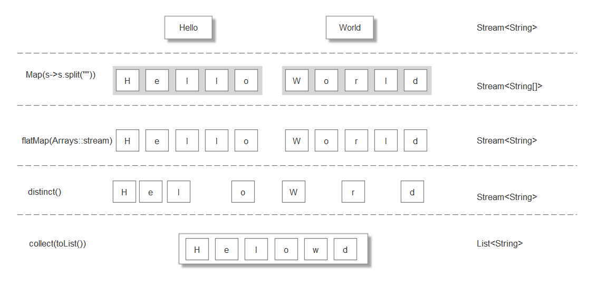
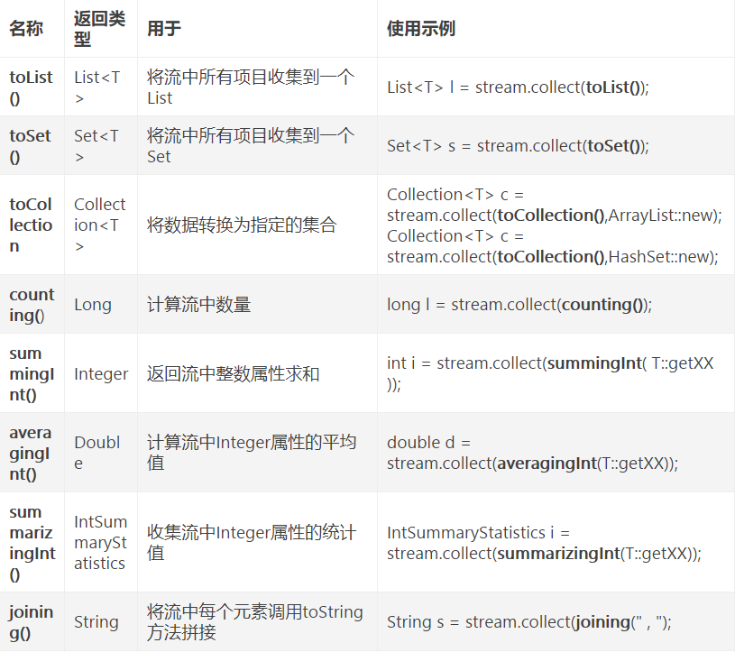
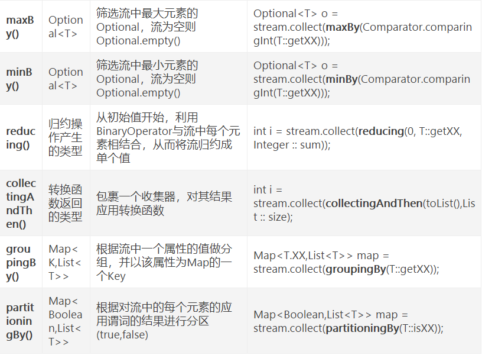

## Lambda
&nbsp;&nbsp;&nbsp;&nbsp;Lambda可以简单理解为简洁的表示可传递的匿名函数的一种方式：它没有名称，但它有参数列表，
函数主体，返回类型，可能还有一个可以抛出的异常列表。  
&nbsp;&nbsp;&nbsp;&nbsp;例如用了Lambda定义一个Comparator对象  
先前：  
```java
Comparator<Apple> byWeight = new Comparator<Apple>(){
  public int compare(Apple a1,Apple a2){
    return a1.getWeight().compareTo(a.getWeight());
  }
}
```
现在：  
```java
Comparator<Apple> byWeight = (Apple a1,Apple a2) -> a1.getWeight().compareTo(a2.getWeight());
```
Lambda语法  
()-> expression; 表达式不加大括号   
()->{ statements; }  return加大括号  

Lambda运用在函数接口上，函数式接口就是指只定义一个抽象方法的接口。常见的jdk自带的函数式接口：  
```java
@FunctionalInterface
public interface Predicate<T>{
  boolean test(T t);
}  

public interface Comsume<T>{
  void accept(T t);
}

public interface Funcation<T,R>{
  R apply(T t);
}

Supplier<T>  ()-> T;  
UnaryOperator T->T;  
BinaryOperator<T> (T,T)->T;  
BiPredicate<L,R> (L,R)->boolean;  
BiConsumer<T,U> (T,U)->void;  
BiFunction<T,U,R> (T,U)->R;  

DoublePredicate  
IntConsumer;
LongBinaryOperator;
IntFunction;
```
常见的jdk自带的函数式接口是不允许抛出异常的，需要用try catch捕捉。  
#### 方法引用
java.util.Comparator.comparing;
（Apple a1,Apple a2）->a1.getWeight().compareTo(a2.getWeight()) = comparing(Apple::getWeight);  
Supplier<Apppe> c1 = Apple::new;  
Aooke a1 = c1.get();  
##### 谓词复合
negate/and/or
Predicate<Apple> notRedApple = redApple.negate();redApple对象的非  
Predicate<Apple> redAndHeavyApple = redApple.and(a->a.getWeight() > 140);  
Predicate<Apple> redApple = redApple.and().or();  
#### 函数复合
Funtion接口有andThen和compose两个默认方法  
Function<Integer,Integer> f = x->x+1;  
Function<Integer,Integer> g = x->x*2;  
Function<Integer,Integer> h = f.andThen(g);//数学上表示g(f(x))  
Function<Integer,Integer> h2 = f.compose(g);//数学上表示f(g(x))
## Stream
```java
Stream()  
        .filter()  
        .distinct()  
        .limit()  
        .skip(n)  
        .map()  
        .flatMap()  
```
使用flat  
String[] words = {"Goodbye","World"};  
words.stream()  
.map(w->w.split(""))  
.flatMap(Arrays::stream)  
.distinct()  
.collect(Collectors.toList());  
输出"GoodbyeWorld"


##### 查找和匹配  
allMatch, anyMatch, noneMatch, findFirst, findAny  
##### 归纳reduce操作  
元素求和  
numbers.stream().reduce(0,(a,b)->a+b);
更为简洁的方式  
numbers.stream().reduce(0,Integer::sum);
最大值和最小值  
numbers.stream().reduce(Integer::max);  
numbers.stream().reduce(Integer::min)；  

练习题：  
```java
//交易员
public class Trader{
  private final String name;
  private final String city;
}

//交易
public class Transaction{
  private final Trader trader;
  private final int year;
  private final int value;
}

Trader raoul = new Trader("Raour","Cambridge");
Trader mario = new Trader("mario","Milan");
Trader alan = new Trader("alan","Cambridge");
Trander brain = new Trander("Brian","Cambridge");

List<Transaction> transactions = Arrays.asList(
new Transaction(brain,2011,300),
new Transaction(raoul,2012,1000),
new Transaction(raoul,2011,400),
new Transaction(mario,2012,710),
new Transaction(mario,2012,700),
new Transaction(alan,2012,950)
);
```
1) 找出2011年发生的所有交易，并按交易顺序排序（从低到高）  
transactions.stream().filter(t->t.getYear()==2012).sorted(comparing(Transaction::getValue)).collect(Collectors.toList());  
2)交易员都在哪些不同的城市工作过  
transactions.stream().map(Transaction::getTrader).map(Trader::getCity).distinct().collect(Collectors.toList());  
3)查找所有来自剑桥的交易员的姓名，并按姓名排序  
transactions.stream().map(Transaction::getTrader).fliter(t-> t.getCity.equal("Cambridge")).sorted(comparing(Trader::getName)).collect(Collectors.toList());  
4)返回所有交易员的姓名字符串，按字母排序
transactions.stream().map(Transaction::getTrader).map(Trader::getName).distinct().sorted(comparing(Trader::getName)).collect(Collectors.toList());  
5)有没有交易员是在米兰工作的   
transactions.stream().map(Transaction::getTrader).anyMatch(t->t.getCity().equal("Milan")).isPresent();   
6)打印生活在剑桥的交易员的所有交易额  
transactions.stream().filter(t->t.getTrader().getCity().equal(Cambridge)).map(Transaction::getValue).reduce(0,Integer::sum).get();
7）所有交易中，最高的交易额是多少  
transactions.stream().map(Transaction::getValue).reduce(Integer::max).get();  
8)所有交易中，最少的交易额是多少  
transactions.stream().map(Transaction::getValue).reduce(Integer::min).get();  

原始类型流特化  
IntStream  
DoubleStream  
LongStream    
把流转成数值流Stream<Integer>->IntStream    
int calories = menu.stream().mapToInt(Dish::getCalories).sum();  
IntStream intStream = menu.stream().MapToInt(Dish::getCalories);  
intStream还支持max,min,average.   
转回对象流IntStream->Stream<Integer>  
Stream<Integer> stream = intStream.boxed();  

// int[] ת Integer[]  
Integer[] integers1 = Arrays.stream(data).boxed().toArray(Integer[]::new);  

// List<Integer> ת Integer[]  
Integer[] integers2 = list1.toArray(new Integer[0]);  

// List<Integer> ת int[]  
int[] arr1 = list1.stream().mapToInt(Integer::valueOf).toArray();  

// Integer[] ת int[]  
int[] arr2 = Arrays.stream(integers1).mapToInt(Integer::valueOf).toArray();  

// Integer[] ת List<Integer>  
List<Integer> list2 = Arrays.asList(integers1);  

生成流  
Stream.iterate(0,n->n+2).limit(10).forEach(System.out::printIn);  
Steam.generate(Math::random).limit(5);  

#### Collectors
汇总  
menu.steam().collect(counting());  
menu.stream().collect(summingInt(Dish::getCalories));  
Collectors.summingDouble  
从所有菜单中找到Calorie最大的对象  
Optional<Dish> fatDish = menu.stream().collec(maxBy(comparing(Dish::getCalories)));  
连接字符串  
joining()在内部使用StringBuilder  
menu.stream().collect(joining());  
逗号分隔  
menu.stream().collect(joining(","));  
汇总  
int totalCalories = menu.stream().collect(reducing(0,Dish::getCalories,(i,j)->i+j));  
分组  
```java
Map<Dish.Type,List<Dish> dishesByType = menu.stream().collect(groupingBy(Dish::getTeype));  
Map<ColoricLevel,List<Dish>> dishesByCaloricLevel = menu.stream().collect(groupingBy(dish->{
  if(dish.getCalories()<=400) return CaloricLevel.DIET;
  else if(dish.getCalories()<=700) return CaloricLevel.NORMAL;
  else return CaloricLevel.FAT;
})); 
Map<Dish.Type,Long> typesCount = menu.stream().collect(groupingBy(Dish::getType,counting()));  
Map<Dish.Type,Optional<Dish>> mostCaloricBytype = menu.strem().collect(groupingBy(Dish::getType,maxBy(comparingInt(Dish::getCalories)))); 
```
分区  
分区是分组的特殊情况，最多有两项一组是true，一组是false。  
Map<Boolean,List<Dish>> partitionedMenu = menu.stream().collect(partitioningBy(Dish::isVegetarian));  
#### Collectors静态方法



#### 重构设计模式
```java
1、策略模式  
定义策略接口  
public interface ValidationStrategy{
  boolean execute(String s);
}

定义策略执行器  
public class Validator{
  private ValidationStrategy validationStrategy;
  public Validator(ValidationStrategy validationStrategy){
    this.validationStrategy = validationStrategy;
  }
  
  public boolean valid(String s){
    return validationStrategy.execute(s);
  }
}

采用Lamdba表达式  
Validator numericValidator = new Validator((String s)->s.matches("[a-z]+"));  
Validator lowerCaseValidatro = new Validator((String s)->s.matches("\\d+")); 

2、模板方法  
定义模板抽象类  
abstract class OnlineBanking{
  public void processCustomer(int id){
    User user = getUserByid(id);
    makeCustomerHappy(user);
  }
   abstract void makeCustomerHappy(User user);//模板方法，让子类实现
} 
使用Lambda表达式  
定义一个模板类  
public class OnlineBankingLambda{
  public void processCustomer(int id,Consumer<user> makeCustomerHappy comsumer){
    User user = getUserByid(id);
    comsumer.apply(user);//具体方法调用processCustomer()时传入
  }
}
new OnlineBankingLambda().processCustomer(1000,(Customer c)-> System.out.printIn(user.getName));

3、观察者模式
定义观察者
public interface Obsever{
  public void notify(String tweet);
}
定义订阅主题
public interface Subject{
  void registerObservers(Obsever s);//注册观察者
  void notifyObservers(String tweet );//通知观察者
}
具体主题实现类
public Feed implements Subject{
  private final List<observer> observers = new ArrayList<>();
  public void registerObservers(Observer s){
    observers.add(s);
  }
  public void notifyObservers(String tweet){
    observers.forEach(o->o.notify(tweet));
  }
}
使用Lambada注册观察者
Feed f = new Feed();
f.registerObservers((String tweet)->System.out.printIn(tweet));
4、责任链模式
public abstract class ProcessingObject<T>{
  protected ProcessingObject<T> successor;
  public T Handle(T input){
    T r = handleWork(input);
    if(successor!=null){
       r = successor.handleWork(r);
  }
  return r;
  }
  public abstract protected T handleWork(T input);
}
5、工厂模式
利用Supplier<T>，Function<T>,TriFunction<T>代替工厂模式
Supplier<Product> loanSupplier = Loan::new;
loanSupplier.get();
```
