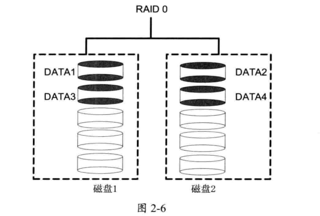
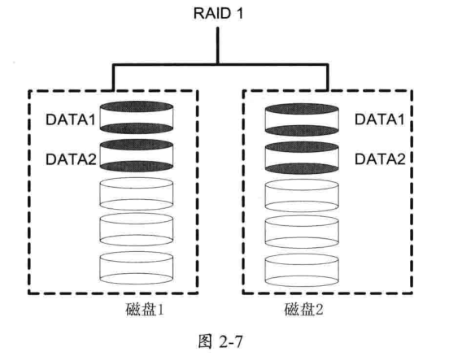
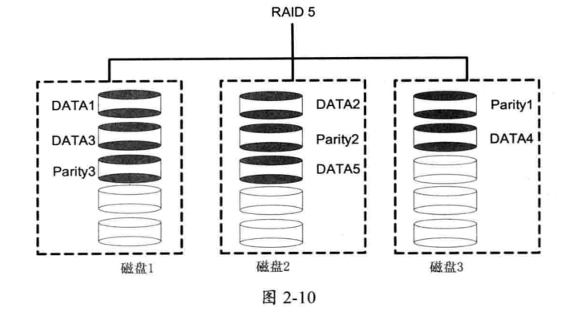
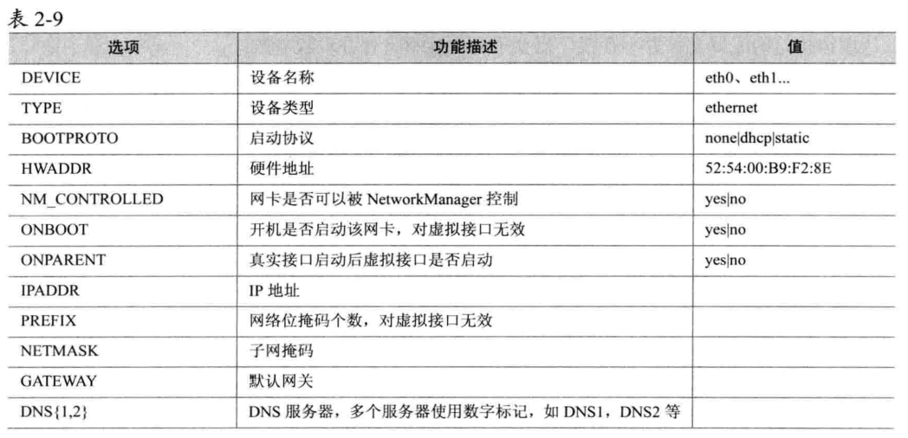

##### vim
快捷键命令
* gg
* G
* nG
* ^
* $
* x
* dd
* u
* yy
* p
* P
* d$  
  
查找  
/xxx从上至下找，n下一个匹配，N上一个匹配  
？xxx从下至上找，n下一个匹配，N上一个匹配  

vim小技巧  
* :set nu 显示行号
* :split :vsplit :close Ctrl+w
* :!{命令}

##### Command
* touch
* mkdir -p 多级目录
* rm -r删除多级目录内容 -f强制删除不提示
* cat -n 显示行号
* grpe -i忽略大小写 -v去反匹配
* ln -s source 创建软连接，源文件不可删除 ln [选项] 目标 链接名

#### 账户与安全
* useradd -u -g 
* groupadd -g 
* passwd username 设置密码
* usermode -g main tom/usermode -u 1003 tom
* userdel [-r] tom
* groupdel tom
* 用户信息查看/etc/passwd
* 用户组信息查看/etc/group

#### 文件权限
[root@localhost zookeeper-3.4.10]# ll -h  
总用量 1.6M  
drwxr-xr-x.  2 1001 usertest  149 3月  23 2017 bin  
-rw-rw-r--.  1 1001 usertest  83K 3月  23 2017 build.xml  
drwxr-xr-x.  2 1001 usertest  125 1月  10 22:43 conf  
第一列-代表普通文件，-d表示目录，l表示链接文件 b或c表是设备。第二列10列表示权限，3位一体。rwxrwxrwx表是该文档的所有者(user)，组（group）,其他账户都具有可读可写可执行权限。  

修改文档属性：  
chmod参数中
* u 代表所有者
* g 代表所属组
* o 代表其他用户
* a 代表所有人 

chmod u=rwx,g=rwx,o=rwx test.log  
在原有权限基础上修改权限 +/-  
chmod u+x test.log在原有基础上增加文档所有者执行权限  
chmod a+x test.log所有人增加执行权限    
chmod  4(r) 2(w) 1(x)，chomd 777 1.txt 7=4+2+1  
chown  修改文件的所有者和所有组  
 chown root txt.log  
#### 存储管理
MBR分区方式：最多四个主分区，如果需要更多的分区，需在扩展分区里面创建多个逻辑分区。

具体命令：  
fdisk -l  
fdisk /dev/sdb  
partprobe -a  
GPT分区方式:  
parted [选项] [磁盘命令]  
1.修改分区表类型  
parted /dev/sdc mklabel gpt  
2.创建分区  
parted [磁盘] mkpart 分区类型 文件系统类型 开始 结束  
parted /dev/sdc mkpart primary exts 1 2G  
parted /dev/sdc mkpart primary exts 2G 4G  
parted /dev/sdc print  
格式化与挂载文件系统  
mkfs -t xfs /dev/sdc1  
mount  
1.mount /dev/sdc1 /data1  
umount /dev/sdc1  
2.vim /etc/fstab  
/dev/sdc1 /data1 xfs defaults 0 0
mount -a //修改完/tc/fstab后执行

1.RAID 0 (不含校验与冗余的条状存储)  
至少要2个硬盘，一个文件写入RAID 0分成两部分DATA1和DATA2写入

2.RAID 1 (不含校验的镜像存储)  
写入一个文件会同时复制到另一个硬盘做备份，利用率只有50% 

6.RAID 5 

11.RAID 10
RAID1+0   
RAID0+1
创建RAID  
mdadm  -C  //create  
      -l //RAID level  
      -n //磁盘个数  
      -x //指定备用设备个数  
mdadm -C /dev/mdo -l 0 -n 3 /dev/sdb1 /dev/sdc1 /dev/sdd1    
time dd if=/dev/zero of txt bs=1M count=1000

/dev/null，外号叫无底洞，你可以向它输出任何数据，它通吃，并且不会撑着  
/dev/zero，是一个输入设备，你可你用它来初始化文件。该设备无穷尽地提供0  
#### 软件管理
rpm -ivh xxx.rpm 安装    
rpm -e xxx 卸载  
rpm -q xxx 查询xxx是否安装
rpm -qc xxx 查询配置文件  

设置yum源
默认yum文件放在/etc/yum.repos.d目录下，文件格式如下

[base]  
name=CentOS-$releasever - Base  
mirrorlist=http://mirrorlist.centos.org/?release=$releasever&arch=$basearch&repo=os&infra=$infra  
\#baseurl=http://mirror.centos.org/centos/$releasever/os/$basearch/  
gpgcheck=1  
gpgkey=file:///etc/pki/rpm-gpg/RPM-GPG-KEY-CentOS-7  
yum clean all 
yum remove  
yum makecache  
本地yum源  
安装createrepo  
执行 createrepo /xxx/xxx  
通过RPM或YUM安装一般会在/usr/lib/systemd/system/目录下创建对应的配置文件，可以用systemctl管理这些服务  
python -m SimpleHTTPServer port    
#### 网络配置
命令行设置网络参数  
ip -s link show eno166  
hostnamectl status  查看主机信息  
hostnamectl set-hostname hostname  设置主机名  
yum install net-tools  
设置eno166网卡接口ip地址为192.168.0.31 子网掩码 255.255.255.0  
ifconfig eno166 192.168.0.31 netmask 255.255.255.0  
查看网卡接口信息  
ifconfig eno166  
关闭网卡接口  
ifconfig eno166 down  
开启    
ifconfig eno166 up  
路由参数  
route -n  
添加默认网关  
route add default gw 192.168.0.254   
route del default gw 192.168.0.254  
添加指定网关  
表示访问172.16.0.0/16网段默认都发送到192.168.0.254
route add -net 172.16.0.0/16 gw 192.168.0.254  
route del -net -net 172.16.0.0/16  
网络文件参数  
网卡配置参数路径/etc/sysconfig/network-scripts/ifcfg-&lt;***&gt;/  

修改完配置  systemctl restart network  
路由参数配置文件  
/etc/sysconfig/network-scripts/route-eno166   
172.16.0.0/16 via 192.168.0.254  
trace -I www.baidu.com  
nslookup www.google.com  
-bash: dig: 未找到命令  
yum -y install bind-utils  
修改内核参数  
vim /etc/sysctl.conf  
#### Shell
错误信息重定向需要使用2>或2>>  
&gt;/dev/null 2&gt;&1  
对于& 1 更准确的说应该是文件描述符 1,而1标识标准输出，stdout  
对于2 ，表示标准错误，stderr  
2>&1 的意思就是将标准错误重定向到标准输出。这里标准输出已经重定向到了 /dev/null。那么标准错误也会输出到/dev/null  
ctrl l == clear
  
sed命令:  
* sed '2a TYPE=Ethernet' test.txt #第2行后追加  
* sed '3i TYPE=Ethernet' test.txt #第三行前插入  
* sed 's/yes/no/g' test.txt #所有yes替换为no,不加g则只替换匹配到的第一个
* sed '3,4d' test.txt #删除3,4行的内容  
* sed '/ONBOOT/a TYPE=Ethernet' test.txt #匹配到ONBOOT的行然后在其后追加
* sed -e 's/yes/no/g' -e 's/static/dhcp/g' test.txt #多条命令执行
* sed '/ONBOOT/c ONBOOT=yes' test.txt #匹配到ONBOOT行的内容更改为ONBOOT=yes

Awk:  
awk -F: '{ print $1 }' /etc/passwd  
awk '/^S/ {print "Blank line"}' test.txt #匹配空行输出Blank line
Awk读取一行记录存在字段$0中，记录被分割存储在$1,$2,...,$NF中,NF为字段个数    
echo hello the world|awk '{print $1,$2,$3}'  
echo hello the world|awk '{print $0}'  
echo hello the world|awk '{print NF}'  
echo hello the world|awk '{print $NF}'  
awk '/^$/ {print x+=1}' R1.txt  
awk '/^$ {x+=1} END {print x}' R1.txt  
awk '/^$/ {x+=1} END {print x}' R1.txt  #统计空行  
awk -F: '$5>500 {print $1}' R1.txt  
df |grep "boot"|awk '{if ($4>500) print "Alert";else print "OK"}'  
gsub(x,y,z)  
在字符串z中把x匹配到的字符串替换为y,z默认为$0
sub(x,y,z)  
在字符串z中把x匹配到的第一个字符串替换为y,z默认为$0
awk -F: 'gsub(/root/,admin,$0) {print $0}' /etc/passwd
awk -F: 'sub(/root/,admin,$0) {print $0}' /etc/passwd  
#### 环境变量  
export将环境变量放入环境中  
export NAME=tom  
#### 防火墙
netfilter/iptables  
默认的iptables规则表有：
* filter表（过滤规则表）
* nat表（地址转换规则表）
* mangle表（修改数据标记位规则表）
* raw表（跟踪数据表规则表）  

每个规则表包含多个数据链  
* INPUT
* OUTPUT
* FORWARD
* PREROUTING
* POSTROUTING

iptables -nL  查看规则表  
iptables -t nat -nL  查看nat表规则表  
丢弃192.168.0.1发送给本机的所有数据包  
iptables -t filter -A INPUT -s 192.168.0.1 -j DROP  
iptables -t filter -I INPUT -s 192.168.0.1 -p icmp -j REJECT  
显示编号    
iptables -nL --line-number  
删除编号1的规则
iptables -D INPUT 1  
除了192.168.0.254,其他主机不能访问本机  
iptables -I INPUT ! -s 192.168.0.254 -j REJECT  
访问本机端口的数据包信息记录到message日志：  
iptables -I INPUT -s 192.168.0.254 -p tcp --dport 22 -j LOG  
允许任何主机从网卡访问本机80端口  
iptables -I INPUT -i eno166 --p tcp --dport 80 -j ACCEPT  
场景服务端口/etc/services  
允许任何访问22端口  
iptables -A INPUT -p tcp --dport 22 -j ACCEPT  
vim /etc/sysctl.conf  
/#开启路由转发，实现基于linux的软路由功能   
net.ipv4.ip_forward=1
sysctl -p 生效/etc/sysctl.conf  
iptables -t nat -I POSTROUTING -s 192.168.0.0/24  -j SANT --to-source 127.126.199.84  
iptables-save > /etc/sysconfig/iptables  
iptables-restore < firewll.bak  

firewalld  
firewall-cmd --get-zones  
firewall-cmd --add-port=3306/tcp --zone=public  
firewall-cmd --remove-port=3306/tcp --zone=public  
绑定网卡和public zone  
firewall-cmd --add-interface=eno166 --zone=public  
firewall-cmd --remove-interface=eno166 --zone=public  
firewall-cmd --list-all --zone=public  
firewall-cmd --permanent --add-port=3306/tcp --zone=public

 
