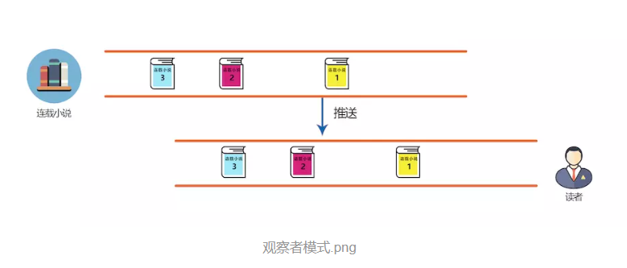

## RxJava2.0
要理解Rxjava2.0首先得搞懂什么是观察者模式。举个例子，假设A是连载小说，B是读者，读者订阅了连载小说，当小说出现了新的连载的时候，会推送给读者。读者不用时刻盯着小说连载，而小说有了新的连载会主动推送给读者。这就是观察者模式。而RxJava正是基于观察者模式开发的。


## RxJava2.0的基本使用
### 添加依赖
```java
<dependency>
  <groupId>io.reactivex.rxjava2</groupId>
  <artifactId>rxjava</artifactId>
  <version>2.2.8</version>
</dependency>
```
### 被观察者
```java
        Observable novel=Observable.create(new ObservableOnSubscribe<String>() {
            @Override
            public void subscribe(ObservableEmitter<String> emitter) throws Exception {
                emitter.onNext("连载1");
                emitter.onNext("连载2");
                emitter.onNext("连载3");
                emitter.onComplete();
            }
        });
```
Observable是被观察者，ObservableEmitter有三种发射的方法，分别是
* void onNext(T value) 
- void onError(Throwable error)
+ void onComplete()

onNext方法即推送的内容，可以不限调用。onError只能调用一次，onComplete可以重复调用，但仅有一次观察可以收到消息。

### 观察者
```java
Observer<String> reader=new Observer<String>() {
            @Override
            public void onSubscribe(Disposable d) {
                mDisposable=d;
                Log.e(TAG,"onSubscribe");
            }
            
            @Override
            public void onNext(String value) {
                if ("2".equals(value)){
                    mDisposable.dispose();
                    return;
                }
                Log.e(TAG,"onNext:"+value);
            }

            @Override
            public void onError(Throwable e) {
                Log.e(TAG,"onError="+e.getMessage());
            }

            @Override
            public void onComplete() {
                Log.e(TAG,"onComplete()");
            }
        };
```
Disposable表示订阅关系,调用mDisposable.dispose()即取消订阅。
### 订阅关系
```java
novel.subscribe(reader);
```
## RxJava2.0的异步和链式编程
```java
observeOn是事件回调的线程,subscribeOn是事件执行的线程，Schedulers.io()是子线程.把上面的代码写成链式结构如下：
Observable.create(new ObservableOnSubscribe<String>() {
            @Override
            public void subscribe(ObservableEmitter<String> emitter) throws Exception {
                emitter.onNext("连载1");
                emitter.onNext("连载2");
                emitter.onNext("连载3");
                emitter.onComplete();
            }
        })
        .observeOn(AndroidSchedulers.mainThread())//回调在主线程
        .subscribeOn(Schedulers.io())//执行在io线程
        .subscribe(new Observer<String>() {
            @Override
            public void onSubscribe(Disposable d) {
                Log.e(TAG,"onSubscribe");
            }

            @Override
            public void onNext(String value) {
                Log.e(TAG,"onNext:"+value);
            }

            @Override
            public void onError(Throwable e) {
                Log.e(TAG,"onError="+e.getMessage());
            }

            @Override
            public void onComplete() {
                Log.e(TAG,"onComplete()");
            }
        });    
```
