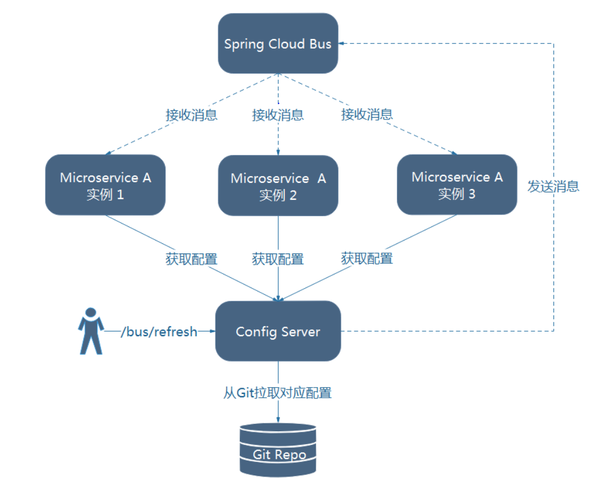

  
```
<dependency>
            <groupId>org.springframework.cloud</groupId>
            <artifactId>spring-cloud-starter-bus-amqp</artifactId>
        </dependency>
```

往config-server和所有的config-client配置文件添加
```
spring:
  rabbitmq:
    host:localhost
    port:5672
    username: admin
    password: admin
```
当修改配置文件时，curl -X POST http://config-server:8081/bus/refresh 所有订阅的服务就会刷新配置。
