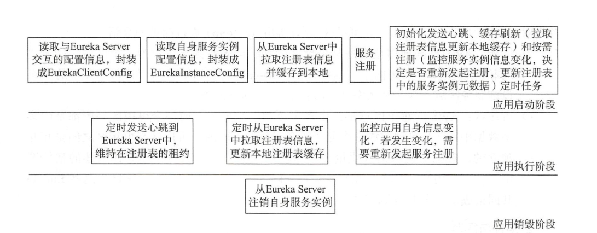
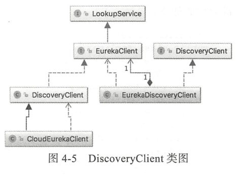
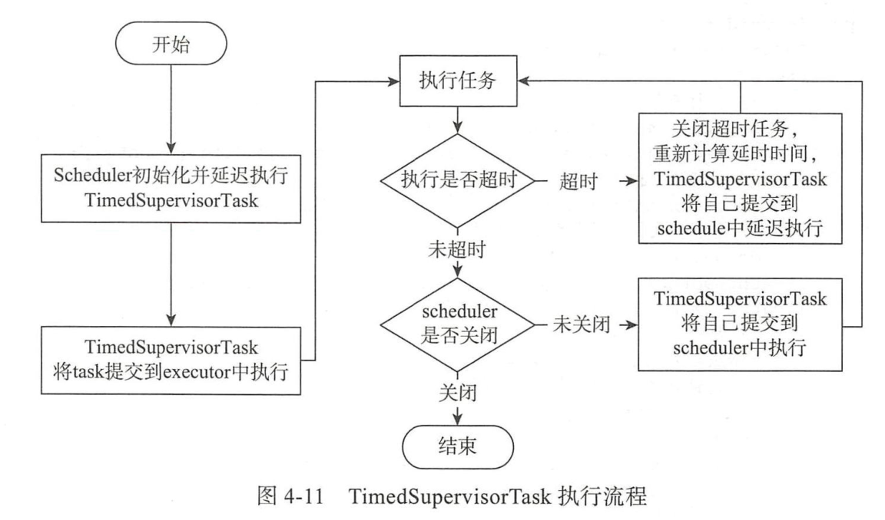
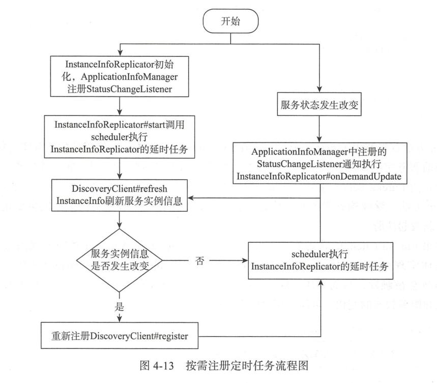

#### eureka client源码解析  

```
#server
eureka:
  instance:
    hostname: eureka-server-1
    instance-id: eureka-server-1
    #eureka是使用hostname进行注册的，使用IP进行注册
    prefer-ip-address: false
    appname: ${spring.application.name}
    # 续约到期时间（默认90秒）
    lease-expiration-duration-in-seconds: 30
    # 续约更新时间间隔（默认30秒）
    lease-renewal-interval-in-seconds: 15
  server:
    # 设为false，关闭自我保护
    enable-self-preservation: false
    #自我保护系数（默认0.85）
    renewal-percent-threshold: 0.85
    #禁用Eureka的ReadOnlyMap缓存
    use-read-only-response-cache: false
    # 清理无效节点间隔（单位毫秒，默认是60*1000）
    eviction-interval-timer-in-ms: 3000
    #注册信息缓存有效时长（s），默认180秒
    response-cache-auto-expiration-in-seconds: 15
    #注册信息缓存更新间隔（s），默认30秒
    response-cache-update-interval-ms: 5000
    #设置eureka server同步失败的等待时间，默认5分钟，在这期间它不向客户端提供服务注册信息
    wait-time-in-ms-when-sync-empty: 5
    #设置eureka server同步失败的重试次数，默认为5次
    number-of-replication-retries: 5
  client:
    healthcheck:
      enabled: true
    registerWithEureka: true
    fetchRegistry: true
    service-url:
      defaultZone: http://eureka-server-2:${server.port}/eureka/,http://eureka-server-3:${server.port}/eureka/

#client
eureka:
  instance:
    #使用IP注册
    prefer-ip-address: true
    #注册到eureka上的唯一实例ID(不能与相同appName的其他实例重复)。
    instance-id: ${spring.cloud.client.ip-address}:${server.port}
    #主机名,不配置的时候讲根据操作系统的主机名来获取
    hostname: ${spring.application.name}
    #实例续约间隔时间(默认30秒)
    lease-renewal-interval-in-seconds: 5
    #实例超时时间，表示*秒后没有续约，Server就认为他不可用了，随之就会将其剔除。
    lease-expiration-duration-in-seconds: 15
    status-page-url-path: management/info
    health-check-url-path: management/health
  client:
    #指示此实例是否应将其信息注册到eureka服务器以供其他服务发现，默认为false
    register-with-eureka: true
    #是否从Server获取注册信息
    fetch-registry: true
    #定时从Eureka Server拉取服务注册信息的间隔时间(默认30秒，单位：s/秒）
    registry-fetch-interval-seconds: 5
    #Eureka 集群地址
    service-url:
      defaultZone: ${eureka.server}
```


三个重要的配置类  
//自身关键beans的配置和初始化  
org.springframework.cloud.netflix.eureka.EurekaClientAutoConfiguration  
//负载均衡相关配置  
org.springframework.cloud.netflix.ribbon.eureka.RibbonEurekaAutoConfiguration  
//配置自动注册和应用的健康检查器  
org.springframework.cloud.netflix.eureka.EurekaDiscoveryClientConfiguration  
//  
  
com.netflix.discovery.DiscoveryClient实现了eureka client注册到server上，下线以及获取server中注册表信息等关键功能。 
discoveryClient构造函数实现了以下的事情：  
1)相关配置的赋值，类似ApplicationInfoManager、EurekaClientConfig等  
2）拉取Eureka注册表中的信息  
3)注册自身  
4）初始化心跳定时任务，缓存刷新和按需注册定时任务  
全量拉取注册表在getAndStoreFullReistry()方法实现，为了防止多线程时造成的覆盖，Eureka通过类型AtomicLong的currentUpdateGeneration对apps的更新版本进行跟踪。 
```java
Discovery继承LookupService接口，LookUpservice接口是发现活跃的服务实例，主要方法如下：
public interface LookupService<T> {
    //根据appname获取相同的appname的服务实例信息
    Application getApplication(String appName);
    //返回当前注册表中的所有信息
    Applications getApplications();
    //根据id返回相同id的实例列表
    List<InstanceInfo> getInstancesById(String id);

}
Application可以理解一个应用信息，InstanceInfo代表一个实例信息，多个相同appname的instanceInfo组成一个Application；
public class Application {
    
    private static Random shuffleRandom = new Random();
    
    private final Set<InstanceInfo> instances;

    private final AtomicReference<List<InstanceInfo>> shuffledInstances;

    private final Map<String, InstanceInfo> instancesMap;

    public Application() {
        instances = new LinkedHashSet<InstanceInfo>();
        instancesMap = new ConcurrentHashMap<String, InstanceInfo>();
        shuffledInstances = new AtomicReference<List<InstanceInfo>>();
    }

Discovery构造函数
@Inject
    DiscoveryClient(ApplicationInfoManager applicationInfoManager, EurekaClientConfig config, AbstractDiscoveryClientOptionalArgs args,
                    Provider<BackupRegistry> backupRegistryProvider) {
        if (args != null) {
            this.healthCheckHandlerProvider = args.healthCheckHandlerProvider;
            this.healthCheckCallbackProvider = args.healthCheckCallbackProvider;
            this.eventListeners.addAll(args.getEventListeners());
            this.preRegistrationHandler = args.preRegistrationHandler;
        } else {
            this.healthCheckCallbackProvider = null;
            this.healthCheckHandlerProvider = null;
            this.preRegistrationHandler = null;
        }
        
        this.applicationInfoManager = applicationInfoManager;
        InstanceInfo myInfo = applicationInfoManager.getInfo();

        clientConfig = config;
        staticClientConfig = clientConfig;
        transportConfig = config.getTransportConfig();
        instanceInfo = myInfo;
        if (myInfo != null) {
            appPathIdentifier = instanceInfo.getAppName() + "/" + instanceInfo.getId();
        } else {
            logger.warn("Setting instanceInfo to a passed in null value");
        }

        this.backupRegistryProvider = backupRegistryProvider;

        this.urlRandomizer = new EndpointUtils.InstanceInfoBasedUrlRandomizer(instanceInfo);
        localRegionApps.set(new Applications());

        fetchRegistryGeneration = new AtomicLong(0);

        remoteRegionsToFetch = new AtomicReference<String>(clientConfig.fetchRegistryForRemoteRegions());
        remoteRegionsRef = new AtomicReference<>(remoteRegionsToFetch.get() == null ? null : remoteRegionsToFetch.get().split(","));
        //shouldFetchRegistry()即配置文件中eureka.client.fetch-register
        if (config.shouldFetchRegistry()) {
            this.registryStalenessMonitor = new ThresholdLevelsMetric(this, METRIC_REGISTRY_PREFIX + "lastUpdateSec_", new long[]{15L, 30L, 60L, 120L, 240L, 480L});
        } else {
            this.registryStalenessMonitor = ThresholdLevelsMetric.NO_OP_METRIC;
        }
        //eureka.client.register-with-eureka
        if (config.shouldRegisterWithEureka()) {
            this.heartbeatStalenessMonitor = new ThresholdLevelsMetric(this, METRIC_REGISTRATION_PREFIX + "lastHeartbeatSec_", new long[]{15L, 30L, 60L, 120L, 240L, 480L});
        } else {
            this.heartbeatStalenessMonitor = ThresholdLevelsMetric.NO_OP_METRIC;
        }

        logger.info("Initializing Eureka in region {}", clientConfig.getRegion());
        //如果设置不需要向Eureka server注册或者不需要从Eureka server拉取信息，则直接返回
        if (!config.shouldRegisterWithEureka() && !config.shouldFetchRegistry()) {
            logger.info("Client configured to neither register nor query for data.");
            scheduler = null;
            heartbeatExecutor = null;
            cacheRefreshExecutor = null;
            eurekaTransport = null;
            instanceRegionChecker = new InstanceRegionChecker(new PropertyBasedAzToRegionMapper(config), clientConfig.getRegion());

            // This is a bit of hack to allow for existing code using DiscoveryManager.getInstance()
            // to work with DI'd DiscoveryClient
            DiscoveryManager.getInstance().setDiscoveryClient(this);
            DiscoveryManager.getInstance().setEurekaClientConfig(config);

            initTimestampMs = System.currentTimeMillis();
            logger.info("Discovery Client initialized at timestamp {} with initial instances count: {}",
                    initTimestampMs, this.getApplications().size());

            return;  // no need to setup up an network tasks and we are done
        }

        try {
            //定义线程池大小为2，一个用于心跳，一个用于缓存刷新
            // default size of 2 - 1 each for heartbeat and cacheRefresh
            scheduler = Executors.newScheduledThreadPool(2,
                    new ThreadFactoryBuilder()
                            .setNameFormat("DiscoveryClient-%d")
                            .setDaemon(true)
                            .build());
            
            heartbeatExecutor = new ThreadPoolExecutor(
                    1, clientConfig.getHeartbeatExecutorThreadPoolSize(), 0, TimeUnit.SECONDS,
                    new SynchronousQueue<Runnable>(),
                    new ThreadFactoryBuilder()
                            .setNameFormat("DiscoveryClient-HeartbeatExecutor-%d")
                            .setDaemon(true)
                            .build()
            );  
            // use direct handoff

            cacheRefreshExecutor = new ThreadPoolExecutor(
                    1, clientConfig.getCacheRefreshExecutorThreadPoolSize(), 0, TimeUnit.SECONDS,
                    new SynchronousQueue<Runnable>(),
                    new ThreadFactoryBuilder()
                            .setNameFormat("DiscoveryClient-CacheRefreshExecutor-%d")
                            .setDaemon(true)
                            .build()
            );  // use direct handoff

            //初始化Eureka http客户端jersey
            eurekaTransport = new EurekaTransport();
            scheduleServerEndpointTask(eurekaTransport, args);

            AzToRegionMapper azToRegionMapper;
            if (clientConfig.shouldUseDnsForFetchingServiceUrls()) {
                azToRegionMapper = new DNSBasedAzToRegionMapper(clientConfig);
            } else {
                azToRegionMapper = new PropertyBasedAzToRegionMapper(clientConfig);
            }
            if (null != remoteRegionsToFetch.get()) {
                azToRegionMapper.setRegionsToFetch(remoteRegionsToFetch.get().split(","));
            }
            instanceRegionChecker = new InstanceRegionChecker(azToRegionMapper, clientConfig.getRegion());
        } catch (Throwable e) {
            throw new RuntimeException("Failed to initialize DiscoveryClient!", e);
        }
        //从eureka server拉取注册表，如果失败从backup拉取
        if (clientConfig.shouldFetchRegistry() && !fetchRegistry(false)) {
            fetchRegistryFromBackup();
        }

        //注册前准备，用户可自定义实现
        // call and execute the pre registration handler before all background tasks (inc registration) is started
        if (this.preRegistrationHandler != null) {
            this.preRegistrationHandler.beforeRegistration();
        }

        if (clientConfig.shouldRegisterWithEureka() && clientConfig.shouldEnforceRegistrationAtInit()) {
            try {
                if (!register() ) {
                    throw new IllegalStateException("Registration error at startup. Invalid server response.");
                }
            } catch (Throwable th) {
                logger.error("Registration error at startup: {}", th.getMessage());
                throw new IllegalStateException(th);
            }
        }

        //最后，初始化调度任务（例如集群解析器、heartbeat、instanceInfo replicator、fetch
        // finally, init the schedule tasks (e.g. cluster resolvers, heartbeat, instanceInfo replicator, fetch
        initScheduledTasks();

        try {
            Monitors.registerObject(this);
        } catch (Throwable e) {
            logger.warn("Cannot register timers", e);
        }

        // This is a bit of hack to allow for existing code using DiscoveryManager.getInstance()
        // to work with DI'd DiscoveryClient
        DiscoveryManager.getInstance().setDiscoveryClient(this);
        DiscoveryManager.getInstance().setEurekaClientConfig(config);

        initTimestampMs = System.currentTimeMillis();
        logger.info("Discovery Client initialized at timestamp {} with initial instances count: {}",
                initTimestampMs, this.getApplications().size());
    }
```
 拉取注册表  
 调用DiscoveryClient.fetchRegistry方法从eureka server拉取注册信息  
 ```java
 private boolean fetchRegistry(boolean forceFullRegistryFetch) {
        Stopwatch tracer = FETCH_REGISTRY_TIMER.start();

        try {
            // If the delta is disabled or if it is the first time, get all
            // applications
            Applications applications = getApplications();
            //判断是全量拉取还是增量拉取
            if (clientConfig.shouldDisableDelta()
                    || (!Strings.isNullOrEmpty(clientConfig.getRegistryRefreshSingleVipAddress()))
                    || forceFullRegistryFetch
                    || (applications == null)
                    || (applications.getRegisteredApplications().size() == 0)
                    || (applications.getVersion() == -1)) //Client application does not have latest library supporting delta
            {
                logger.info("Disable delta property : {}", clientConfig.shouldDisableDelta());
                logger.info("Single vip registry refresh property : {}", clientConfig.getRegistryRefreshSingleVipAddress());
                logger.info("Force full registry fetch : {}", forceFullRegistryFetch);
                logger.info("Application is null : {}", (applications == null));
                logger.info("Registered Applications size is zero : {}",
                        (applications.getRegisteredApplications().size() == 0));
                logger.info("Application version is -1: {}", (applications.getVersion() == -1));
                getAndStoreFullRegistry();//全量拉取
            } else {
                getAndUpdateDelta(applications);//增量拉取
            }
            applications.setAppsHashCode(applications.getReconcileHashCode());
            logTotalInstances();
        } catch (Throwable e) {
            logger.error(PREFIX + "{} - was unable to refresh its cache! status = {}", appPathIdentifier, e.getMessage(), e);
            return false;
        } finally {
            if (tracer != null) {
                tracer.stop();
            }
        }
        
        //更新远程实例状态前先更新缓存
        // Notify about cache refresh before updating the instance remote status
        onCacheRefreshed();

        //更新拉取获得的远程实例状态
        // Update remote status based on refreshed data held in the cache
        updateInstanceRemoteStatus();

        // registry was fetched successfully, so return true
        return true;
    }
 ```
 全量拉取
 ```java
 private void getAndStoreFullRegistry() throws Throwable {
        //获取注册表的版本，防止被其他落后版本的线程覆盖
        long currentUpdateGeneration = fetchRegistryGeneration.get();

        logger.info("Getting all instance registry info from the eureka server");

        Applications apps = null;
        EurekaHttpResponse<Applications> httpResponse = clientConfig.getRegistryRefreshSingleVipAddress() == null
                ? eurekaTransport.queryClient.getApplications(remoteRegionsRef.get())
                : eurekaTransport.queryClient.getVip(clientConfig.getRegistryRefreshSingleVipAddress(), remoteRegionsRef.get());
        if (httpResponse.getStatusCode() == Status.OK.getStatusCode()) {
            apps = httpResponse.getEntity();
        }
        logger.info("The response status is {}", httpResponse.getStatusCode());

        if (apps == null) {
            logger.error("The application is null for some reason. Not storing this information");
        } else if (fetchRegistryGeneration.compareAndSet(currentUpdateGeneration, currentUpdateGeneration + 1)) {
            localRegionApps.set(this.filterAndShuffle(apps));
            logger.debug("Got full registry with apps hashcode {}", apps.getAppsHashCode());
        } else {
            logger.warn("Not updating applications as another thread is updating it already");
        }
    }
 ```
 跟踪调用链，最后在AbstractJerseyEurekaHttpClient.getApplications()发送http，url为/eureka/apps  
增量式调用  
增量式调用一般发生在全量式调用拉取注册表信息之后，拉取的定义为从某一段时间之后发生的所有变更信息。通常是3分钟之内的注册表的信息变化。eureka client采用一个注册表缓存刷新定时器专门负责刷新client和server直接的同步。  
```java
private void getAndUpdateDelta(Applications applications) throws Throwable {
        long currentUpdateGeneration = fetchRegistryGeneration.get();

        Applications delta = null;
        EurekaHttpResponse<Applications> httpResponse = eurekaTransport.queryClient.getDelta(remoteRegionsRef.get());//获取增量注册表信息
        if (httpResponse.getStatusCode() == Status.OK.getStatusCode()) {
            delta = httpResponse.getEntity();
        }
        //如果为null,则获取全量
        if (delta == null) {
            logger.warn("The server does not allow the delta revision to be applied because it is not safe. "
                    + "Hence got the full registry.");
            getAndStoreFullRegistry();
        } else if (fetchRegistryGeneration.compareAndSet(currentUpdateGeneration, currentUpdateGeneration + 1)) {
            logger.debug("Got delta update with apps hashcode {}", delta.getAppsHashCode());
            String reconcileHashCode = "";
            if (fetchRegistryUpdateLock.tryLock()) {
                try {
                    //更新本地缓存
                    updateDelta(delta);
                    reconcileHashCode = getReconcileHashCode(applications);
                } finally {
                    fetchRegistryUpdateLock.unlock();
                }
            } else {
                logger.warn("Cannot acquire update lock, aborting getAndUpdateDelta");
            }
            //比较应用集合一致性哈希吗，如果不一致将认为增量获取的数据已脏
            // There is a diff in number of instances for some reason
            if (!reconcileHashCode.equals(delta.getAppsHashCode()) || clientConfig.shouldLogDeltaDiff()) {
                reconcileAndLogDifference(delta, reconcileHashCode);  // this makes a remoteCall
            }
        } else {
            logger.warn("Not updating application delta as another thread is updating it already");
            logger.debug("Ignoring delta update with apps hashcode {}, as another thread is updating it already", delta.getAppsHashCode());
        }
    }
```
增量式调用的url为/eureka/app/delta  
更新本地缓存代码  
```java
private void updateDelta(Applications delta) {
        int deltaCount = 0;
        //循环从远程获取的增量数据
        for (Application app : delta.getRegisteredApplications()) {
            for (InstanceInfo instance : app.getInstances()) {
                Applications applications = getApplications();
                String instanceRegion = instanceRegionChecker.getInstanceRegion(instance);
                if (!instanceRegionChecker.isLocalRegion(instanceRegion)) {
                    Applications remoteApps = remoteRegionVsApps.get(instanceRegion);
                    if (null == remoteApps) {
                        remoteApps = new Applications();
                        remoteRegionVsApps.put(instanceRegion, remoteApps);
                    }
                    applications = remoteApps;
                }

                ++deltaCount;
                //变更类型为added，表面有新的服务加入
                if (ActionType.ADDED.equals(instance.getActionType())) {
                    Application existingApp = applications.getRegisteredApplications(instance.getAppName());
                    if (existingApp == null) {
                        applications.addApplication(app);
                    }
                    logger.debug("Added instance {} to the existing apps in region {}", instance.getId(), instanceRegion);
                    applications.getRegisteredApplications(instance.getAppName()).addInstance(instance);
                }//MODIFIED表明服务状态改变
                else if (ActionType.MODIFIED.equals(instance.getActionType())) {
                    Application existingApp = applications.getRegisteredApplications(instance.getAppName());
                    if (existingApp == null) {
                        applications.addApplication(app);
                    }
                    logger.debug("Modified instance {} to the existing apps ", instance.getId());

                    applications.getRegisteredApplications(instance.getAppName()).addInstance(instance);

                }//表明服务下线或删除 
                else if (ActionType.DELETED.equals(instance.getActionType())) {
                    Application existingApp = applications.getRegisteredApplications(instance.getAppName());
                    if (existingApp == null) {
                        applications.addApplication(app);
                    }
                    logger.debug("Deleted instance {} to the existing apps ", instance.getId());
                    applications.getRegisteredApplications(instance.getAppName()).removeInstance(instance);
                }
            }
        }
        logger.debug("The total number of instances fetched by the delta processor : {}", deltaCount);

        getApplications().setVersion(delta.getVersion());
        getApplications().shuffleInstances(clientConfig.shouldFilterOnlyUpInstances());

        for (Applications applications : remoteRegionVsApps.values()) {
            applications.setVersion(delta.getVersion());
            applications.shuffleInstances(clientConfig.shouldFilterOnlyUpInstances());
        }
    }
```
服务注册  
注册接口地址为apps/app_name
```java
boolean register() throws Throwable {
        logger.info(PREFIX + "{}: registering service...", appPathIdentifier);
        EurekaHttpResponse<Void> httpResponse;
        try {
            httpResponse = eurekaTransport.registrationClient.register(instanceInfo);
        } catch (Exception e) {
            logger.warn(PREFIX + "{} - registration failed {}", appPathIdentifier, e.getMessage(), e);
            throw e;
        }
        if (logger.isInfoEnabled()) {
            logger.info(PREFIX + "{} - registration status: {}", appPathIdentifier, httpResponse.getStatusCode());
        }
        return httpResponse.getStatusCode() == 204;
    }

```
初始化定时任务  

```java
private void initScheduledTasks() {
        if (clientConfig.shouldFetchRegistry()) {
            //拉取注册表默认30秒
            // registry cache refresh timer
            int registryFetchIntervalSeconds = clientConfig.getRegistryFetchIntervalSeconds();
            int expBackOffBound = clientConfig.getCacheRefreshExecutorExponentialBackOffBound();
            scheduler.schedule(
                    new TimedSupervisorTask(
                            "cacheRefresh",
                            scheduler,
                            cacheRefreshExecutor,
                            registryFetchIntervalSeconds,
                            TimeUnit.SECONDS,
                            expBackOffBound,
                            new CacheRefreshThread()
                    ),
                    registryFetchIntervalSeconds, TimeUnit.SECONDS);
        }
        
        //心跳定时器，默认30秒，续约接口地址为eureka/apps/app_name/instance_id
        if (clientConfig.shouldRegisterWithEureka()) {
            int renewalIntervalInSecs = instanceInfo.getLeaseInfo().getRenewalIntervalInSecs();
            int expBackOffBound = clientConfig.getHeartbeatExecutorExponentialBackOffBound();
            logger.info("Starting heartbeat executor: " + "renew interval is: {}", renewalIntervalInSecs);

            // Heartbeat timer
            scheduler.schedule(
                    new TimedSupervisorTask(
                            "heartbeat",
                            scheduler,
                            heartbeatExecutor,
                            renewalIntervalInSecs,
                            TimeUnit.SECONDS,
                            expBackOffBound,
                            new HeartbeatThread()
                    ),
                    renewalIntervalInSecs, TimeUnit.SECONDS);
            //按需注册，定时刷新自身状态变化，如果状态改变重新注册
            // InstanceInfo replicator
            instanceInfoReplicator = new InstanceInfoReplicator(
                    this,
                    instanceInfo,
                    clientConfig.getInstanceInfoReplicationIntervalSeconds(),
                    2); // burstSize
            //注册状态变化监听器
            statusChangeListener = new ApplicationInfoManager.StatusChangeListener() {
                @Override
                public String getId() {
                    return "statusChangeListener";
                }

                @Override
                public void notify(StatusChangeEvent statusChangeEvent) {
                    if (InstanceStatus.DOWN == statusChangeEvent.getStatus() ||
                            InstanceStatus.DOWN == statusChangeEvent.getPreviousStatus()) {
                        // log at warn level if DOWN was involved
                        logger.warn("Saw local status change event {}", statusChangeEvent);
                    } else {
                        logger.info("Saw local status change event {}", statusChangeEvent);
                    }
                    instanceInfoReplicator.onDemandUpdate();
                }
            };

            if (clientConfig.shouldOnDemandUpdateStatusChange()) {
                applicationInfoManager.registerStatusChangeListener(statusChangeListener);
            }
            //启动按需注册定时任务
            instanceInfoReplicator.start(clientConfig.getInitialInstanceInfoReplicationIntervalSeconds());
        } else {
            logger.info("Not registering with Eureka server per configuration");
        }
    }
```
  
Eureka server源码解析  
服务注册  
接收服务心跳  
服务剔除  
服务下线  
集群同步  
获取注册表中服务实例信息  
LeaseManager接口提供的方法如下所示：  
```java
public interface LeaseManager<T>{
  void register();
  boolean cancel();
  boolean renew();
}
```
LeaseManager接口管理的对象是lease，代表一个Eureka client服务实例信息的租约。Lease定义了租约的操作类型。分别是注册，下线，更新，租约默认有效时长为90秒。  
PeerAwareInstanceRegistry继承了InstanceRegistry接口，在其基础上添加Eureka server集群同步的操作，其实现类PeerAwareInstanceRegistryImpl添加了对其peer节点的同步操作，是的Eureka server集群中的注册表信息保持一致。  
服务注册  
Eureka server接收client注册请求，执行注册动作如下:  
AbstractInstanceRegistry：  
```java
public void register(InstanceInfo registrant, int leaseDuration, boolean isReplication) {
        try {
            read.lock();
            Map<String, Lease<InstanceInfo>> gMap = registry.get(registrant.getAppName());//根据appname获取实例信息
            REGISTER.increment(isReplication);
            if (gMap == null) {
                final ConcurrentHashMap<String, Lease<InstanceInfo>> gNewMap = new ConcurrentHashMap<String, Lease<InstanceInfo>>();
                //如果有其他线程已经执行了，那么直接返回key对应的value即可
                gMap = registry.putIfAbsent(registrant.getAppName(), gNewMap);
                if (gMap == null) {
                    gMap = gNewMap;
                }
            }
            Lease<InstanceInfo> existingLease = gMap.get(registrant.getId());//获取对应的租约
            // Retain the last dirty timestamp without overwriting it, if there is already a lease
            if (existingLease != null && (existingLease.getHolder() != null)) {
               //如果租约存在，比较server里面和实例传递过来的时间戳，区较大值更新
                Long existingLastDirtyTimestamp = existingLease.getHolder().getLastDirtyTimestamp();
                Long registrationLastDirtyTimestamp = registrant.getLastDirtyTimestamp();
                logger.debug("Existing lease found (existing={}, provided={}", existingLastDirtyTimestamp, registrationLastDirtyTimestamp);

                // this is a > instead of a >= because if the timestamps are equal, we still take the remote transmitted
                // InstanceInfo instead of the server local copy.
                if (existingLastDirtyTimestamp > registrationLastDirtyTimestamp) {
                    logger.warn("There is an existing lease and the existing lease's dirty timestamp {} is greater" +
                            " than the one that is being registered {}", existingLastDirtyTimestamp, registrationLastDirtyTimestamp);
                    logger.warn("Using the existing instanceInfo instead of the new instanceInfo as the registrant");
                    registrant = existingLease.getHolder();
                }
            } else {
               //如果不存在，则是一次新的注册
                // The lease does not exist and hence it is a new registration
                synchronized (lock) {
                    if (this.expectedNumberOfRenewsPerMin > 0) {
                        // Since the client wants to cancel it, reduce the threshold
                        // (1
                        // for 30 seconds, 2 for a minute)
                        this.expectedNumberOfRenewsPerMin = this.expectedNumberOfRenewsPerMin + 2;
                        this.numberOfRenewsPerMinThreshold =
                                (int) (this.expectedNumberOfRenewsPerMin * serverConfig.getRenewalPercentThreshold());
                    }
                }
                logger.debug("No previous lease information found; it is new registration");
            }
           //创建新的租约
            Lease<InstanceInfo> lease = new Lease<InstanceInfo>(registrant, leaseDuration);
            if (existingLease != null) {
                lease.setServiceUpTimestamp(existingLease.getServiceUpTimestamp());
            }
            gMap.put(registrant.getId(), lease);
            //添加最新注册队列，用于client增量式拉取
            synchronized (recentRegisteredQueue) {
                recentRegisteredQueue.add(new Pair<Long, String>(
                        System.currentTimeMillis(),
                        registrant.getAppName() + "(" + registrant.getId() + ")"));
            }
            // This is where the initial state transfer of overridden status happens
            if (!InstanceStatus.UNKNOWN.equals(registrant.getOverriddenStatus())) {
                logger.debug("Found overridden status {} for instance {}. Checking to see if needs to be add to the "
                                + "overrides", registrant.getOverriddenStatus(), registrant.getId());
                if (!overriddenInstanceStatusMap.containsKey(registrant.getId())) {
                    logger.info("Not found overridden id {} and hence adding it", registrant.getId());
                    overriddenInstanceStatusMap.put(registrant.getId(), registrant.getOverriddenStatus());
                }
            }
            InstanceStatus overriddenStatusFromMap = overriddenInstanceStatusMap.get(registrant.getId());
            if (overriddenStatusFromMap != null) {
                logger.info("Storing overridden status {} from map", overriddenStatusFromMap);
                registrant.setOverriddenStatus(overriddenStatusFromMap);
            }

            // Set the status based on the overridden status rules
            InstanceStatus overriddenInstanceStatus = getOverriddenInstanceStatus(registrant, existingLease, isReplication);
            registrant.setStatusWithoutDirty(overriddenInstanceStatus);

             //设置服务上线时间，只有第一次设置有效
            // If the lease is registered with UP status, set lease service up timestamp
            if (InstanceStatus.UP.equals(registrant.getStatus())) {
                lease.serviceUp();
            }
            registrant.setActionType(ActionType.ADDED);
            recentlyChangedQueue.add(new RecentlyChangedItem(lease));
            //设置注册最后时间
            registrant.setLastUpdatedTimestamp();
            //设置response缓存过期时间，这将用于eureka client全量获取注册表信息
            invalidateCache(registrant.getAppName(), registrant.getVIPAddress(), registrant.getSecureVipAddress());
            logger.info("Registered instance {}/{} with status {} (replication={})",
                    registrant.getAppName(), registrant.getId(), registrant.getStatus(), isReplication);
        } finally {
            read.unlock();
        }
    }
```
接受心跳  
```java
public boolean renew(String appName, String id, boolean isReplication) {
        RENEW.increment(isReplication);
        Map<String, Lease<InstanceInfo>> gMap = registry.get(appName);
        Lease<InstanceInfo> leaseToRenew = null;
        if (gMap != null) {
            leaseToRenew = gMap.get(id);
        }
        //租约不存在，直接返回
        if (leaseToRenew == null) {
            RENEW_NOT_FOUND.increment(isReplication);
            logger.warn("DS: Registry: lease doesn't exist, registering resource: {} - {}", appName, id);
            return false;
        } else {
            InstanceInfo instanceInfo = leaseToRenew.getHolder();
            if (instanceInfo != null) {
                // touchASGCache(instanceInfo.getASGName());
                //根据覆盖状态规则得到服务实例的最终状态
                InstanceStatus overriddenInstanceStatus = this.getOverriddenInstanceStatus(
                        instanceInfo, leaseToRenew, isReplication);
                if (overriddenInstanceStatus == InstanceStatus.UNKNOWN) {//如果得到的状态是unknow，则取消续约
                    logger.info("Instance status UNKNOWN possibly due to deleted override for instance {}"
                            + "; re-register required", instanceInfo.getId());
                    RENEW_NOT_FOUND.increment(isReplication);
                    return false;
                }
                if (!instanceInfo.getStatus().equals(overriddenInstanceStatus)) {
                    logger.info(
                            "The instance status {} is different from overridden instance status {} for instance {}. "
                                    + "Hence setting the status to overridden status", instanceInfo.getStatus().name(),
                                    instanceInfo.getOverriddenStatus().name(),
                                    instanceInfo.getId());
                    instanceInfo.setStatusWithoutDirty(overriddenInstanceStatus);

                }
            }
            renewsLastMin.increment();//统计每分钟续约的次数，用于自我保护
            leaseToRenew.renew();//更新续约的有效时间
            return true;
        }
    }
```
服务剔除(发生网络异常的client剔除)  
```java
public void evict(long additionalLeaseMs) {
        logger.debug("Running the evict task");

        //自我保护机制
        if (!isLeaseExpirationEnabled()) {
            logger.debug("DS: lease expiration is currently disabled.");
            return;
        }

        // We collect first all expired items, to evict them in random order. For large eviction sets,
        // if we do not that, we might wipe out whole apps before self preservation kicks in. By randomizing it,
        // the impact should be evenly distributed across all applications.
        List<Lease<InstanceInfo>> expiredLeases = new ArrayList<>();
        for (Entry<String, Map<String, Lease<InstanceInfo>>> groupEntry : registry.entrySet()) {
            Map<String, Lease<InstanceInfo>> leaseMap = groupEntry.getValue();
            if (leaseMap != null) {
                for (Entry<String, Lease<InstanceInfo>> leaseEntry : leaseMap.entrySet()) {
                    Lease<InstanceInfo> lease = leaseEntry.getValue();
                    //判断是否过期，添加到过期列表
                    if (lease.isExpired(additionalLeaseMs) && lease.getHolder() != null) {
                        expiredLeases.add(lease);
                    }
                }
            }
        }

        // To compensate for GC pauses or drifting local time, we need to use current registry size as a base for
        // triggering self-preservation. Without that we would wipe out full registry.
        int registrySize = (int) getLocalRegistrySize();
        int registrySizeThreshold = (int) (registrySize * serverConfig.getRenewalPercentThreshold());
        int evictionLimit = registrySize - registrySizeThreshold;//计算允许剔除的数量

        int toEvict = Math.min(expiredLeases.size(), evictionLimit);
        if (toEvict > 0) {
            logger.info("Evicting {} items (expired={}, evictionLimit={})", toEvict, expiredLeases.size(), evictionLimit);
            //随机删除
            Random random = new Random(System.currentTimeMillis());
            for (int i = 0; i < toEvict; i++) {
                // Pick a random item (Knuth shuffle algorithm)
                int next = i + random.nextInt(expiredLeases.size() - i);
                Collections.swap(expiredLeases, i, next);
                Lease<InstanceInfo> lease = expiredLeases.get(i);

                String appName = lease.getHolder().getAppName();
                String id = lease.getHolder().getId();
                EXPIRED.increment();
                logger.warn("DS: Registry: expired lease for {}/{}", appName, id);
                internalCancel(appName, id, false);
            }
        }
    }
```
evict方法中有很多限制：  
自我保护时期不能剔除操作  
过期操作是分批处理进行  
服务随机剔除，防止同一时间同一个服务全部过期被剔除，造成程序崩溃  
服务剔除任务是在一个EvictionTask内进行的，默认60秒一次。  
自我保护机制：  
```java
@Override
   public boolean isLeaseExpirationEnabled() {
       if (!isSelfPreservationModeEnabled()) {
           // The self preservation mode is disabled, hence allowing the instances to expire.
           return true;
       }
       //最近一分钟续约的数目与小于设定阈值，则开启保护机制
       return numberOfRenewsPerMinThreshold > 0 && getNumOfRenewsInLastMin() > numberOfRenewsPerMinThreshold;
   }
```
服务下线  
```java
protected boolean internalCancel(String appName, String id, boolean isReplication) {
        try {
            read.lock();
            CANCEL.increment(isReplication);
            Map<String, Lease<InstanceInfo>> gMap = registry.get(appName);
            Lease<InstanceInfo> leaseToCancel = null;
            if (gMap != null) {
                leaseToCancel = gMap.remove(id);//删除id的实例
            }
            synchronized (recentCanceledQueue) {//添加最近下线队列
                recentCanceledQueue.add(new Pair<Long, String>(System.currentTimeMillis(), appName + "(" + id + ")"));
            }
            InstanceStatus instanceStatus = overriddenInstanceStatusMap.remove(id);
            if (instanceStatus != null) {
                logger.debug("Removed instance id {} from the overridden map which has value {}", id, instanceStatus.name());
            }
            if (leaseToCancel == null) {
                CANCEL_NOT_FOUND.increment(isReplication);
                logger.warn("DS: Registry: cancel failed because Lease is not registered for: {}/{}", appName, id);
                return false;
            } else {
                leaseToCancel.cancel();
                InstanceInfo instanceInfo = leaseToCancel.getHolder();
                String vip = null;
                String svip = null;
                if (instanceInfo != null) {
                    instanceInfo.setActionType(ActionType.DELETED);
                    recentlyChangedQueue.add(new RecentlyChangedItem(leaseToCancel));//最近状态变更队列
                    instanceInfo.setLastUpdatedTimestamp();
                    vip = instanceInfo.getVIPAddress();
                    svip = instanceInfo.getSecureVipAddress();
                }
                invalidateCache(appName, vip, svip);//设置缓存失效过期
                logger.info("Cancelled instance {}/{} (replication={})", appName, id, isReplication);
                return true;
            }
        } finally {
            read.unlock();
        }
    }
```
获取注册表中服务实例信息  
(下线过期时间90秒)
```java
public Applications getApplicationsFromMultipleRegions(String[] remoteRegions) {

        boolean includeRemoteRegion = null != remoteRegions && remoteRegions.length != 0;

        logger.debug("Fetching applications registry with remote regions: {}, Regions argument {}",
                includeRemoteRegion, remoteRegions);

        if (includeRemoteRegion) {
            GET_ALL_WITH_REMOTE_REGIONS_CACHE_MISS.increment();
        } else {
            GET_ALL_CACHE_MISS.increment();
        }
        Applications apps = new Applications();
        apps.setVersion(1L);
        //从本地缓存获取全量注册列表
        for (Entry<String, Map<String, Lease<InstanceInfo>>> entry : registry.entrySet()) {
            Application app = null;

            if (entry.getValue() != null) {
                for (Entry<String, Lease<InstanceInfo>> stringLeaseEntry : entry.getValue().entrySet()) {
                    Lease<InstanceInfo> lease = stringLeaseEntry.getValue();
                    if (app == null) {
                        app = new Application(lease.getHolder().getAppName());
                    }
                    app.addInstance(decorateInstanceInfo(lease));
                }
            }
            if (app != null) {
                apps.addApplication(app);
            }
        }
        if (includeRemoteRegion) {
            for (String remoteRegion : remoteRegions) {
                RemoteRegionRegistry remoteRegistry = regionNameVSRemoteRegistry.get(remoteRegion);
                ...
            }
        }
        apps.setAppsHashCode(apps.getReconcileHashCode());
        return apps;
    }
```
获取增量注册列表  
```java
public Applications getApplicationDeltasFromMultipleRegions(String[] remoteRegions) {
        if (null == remoteRegions) {
            remoteRegions = allKnownRemoteRegions; // null means all remote regions.
        }

        boolean includeRemoteRegion = remoteRegions.length != 0;

        if (includeRemoteRegion) {
            GET_ALL_WITH_REMOTE_REGIONS_CACHE_MISS_DELTA.increment();
        } else {
            GET_ALL_CACHE_MISS_DELTA.increment();
        }

        Applications apps = new Applications();
        apps.setVersion(responseCache.getVersionDeltaWithRegions().get());
        Map<String, Application> applicationInstancesMap = new HashMap<String, Application>();
        try {
            write.lock();
            Iterator<RecentlyChangedItem> iter = this.recentlyChangedQueue.iterator();//最新状态变更队列
            logger.debug("The number of elements in the delta queue is :{}", this.recentlyChangedQueue.size());
            while (iter.hasNext()) {
                Lease<InstanceInfo> lease = iter.next().getLeaseInfo();
                InstanceInfo instanceInfo = lease.getHolder();
                logger.debug("The instance id {} is found with status {} and actiontype {}",
                        instanceInfo.getId(), instanceInfo.getStatus().name(), instanceInfo.getActionType().name());
                Application app = applicationInstancesMap.get(instanceInfo.getAppName());
                if (app == null) {
                    app = new Application(instanceInfo.getAppName());
                    applicationInstancesMap.put(instanceInfo.getAppName(), app);
                    apps.addApplication(app);
                }
                app.addInstance(decorateInstanceInfo(lease));
            }

            if (includeRemoteRegion) {
                ...
            }

            Applications allApps = getApplicationsFromMultipleRegions(remoteRegions);
            apps.setAppsHashCode(allApps.getReconcileHashCode());//计算一致性哈希码
            return apps;
        } finally {
            write.unlock();
        }
    }
```
集群同步  
PeerAwareInstanceRegistryImpl  
Eureka server初始化本地注册表信息  
```java
从其他peer拉取注册表
@Override
    public int syncUp() {
        // Copy entire entry from neighboring DS node
        int count = 0;
        //循环getRegistrySyncRetries次数不管从其他peer拉取注册表信息，默认5次
        for (int i = 0; ((i < serverConfig.getRegistrySyncRetries()) && (count == 0)); i++) {
            if (i > 0) {
                try {
                    Thread.sleep(serverConfig.getRegistrySyncRetryWaitMs());
                } catch (InterruptedException e) {
                    logger.warn("Interrupted during registry transfer..");
                    break;
                }
            }
            Applications apps = eurekaClient.getApplications();
            for (Application app : apps.getRegisteredApplications()) {
                for (InstanceInfo instance : app.getInstances()) {
                    try {
                        if (isRegisterable(instance)) {
                            register(instance, instance.getLeaseInfo().getDurationInSecs(), true);
                            count++;
                        }
                    } catch (Throwable t) {
                        logger.error("During DS init copy", t);
                    }
                }
            }
        }
        return count;
    }
```
在eureka server初始化过程中并不会接收client的通信请求,在同步注册表结束后会打开openForTraffic接收client的请求    
```java
@Override
    public void openForTraffic(ApplicationInfoManager applicationInfoManager, int count) {
        // Renewals happen every 30 seconds and for a minute it should be a factor of 2.
        //自我保护机制的统计参数
        this.expectedNumberOfRenewsPerMin = count * 2;
        this.numberOfRenewsPerMinThreshold =
                (int) (this.expectedNumberOfRenewsPerMin * serverConfig.getRenewalPercentThreshold());
        logger.info("Got {} instances from neighboring DS node", count);
        logger.info("Renew threshold is: {}", numberOfRenewsPerMinThreshold);
        this.startupTime = System.currentTimeMillis();
        if (count > 0) {
            this.peerInstancesTransferEmptyOnStartup = false;
        }
        DataCenterInfo.Name selfName = applicationInfoManager.getInfo().getDataCenterInfo().getName();
        boolean isAws = Name.Amazon == selfName;
        if (isAws && serverConfig.shouldPrimeAwsReplicaConnections()) {
            logger.info("Priming AWS connections for all replicas..");
            primeAwsReplicas(applicationInfoManager);
        }
        logger.info("Changing status to UP");
        applicationInfoManager.setInstanceStatus(InstanceStatus.UP);
        super.postIn
```
同步  
在本台eureka server接收到一个新的client通信请求并注册表实例更新的时候，需要同步到其他server上  
```java
@Override
    public void register(final InstanceInfo info, final boolean isReplication) {
        int leaseDuration = Lease.DEFAULT_DURATION_IN_SECS;
        if (info.getLeaseInfo() != null && info.getLeaseInfo().getDurationInSecs() > 0) {
            leaseDuration = info.getLeaseInfo().getDurationInSecs();
        }
        //执行的就是上边的Abstractinstanceregistry
        super.register(info, leaseDuration, isReplication);
        //同步到其他server
        replicateToPeers(Action.Register, info.getAppName(), info.getId(), info, null, isReplication);
    }
  
    private void replicateToPeers(Action action, String appName, String id,
                                   InstanceInfo info /* optional */,
                                   InstanceStatus newStatus /* optional */, boolean isReplication) {
         Stopwatch tracer = action.getTimer().start();
         try {
             if (isReplication) {
                 numberOfReplicationsLastMin.increment();
             }
             // If it is a replication already, do not replicate again as this will create a poison replication
             if (peerEurekaNodes == Collections.EMPTY_LIST || isReplication) {
                 return;
             }
             
            //循环列表，peerEurekaNodes从配置文件中读取
             for (final PeerEurekaNode node : peerEurekaNodes.getPeerEurekaNodes()) {
                 // If the url represents this host, do not replicate to yourself.
                 if (peerEurekaNodes.isThisMyUrl(node.getServiceUrl())) {
                     continue;
                 }
                 //根据action不同进行不同的同步操作
                 replicateInstanceActionsToPeers(action, appName, id, info, newStatus, node);
             }
         } finally {
             tracer.stop();
         }
     }
  
     private void replicateInstanceActionsToPeers(Action action, String appName,
                                                  String id, InstanceInfo info, InstanceStatus newStatus,
                                                  PeerEurekaNode node) {
         try {
             InstanceInfo infoFromRegistry = null;
             CurrentRequestVersion.set(Version.V2);
             switch (action) {
                 case Cancel:
                     node.cancel(appName, id);
                     break;
                 case Heartbeat:
                     InstanceStatus overriddenStatus = overriddenInstanceStatusMap.get(id);
                     infoFromRegistry = getInstanceByAppAndId(appName, id, false);
                     node.heartbeat(appName, id, infoFromRegistry, overriddenStatus, false);
                     break;
                 case Register:
                     node.register(info);//自身也是client，发出注册请求到其他server中
                     break;
                 case StatusUpdate:
                     infoFromRegistry = getInstanceByAppAndId(appName, id, false);
                     node.statusUpdate(appName, id, newStatus, infoFromRegistry);
                     break;
                 case DeleteStatusOverride:
                     infoFromRegistry = getInstanceByAppAndId(appName, id, false);
                     node.deleteStatusOverride(appName, id, infoFromRegistry);
                     break;
             }
         } catch (Throwable t) {
             logger.error("Cannot replicate information to {} for action {}", node.getServiceUrl(), action.name(), t);
         }
     }
    
```
