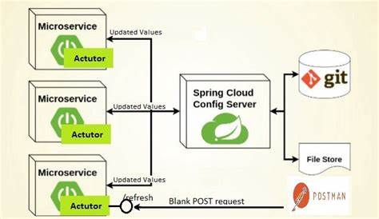

统一管理微服务配置   
集中管理配置   
运行期间可动态管理调整  
配置更改后自动更新  
     
#### config-server
pom文件
```
<dependency>
            <groupId>org.springframework.cloud</groupId>
            <artifactId>spring-cloud-starter-config</artifactId>
        </dependency>
        <dependency>
            <groupId>org.springframework.cloud</groupId>
            <artifactId>spring-cloud-config-server</artifactId>
        </dependency>
```
application.yml  
```
server:
  port: 8766
eureka:
  client:
    service-url:
      defaultZone: http://localhost:8761/eureka/
spring:
  application:
    name: configserver
  cloud:
    config:
      server:
        git:
          uri: https://github.com/yyh-log/Kubernetes
          username: yyh-log
          password: shu19910910
```
自动  
```java
@SpringBootApplication
@EnableConfigServer
@EnableEurekaClient
public class ConfigServer {

    public static void main(String[] args) {
        SpringApplication.run(ConfigServer.class, args);
    }

}
```
可以使用url来获取配置文件,label为git分支
```
/{application}/{profile}[/{label}]
/{application}-{profile}.yml
/{label}/{application}-{profile}.yml
/{application}-{profile}.properties
/{label}/{application}-{profile}.properties
```
#### Config-client
pom文件 
```
<dependency>
            <groupId>org.springframework.cloud</groupId>
            <artifactId>spring-cloud-starter-config</artifactId>
        </dependency>
        <dependency>
            <groupId>org.springframework.cloud</groupId>
            <artifactId>spring-cloud-starter-netflix-eureka-client</artifactId>
        </dependency>
        <dependency>
            <groupId>org.springframework.cloud</groupId>
            <artifactId>spring-cloud-context</artifactId>
        </dependency>
```

bootstrap.yml  
```
spring:
  application:
    name: configclient
  cloud:
    config:
      discovery:
        enabled: true
        service-id: configserver #config server名
      name: config #对应配置文件中的{application}
      profile: dev #对应profile
      label: master #对应分支
eureka:
  client:
    service-url:
      defaultZone: http://localhost:8761/eureka/
server:
  port: 8080
```
启动
```java
@SpringBootApplication
@EnableEurekaClient
@RestController
@RefreshScope //需要actuator包
public class ConfigClient {

    public static void main(String[] args) {
        SpringApplication.run(ConfigClient.class,args);
    }

    @Value("${name}")//从远程拉取
    String name;

    @RequestMapping("/test")
    public String test(){
        return name;
    }
}

```
