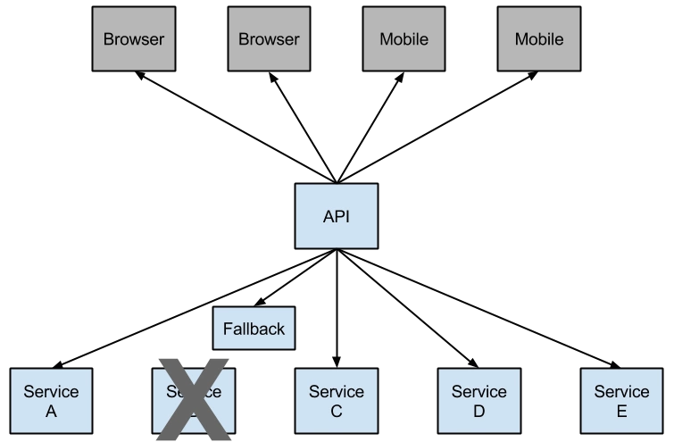

  
maven配置  
```
<dependency>
           <groupId>org.springframework.cloud</groupId>
           <artifactId>spring-cloud-starter-netflix-hystrix</artifactId>
       </dependency>
       <!--监控仪表板-->
       <dependency>
           <groupId>org.springframework.cloud</groupId>
           <artifactId>spring-cloud-starter-netflix-hystrix-dashboard</artifactId>
       </dependency>
       <dependency>
           <groupId>org.springframework.boot</groupId>
           <!--spring-boot-actuator-->
           <artifactId>spring-boot-starter-actuator</artifactId>
       </dependency>
```
#### 基本使用
```java
@SpringBootApplication
@EnableHystrix
@RestController
@Configuration
public class HystrixServer {

    public static void main(String[] args) {
        SpringApplication.run(HystrixServer.class,args);
    }

    @Autowired
    private RestTemplate restTemplate;

    @Bean
    @LoadBalanced
    public RestTemplate restTemplate(){
        return new RestTemplate();
    }
    
    //配置详解
    //https://github.com/Netflix/Hystrix/wiki/Configuration#metrics.rollingStats.timeInMilliseconds
    @HystrixCommand(fallbackMethod = "fallbackMethod",commandProperties = {
            @HystrixProperty(name="execution.isolation.thread.timeoutInMilliseconds",value = "5000"),
            @HystrixProperty(name="hystrix.command.default.metrics.rollingStats.timeInMilliseconds",value="1000")
    },threadPoolProperties = {
            @HystrixProperty(name="coreSize",value="1"),
            @HystrixProperty(name="maxQueueSize",value="10")
    })
    @GetMapping("/hystrix/test")
    public void getInstance(){

    }
    //throwable是可选的
    public void fallbackMethod(Throwable throwable){

    }
}
//断路器配置
//circuitBreaker.enabled //默认true
//circuitBreaker.requestVolumeThreshold //窗口内统计请求个数的阈值，例如设为20，那么一个窗口内只有19个请求，即使全部失败，断路器也不会打开
//circuitBreaker.sleepWindowInMilliseconds//窗口大小，默认5秒为一个窗口
//circuitBreaker.errorThresholdPercentage//一个窗口内失败比例，默认50%,失败超过50%,断路器打开
//circuitBreaker.forceOpen
//circuitBreaker.forceClosed
```
#### 资源隔离
* THREAD（线程隔离）使用该方式，HystrixCommand将在单独的线程上执行，并发请求受到线程池中的线程数量的限制。
* SEMAPHORE(信号量隔离)，使用该方式，HystrixCommand在调用的线程执行，开销较小，适用非网络调用
```
@HystrixProperty(name="execution.isolation.strategy",value = "SEMAPHORE"),
```
#### feign使用hystrix  
```java
@FeignClient(value = "supplyserver",fallbackFactory = FallBackFactory.class)
public interface FeignHttpClient {
    @RequestMapping(value = "/hi",method = RequestMethod.GET)
    String sayHi(@RequestParam(value = "name") String name);
}

@Component
class FallBackFactory implements FallbackFactory<FeignHttpClient>{

    @Override
    public FeignHttpClient create(Throwable throwable) {//捕捉异常
        return new FeignHttpClient() {
            @Override
            public String sayHi(String name) {
                return "hello world";
            }
        };
    }
}
```
#### hystrix监控
```java
<dependency>
            <groupId>org.springframework.cloud</groupId>
            <artifactId>spring-cloud-starter-netflix-hystrix</artifactId>
        </dependency>
        <dependency>
            <groupId>org.springframework.cloud</groupId>
            <artifactId>spring-cloud-starter-netflix-hystrix-dashboard</artifactId>
        </dependency>
        <dependency>
            <groupId>org.springframework.boot</groupId>
            <!--spring-boot-actuator-->
            <artifactId>spring-boot-starter-actuator</artifactId>
        </dependency>
```
application.yml  
```
server:
  port: 8085
eureka:
  client:
    service-url:
      defaultZone: http://localhost:8761/eureka/
spring:
  application:
    name: hystrixserver
#actuator设置
management:
  endpoints:
    web:
      #base-path: / #修改访问路径  2.0之前默认是/   2.0默认是 /actuator  可以通过这个属性值修改
      exposure:
        include: '*'  #开放所有页面节点  默认只开启了health、info两个节点
```
上诉配置后启动项目，访问http://127.0.0.1:8085/hystrix可以打开Hystrix Dashboard主页  
访问http://127.0.0.1:8085/actuator/hystrix.stream可以输出监控数据，一开始监控数据可能为空，通过下面方式产生监控数据  
hystrixCommand触发hystrix监控
```java
@SpringBootApplication
@EnableHystrix
@EnableHystrixDashboard
@RestController
@Configuration
public class HystrixServer {

    public static void main(String[] args) {
        SpringApplication.run(HystrixServer.class,args);
    }

    @Autowired
    private RestTemplate restTemplate;

    @Bean
    @LoadBalanced
    public RestTemplate restTemplate(){
        return new RestTemplate();
    }

    @HystrixCommand(fallbackMethod = "fallbackMethod",commandProperties = {
            @HystrixProperty(name="execution.isolation.thread.timeoutInMilliseconds",value = "1000")
    },threadPoolProperties = {
            @HystrixProperty(name="coreSize",value="1"),
            @HystrixProperty(name="maxQueueSize",value="10")
    })
    @GetMapping("/hystrix/test")
    public void getInstance(){
        String s = restTemplate.getForObject("http://eurekaclient/instance/test", String.class);
        System.out.println("response:" + s);
    }

    public void fallbackMethod(Throwable throwable){
        System.out.println("fallback method...");
    }
}
```
2 turbine
使用turbine可以监控多个微服务，需要在配置文件配置需要监控哪几个微服务    
```
<dependency>
            <groupId>org.springframework.cloud</groupId>
            <artifactId>spring-cloud-starter-netflix-turbine</artifactId>
        </dependency>
        <dependency>
            <groupId>org.springframework.cloud</groupId>
            <artifactId>spring-cloud-starter-netflix-hystrix-dashboard</artifactId>
        </dependency>
        <dependency>
            <groupId>org.springframework.boot</groupId>
            <!--spring-boot-actuator-->
            <artifactId>spring-boot-starter-actuator</artifactId>
        </dependency>
```
application.yml
```
server:
  port: 8086
eureka:
  client:
    service-url:
      defaultZone: http://localhost:8761/eureka/
spring:
  application:
    name: turbineserver

#springboot2.0. 的配置项为：
#actuator端口
management:
  #  server:
  #    port: 9007
  endpoints:
    web:
      #      base-path: /monitor #修改访问路径  2.0之前默认是/   2.0默认是 /actuator  可以通过这个属性值修改
      exposure:
        include: '*'  #开放所有页面节点  默认只开启了health、info两个节点

turbine:
  aggregator:
    cluster-config: default     #需要监控的服务集群名
  app-config: hystrixserver    #需要监控的服务名
  cluster-name-expression: new String("default")
#  instanceUrlSuffix:
#      default: actuator/hystrix.stream    #key是clusterConfig集群的名字，value是hystrix监控的后缀，springboot2.0为actuator/hystrix.stream
```
* turbine.appConfig ：配置Eureka中的serviceId列表，表明监控哪些服务
* turbine.aggregator.clusterConfig ：指定聚合哪些集群，多个使用”,”分割，默认为default。可使用http://.../turbine.stream?cluster={clusterConfig之一}访问
* turbine.clusterNameExpression ： 1. clusterNameExpression指定集群名称，默认表达式appName；此时：turbine.aggregator.clusterConfig需要配置想要监控的应用名称；2. 当clusterNameExpression: default时，turbine.aggregator.clusterConfig可以不写，因为默认就是default；3. 当clusterNameExpression: metadata[‘cluster’]时，假设想要监控的应用配置了eureka.instance.metadata-map.cluster: ABC，则需要配置，同时turbine.aggregator.clusterConfig: ABC
* turbine.combine-host-port参数设置为true，可以让同一主机上的服务通过主机名与端口号的组合来进行区分，默认情况下会以host来区分不同的服务，这会使得在本机调试的时候，本机上的不同服务聚合成一个服务来统计。  

启动
```java
@SpringBootApplication
@EnableTurbine
@EnableHystrixDashboard
public class TurbineServer {

    public static void main(String[] args) {
        SpringApplication.run(TurbineServer.class,args);
    }
}
```
```
# hystrix.command.default和hystrix.threadpool.default中的default为默认CommandKey，CommandKey默认值为服务方法名。
# 在properties配置中配置格式混乱，如果需要为每个方法设置不同的容错规则，建议使用yml文件配置。
# Command Properties

# Execution相关的属性的配置：
# 隔离策略，默认是Thread, 可选Thread｜Semaphore
hystrix.command.default.execution.isolation.strategy=THREAD
#命令执行超时时间，默认1000ms，只在线程池隔离中有效。
hystrix.command.default.execution.isolation.thread.timeoutInMilliseconds=1000
# 执行是否启用超时，默认启用true，只在线程池隔离中有效。
hystrix.command.default.execution.timeout.enabled=true
# 发生超时是是否中断，默认true，只在线程池隔离中有效。
hystrix.command.default.execution.isolation.thread.interruptOnTimeout=true
# 最大并发请求数，默认10，该参数当使用ExecutionIsolationStrategy.SEMAPHORE策略时才有效。如果达到最大并发请求数，请求会被拒绝。
# 理论上选择semaphore的原则和选择thread一致，但选用semaphore时每次执行的单元要比较小且执行速度快（ms级别），否则的话应该用thread。
# semaphore应该占整个容器（tomcat）的线程池的一小部分。
hystrix.command.default.execution.isolation.semaphore.maxConcurrentRequests=10
# 如果并发数达到该设置值，请求会被拒绝和抛出异常并且fallback不会被调用。默认10。
# 只在信号量隔离策略中有效，建议设置大一些，这样并发数达到execution最大请求数时，会直接调用fallback，而并发数达到fallback最大请求数时会被拒绝和抛出异常。
hystrix.command.default.fallback.isolation.semaphore.maxConcurrentRequests=10

# ThreadPool 相关参数
# 并发执行的最大线程数，默认10
hystrix.threadpool.default.coreSize=10
# BlockingQueue的最大队列数，当设为-1，会使用SynchronousQueue，值为正时使用LinkedBlcokingQueue。
# 该设置只会在初始化时有效，之后不能修改threadpool的queue size，除非reinitialising thread executor。默认-1。
hystrix.threadpool.default.maxQueueSize=-1
# 即使maxQueueSize没有达到，达到queueSizeRejectionThreshold该值后，请求也会被拒绝。
hystrix.threadpool.default.queueSizeRejectionThreshold=20
# 线程存活时间，单位是分钟。默认值为1。
hystrix.threadpool.default.keepAliveTimeMinutes=1
# Fallback相关的属性 
# 当执行失败或者请求被拒绝，是否会尝试调用fallback方法 。默认true 
hystrix.command.default.fallback.enabled=true 

# Circuit Breaker相关的属性 
# 是否开启熔断器。默认true 
hystrix.command.default.circuitBreaker.enabled=true 
# 一个rolling window内最小的请求数。如果设为20，那么当一个rolling window的时间内（比如说1个rolling window是10毫秒）收到19个请求
# 即使19个请求都失败，也不会触发circuit break。默认20
hystrix.command.default.circuitBreaker.requestVolumeThreshold=20
# 触发短路的时间值，当该值设为5000时，则当触发circuit break后的5000毫秒内都会拒绝远程服务调用，也就是5000毫秒后才会重试远程服务调用。默认5000
hystrix.command.default.circuitBreaker.sleepWindowInMilliseconds=5000
# 错误比率阀值，如果错误率>=该值，circuit会被打开，并短路所有请求触发fallback。默认50
hystrix.command.default.circuitBreaker.errorThresholdPercentage=50
# 强制打开熔断器
hystrix.command.default.circuitBreaker.forceOpen=false
# 强制关闭熔断器
hystrix.command.default.circuitBreaker.forceClosed=false
```
