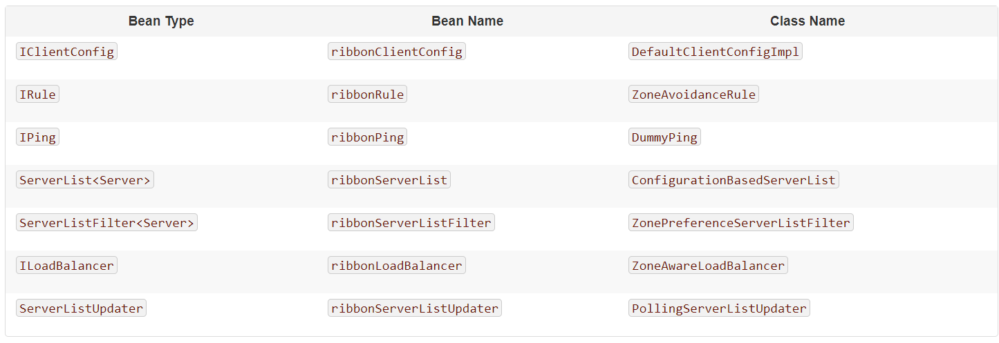

\<dependency\>  
\<groupId\>org.springframework.cloud\</groupId\>  
\<artifactId\>spring-cloud-starter-netflix-ribbon\</artifactId\>  
\</dependency\>  
[官网](https://cloud.spring.io/spring-cloud-netflix/multi/multi_spring-cloud-ribbon.html)  
ribbon默认配置如下

Class Name为配置的具体实现类。在Springcloud中默认的配置类是RibbonClientConfiguration。  
Ribbon自定义配置  
1. 指定名称配置  
注解@RibbonClient，对name为(springcloud-userservcie)的服务端做RibbonConfiguration.java类中自定义的负载均衡策略,不同名称的RibbonClient使用不同的配置
```java
//@Configuration //此配置类不能被spring扫描到，不然会变成全部ribbon client共享此配置
public class RibbonConfiguration {
    @Bean
    public IRule ribbonRule(){
        return new RandomRule();//负载均衡规则设置为随机
    }
    
    @Bean  
    public IPing ribbonPing(){
      return new PingUrl();
    }
}

@Configuration
//为微服务名为ribbon_1定义ribbon客户端
@RibbonClient(name="ribbon_1",configuration = RibbonConfiguration.class)
public class TestConfiguration {
}

使用
@RestController
public class ApiController {

    @Autowired
    @LoadBalanced
    private RestTemplate restTemplate;

    @Autowired
    private LoadBalancerClient loadBalancerClient;

    
    @GetMapping("/ribbon/test_1")
    public void getInstance(){
        //从ribbon_1的服务列表通过负载均衡策略选出一个server
        ServiceInstance instance = loadBalancerClient.choose("ribbon_1");
        System.out.println("port: " + instance.getPort());
    }
    
    @GetMapping("/ribbon/test_2")
    public void getInstance(){
       //发送请求
        restTemplate.getForObject("http://ribbon_1/xxx/xxx",String.class);
    }
}

```
2 使用全局配置  
@RibbonClients(defaultConfiguration=DefaultRibbonConfiguration.class)  
public class TestConfiguration{

}


3 配置文件配置ribbon  
从Spring Cloud Netflix1.2.0开始，Ribbon支持使用属性自定义Ribbon客户端。这种方式比使用Java代码配置的方式更加方便。
支持的属性如下，配置的前缀是\<clientName\>.ribbon.  
NFLoadBalancerClassName：配置ILoadBalancer的实现类
NFLoadBalancerRuleClassName：配置IRule的实现类
NFLoadBalancerPingClassName：配置IPing的实现类
NIWSServerListClassName：配置ServerList的实现类
NIWSServerListFilterClassName：配置ServerListFilter的实现类  
例如application.yml中添加一下内容:  
microservice-provider-user:  
  ribbon:  
    NFLoadBalancerRuleClassName: com.netflix.loadbalancer.RandomRule  

配置文件的优先级 > java代码的配置方式 > netflix自定义的配置方式  
服务列表在配置文件设置：  
microservice-provider-user:  
  ribbon:  
    listOfServers: localhost:8000,localhost:8001  

 
