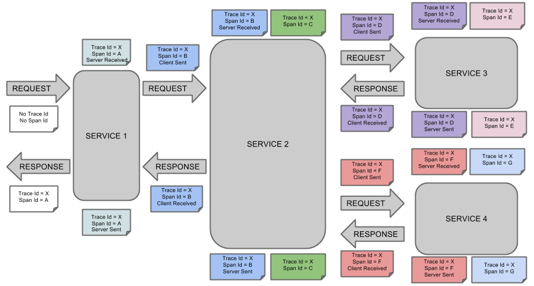
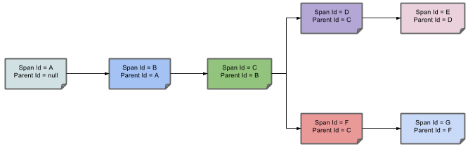

Spring Cloud Sleuth为Spring Cloud实现了分布式跟踪解决方案。  
* Span:工作的基本单位。例如，发送RPC是一个新的跨度，就像发送响应到RPC一样。Span是由一个唯一的64位ID来标识的，而另一个64位ID用于跟踪。span还具有其他数据，如描述、时间戳事件、键值标注(标记)、导致它们的span的ID和进程ID(通常是IP地址)。
可以启动和停止跨度，并跟踪其时间信息。 创建跨度后，必须在将来的某个时刻停止它。
启动跟踪的初始范围称为根跨度。 该范围的ID值等于跟踪ID。
* Trace：一组span形成树状结构。 例如，如果运行分布式大数据存储，则可能由PUT请求形成跟踪。
注解：用于及时记录事件的存在。 使用Brave工具，我们不再需要为Zipkin设置特殊事件，以了解客户端和服务器是谁，请求开始的位置以及结束位置。
* cs：客户已发送。 客户提出了请求。 此注释表示跨度的开始。
* sr：Server Received：服务器端获得请求并开始处理它。 从此时间戳中减去cs时间戳会显示网络延迟。
* ss：服务器已发送。 在完成请求处理时（当响应被发送回客户端时）注释。 从此时间戳中减去sr时间戳会显示服务器端处理请求所需的时间。
* cr：客户收到了。 表示跨度的结束。 客户端已成功收到服务器端的响应。 从此时间戳中减去cs时间戳会显示客户端从服务器接收响应所需的全部时间。
  
下图显示了跨度的父子关系：  
  
#### zipkinserver 
```
<dependency>
            <groupId>io.zipkin.java</groupId>
            <artifactId>zipkin-autoconfigure-ui</artifactId>
            <zipkin.version>2.12.0</zipkin.version>
        </dependency>
        <dependency>
            <groupId>io.zipkin.java</groupId>
            <artifactId>zipkin-server</artifactId>
            <zipkin.version>2.12.0</zipkin.version>
            <exclusions>
                <exclusion>
                    <groupId>org.springframework.boot</groupId>
                    <artifactId>spring-boot-starter-log4j2</artifactId>
                </exclusion>
            </exclusions>
        </dependency>
```
```java
@SpringBootApplication
@EnableZipkinServer
@EnableEurekaClient
public class ZipkinServer {

    public static void main(String[] args) {
        SpringApplication.run(ZipkinServer.class,args);
    }
}
```
#### ziplin-client  
```
<dependency>
            <groupId>org.springframework.cloud</groupId>
            <artifactId>spring-cloud-starter-zipkin</artifactId>
        </dependency>
```
```
spring:
  application:
    name: hystrixserver
  zipkin:
    base-url: http://zipkinserver/
    enabled: true
  sleuth:
    sampler:
      probability: 1.0 //采样率100%
```
##### zipkin-elk  
// STORAGE_TYPE=elasticsearch ES_HOSTS=http://myhost:9200 java -jar zipkin.jar   
//https://github.com/openzipkin/zipkin/blob/master/zipkin-server/README.md#elasticsearch-storage
