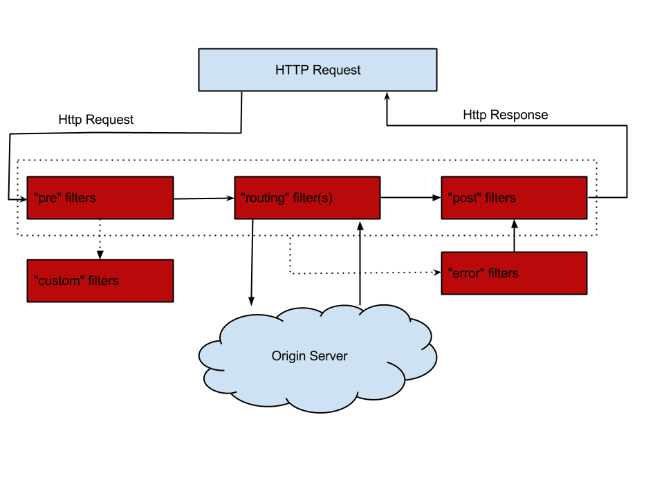
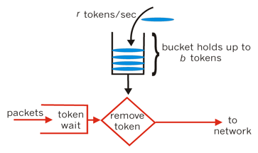
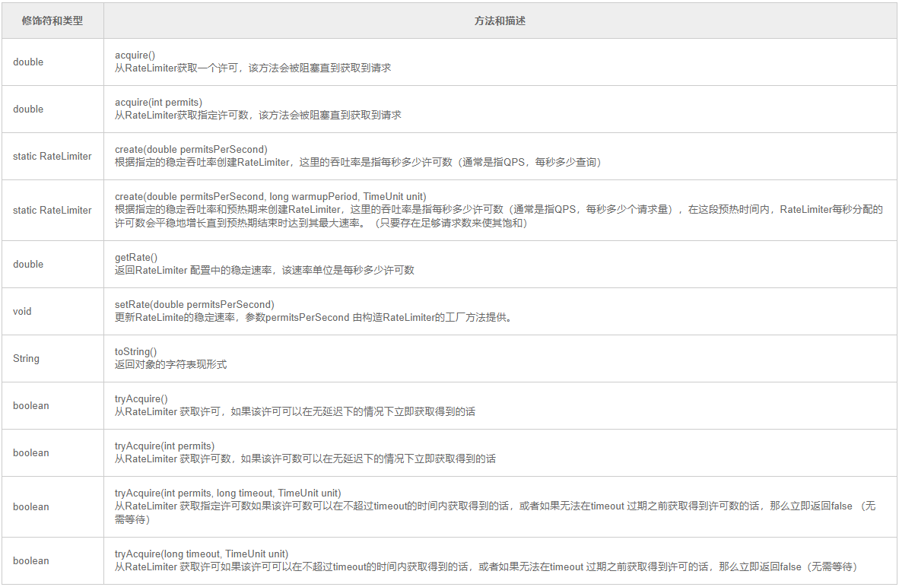

zuul是spring cloud的网关组件，集成ribbon,hystrix等组件，包含一些列的过滤器可以实现认证，限流，熔断，负载均衡等。  
```
<dependency>
  <groupId>org.springframework.cloud</groupId>
  <artifactId>spring-cloud-starter-netflix-zuul</artifactId>
</dependency>
```
启动类加上@EnableZuulProxy  
zuul暴露两个端点  
* /routes:返回路由映射http://127.0.0.1:8088/actuator/routes
* /filters：返回设置过滤器http://127.0.0.1:8088/actuator/filters
#### 路由配置：  
```
//简单配置
zuul:
  routes:
    eurekaclient: /client/**
//或者
zuul:
  routes:
    custom-route://自定义名称
      service-id: eurekaclient
      path: /client/**
//访问http://zuulserver:port/client/**就会映射成http://zuulserver:port/eurekaclient/**
//路由前缀
zuul:
 prefix: /api //全局
  routes:
    custom-route://自定义名称
      service-id: eurekaclient
      path: /client/**
//访问http://zuulserver:port/api/client/**就会映射成http://zuulserver:port/eurekaclient/**

//本地转发
zuul:
  routes:
    route-name:
      path: /path-a/**
      url: forward:/path-b      
//访问zuul的/path-a/**就会转发到本地/path-b/**
```
#### 回退
要想要为zuul添加回退，需继承FallbackProvider，可以指定为哪个微服务提供回退
```java
@Component
public class MyFallbackProvider implements FallbackProvider {
  @Override
  public String getRoute() {
    // 表明是为哪个微服务提供回退，*表示为所有微服务提供回退
    return "*";
  }

  @Override
  public ClientHttpResponse fallbackResponse(String route, Throwable cause) {
    if (cause instanceof HystrixTimeoutException) {
      return response(HttpStatus.GATEWAY_TIMEOUT);
    } else {
      return this.fallbackResponse();
    }
  }

  public ClientHttpResponse fallbackResponse() {
    return this.response(HttpStatus.INTERNAL_SERVER_ERROR);
  }

  private ClientHttpResponse response(final HttpStatus status) {
    return new ClientHttpResponse() {
      @Override
      public HttpStatus getStatusCode() throws IOException {
        return status;
      }

      @Override
      public int getRawStatusCode() throws IOException {
        return status.value();
      }

      @Override
      public String getStatusText() throws IOException {
        return status.getReasonPhrase();
      }

      @Override
      public void close() {
      }

      @Override
      public InputStream getBody() throws IOException {
        return new ByteArrayInputStream("服务不可用，请稍后再试。".getBytes());
      }

      @Override
      public HttpHeaders getHeaders() {
        // headers设定
        HttpHeaders headers = new HttpHeaders();
        MediaType mt = new MediaType("application", "json", Charset.forName("UTF-8"));
        headers.setContentType(mt);
        return headers;
      }
    };
  }
}
```
#### 过滤器  

Zuul中定义了四种标准过滤器类型，这些过滤器类型对应于请求的典型生命周期
* (1) PRE：这种过滤器在请求被路由之前调用。我们可利用这种过滤器实现身份验证、在集群中选择请求的微服务、记录调试信息等。
* (2) ROUTING：这种过滤器将请求路由到微服务。这种过滤器用于构建发送给微服务的请求，并使用Apache HttpClient或Netfilx Ribbon请求微服务。
* (3) POST：这种过滤器在路由到微服务以后执行。这种过滤器可用来为响应添加标准的HTTP Header、收集统计信息和指标、将响应从微服务发送给客户端等。
* (4) ERROR：在其他阶段发生错误时执行该过滤器。  

两个重要默认集成的过滤器  
* (1) RibbonRoutingFilter：该过滤器使用Ribbon，Hystrix和可插拔的HTTP客户端发送请求。serviceId在RequestContext.getCurrentContext().get("serviceId") 中。该过滤器可使用不同的HTTP客户端，例如Apache HttpClient：默认的HTTP客户端
Squareup OkHttpClient v3：如需使用该客户端，需保证com.squareup.okhttp3的依赖在classpath中，并设置ribbon.okhttp.enabled = true 。
Netflix Ribbon HTTP client：设置ribbon.restclient.enabled = true 即可启用该HTTP客户端。需要注意的是，该客户端有一定限制，例如不支持PATCH方法，另外，它有内置的重试机制。
* (2) SimpleHostRoutingFilter：该过滤器通过Apache HttpClient向指定的URL发送请求。URL在RequestContext.getRouteHost() 中。

自定义过滤器  
```java
public class PreRequestLogFilter extends ZuulFilter {
  private static final Logger LOGGER = LoggerFactory.getLogger(PreRequestLogFilter.class);

  @Override
  public String filterType() {//过滤器的类型。有pre、route、post、error等几种取值
    return "pre";
  }

  @Override
  public int filterOrder() {//过滤器顺序
    return 1;
  }

  @Override
  public boolean shouldFilter() {//开关
    return true;
  }

  @Override
  public Object run() {//执行内容
    RequestContext ctx = RequestContext.getCurrentContext();
    HttpServletRequest request = ctx.getRequest();
    PreRequestLogFilter.LOGGER.info(String.format("send %s request to %s", request.getMethod(), request.getRequestURL().toString()));
    return null;
  }
}
//申明bean
@Bean
public PreRequestLogFilter preRequestLogFilter() {
  return new PreRequestLogFilter();
}
```

#### 漏桶算法  
漏桶算法思路很简单，水（请求）先进入到漏桶里，漏桶以一定的速度出水，当水流入速度过大会直接溢出，可以看出漏桶算法能强行限制数据的传输速率。  
  
#### 令牌算法  
令牌桶算法的原理是系统会以一个恒定的速度往桶里放入令牌，而如果请求需要被处理，则需要先从桶里获取一个令牌，当桶里没有令牌可取时，则拒绝服务。  

#### guava RateLimiter
RateLimiter使用的是一种叫令牌桶的流控算法，RateLimiter会按照一定的频率往桶里扔令牌，线程拿到令牌才能执行，比如你希望自己的应用程序QPS不要超过1000，那么RateLimiter设置1000的速率后，就会每秒往桶里扔1000个令牌。  
```java
//速率是每秒两个许可
final RateLimiter rateLimiter = RateLimiter.create(2.0);

void submitTasks(List tasks, Executor executor) {
    for (Runnable task : tasks) {
        rateLimiter.acquire(); // 也许需要等待
        executor.execute(task);
    }
}
```
方法  

#### zuul限流  
可以创建一个zuul过滤器，在过滤器使用guava ratelimiter来实现限流。
```java
@Component
public class RateLimitZuulFilter extends ZuulFilter {
    //每秒生成1000个令牌
    private final RateLimiter rateLimiter = RateLimiter.create(1000.0);

    @Override
    public String filterType() {
        return FilterConstants.PRE_TYPE;
    }

    @Override
    public int filterOrder() {
        return Ordered.HIGHEST_PRECEDENCE;
    }

    @Override
    public boolean shouldFilter() {
        // 这里可以考虑弄个限流开启的开关，开启限流返回true，关闭限流返回false，你懂的。
        return true;
    }

    @Override
    public Object run() {
        try {
            RequestContext currentContext = RequestContext.getCurrentContext();
            HttpServletResponse response = currentContext.getResponse();
            if (!rateLimiter.tryAcquire()) {//如果返回失败，说明令牌已被抢完
                HttpStatus httpStatus = HttpStatus.TOO_MANY_REQUESTS;

                response.setContentType(MediaType.TEXT_PLAIN_VALUE);
                response.setStatus(httpStatus.value());
                response.getWriter().append(httpStatus.getReasonPhrase());

                currentContext.setSendZuulResponse(false);

                throw new ZuulException(
                        httpStatus.getReasonPhrase(),
                        httpStatus.value(),
                        httpStatus.getReasonPhrase()
                );
            }
        } catch (Exception e) {
            ReflectionUtils.rethrowRuntimeException(e);
        }
        return null;
    }
}
```
#### zuul + spring-cloud-zuul-ratelimit
[参考](https://blog.csdn.net/SHIYUN123zw/article/details/82315252)  
[spring-cloud-zuul-ratelimit](https://github.com/marcosbarbero/spring-cloud-zuul-ratelimit)  
```
<dependency>
    <groupId>com.marcosbarbero.cloud</groupId>
    <artifactId>spring-cloud-zuul-ratelimit</artifactId>
    <version>2.4.0.RELEASE</version>
</dependency>
```
配置文件
```
zuul:
  routes:
    eurekaclient: /client/**
  ratelimit:
    key-prefix: your-prefix
    enabled: true
    repository: REDIS
    behind-proxy: true
    add-response-headers: true
    default-policy-list: #optional - will apply unless specific policy exists
      - limit: 10 #optional - request number limit per refresh interval window
        quota: 1000 #optional - request time limit per refresh interval window (in seconds)
        refresh-interval: 60 #default value (in seconds)
        type: #optional
          - user
          - origin
          - url
          - http_method
```
#### redis
利用redis键过期的自动删除的特性。以url为key,如果key不存在，创建key,并设置键过期时间，相同请求过来就对这个key进行计数，使用redis.incr原子方法，当请求超过limit时，则不让请求api。
```java
//定义注解
@Target(ElementType.METHOD)
@Retention(RetentionPolicy.RUNTIME)
@Documented
public @interface RateLimit {

    //每秒请求
    int value() default 10;

}
//切面
@Aspect
@Component
@Slf4j
public class RateLimitAspect {


    @Autowired
    private RedisTemplate redisTemplate;

    @Pointcut(value = "@annotation(com.pinlor.gml.cloudrateservice.annotation.RateLimit)")
    public void pointcut(){

    }


    @Around(value = "pointcut()")
    @ResponseBody
    public Object around(ProceedingJoinPoint joinPoint) throws Throwable {
        log.debug("限速检测");
        MethodSignature methodSignature = (MethodSignature) joinPoint.getSignature();
        Method method = methodSignature.getMethod();
        RateLimit rate = method.getAnnotation(RateLimit.class);
        int limit = rate.value();
        HttpServletRequest request = RequestUtil.getRequest();
        String key = request.getRequestURI();
        //最好以下部分用redis分布锁加锁一下
        Object object = redisTemplate.opsForValue().get(key);
        if (object == null){
            redisTemplate.opsForValue().increment(key);
            redisTemplate.expire(key, 1, TimeUnit.SECONDS);
        }else {
            System.out.println("当前记数: "+ redisTemplate.opsForValue().get(key));
            if (redisTemplate.opsForValue().increment(key) > limit) {
                System.out.println("服务器繁忙，请稍后再试!!");
                return "服务器繁忙，请稍后再试!!";
            }
        }

        return joinPoint.proceed();

    }

}
//redis配置
@Configuration
public class RedisConfig {

   @Autowired
   private RedisConnectionFactory redisConnectionFactory;

    // 默认用的是用JdkSerializationRedisSerializer进行序列化的
    @Bean
    public RedisTemplate<String, Object> redisTemplate() {
        RedisTemplate<String, Object> redisTemplate = new RedisTemplate<>();
        // 注入数据源
        redisTemplate.setConnectionFactory(redisConnectionFactory);
        // 使用Jackson2JsonRedisSerialize 替换默认序列化
        Jackson2JsonRedisSerializer jackson2JsonRedisSerializer =
        					 new Jackson2JsonRedisSerializer(Object.class);
        StringRedisSerializer stringRedisSerializer = new StringRedisSerializer();
        ObjectMapper objectMapper = new ObjectMapper();
        objectMapper.setVisibility(PropertyAccessor.ALL, JsonAutoDetect.Visibility.ANY);
        objectMapper.enableDefaultTyping(ObjectMapper.DefaultTyping.NON_FINAL);
        jackson2JsonRedisSerializer.setObjectMapper(objectMapper);
        // key-value结构序列化数据结构
        redisTemplate.setKeySerializer(stringRedisSerializer);
        redisTemplate.setValueSerializer(jackson2JsonRedisSerializer);
        // hash数据结构序列化方式,必须这样否则存hash 就是基于jdk序列化的
        redisTemplate.setHashKeySerializer(stringRedisSerializer);
        redisTemplate.setHashValueSerializer(jackson2JsonRedisSerializer);
        // 启用默认序列化方式
        redisTemplate.setEnableDefaultSerializer(true);
        redisTemplate.setDefaultSerializer(jackson2JsonRedisSerializer);

        /// redisTemplate.afterPropertiesSet();
        return redisTemplate;
    }
}
//controller
@RestController
@RequestMapping(value = "/rc")
public class RateController {

    @Value(value = "${server.port}")
    private int port;

    @RateLimit(value = 10)
    @GetMapping("/getRate")
    public String getRate(){
        System.out.println("rate from: "+ port);
        return "rate from: "+ port;
    }

}
//工具
public class RequestUtil {

    public static HttpServletRequest getRequest(){
        RequestAttributes requestAttributes = RequestContextHolder.getRequestAttributes();
        if (requestAttributes == null){
            return null;
        }
        return ((ServletRequestAttributes)requestAttributes).getRequest();
    }
}
<dependency>
    <groupId>org.springframework.boot</groupId>
    <artifactId>spring-boot-starter-data-redis</artifactId>
</dependency>
<dependency>
    <groupId>org.springframework.data</groupId>
    <artifactId>spring-data-redis</artifactId>
</dependency>
```
