## ZooKeeper

### Zookeeper架构
ZooKeeper分布式协调服务
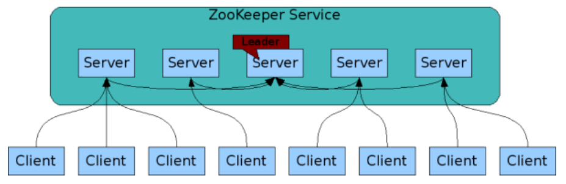

ZooKeeper数据模型  
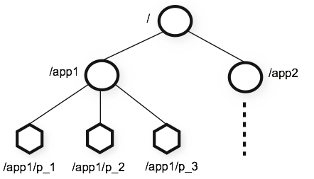

### ZooKeeper安装
1.下载zookeeper  
https://mirrors.tuna.tsinghua.edu.cn/apache/zookeeper/  
2.单机模式  
conf/zoo.cfg:
```java
tickTime=2000
dataDir=/var/lib/zookeeper
clientPort=2181
```
bin/zkServer.sh start  
bin/zkCli.sh -server 127.0.0.1:2181  
3.集群模式
conf/zoo.cfg  
```java
tickTime=2000
dataDir=/var/lib/zookeeper
clientPort=2181
initLimit=5
syncLimit=2
server.1=zoo1:2888:3888
server.2=zoo2:2888:3888
server.3=zoo3:2888:3888
```
4.配置
* clientPort:监听端口  
* dataDir: 存储快照目录  
* dataLog:事务日子存储路径  
* maxClientsCnxns:客户端最大连接数  
* minSessionTimeout:最小会话时间  
* initLimit:允许follower连接并同步到leader的初始化连接时间，以tickTime倍数表示  
* syncLimit: leader与follower请求和应答时间长度，超过此时间leader将会移除follower 

5.四字命令
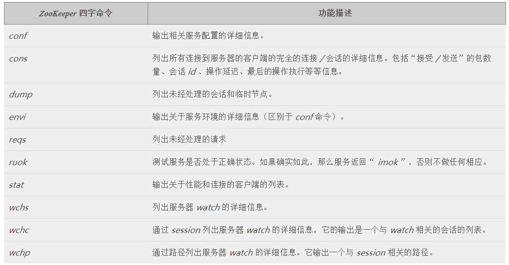
示例：
echo mntr | nc localhost 2181 
### Zookeeper特性
#### Zookeeper数据模型
Znode  
Znode是客户端访问的主要实体，包含以下几个特性  
* Watches：设置在节点的监视器，但节点状态改变时会触发，且只出发一次
* 数据访问：每一个节点都有自己的acl数据访问权限，和父节点和子节点的权限无任何关系
* 临时节点：但sesstion结束临时节点会自动删除
* 顺序节点：路径结尾添加一个递增的计数，格式为'%010d'(10位数字，没有数值的数据位用0填充)

节点属性结构
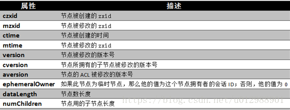
#### Zookeeper watches

#### Zookeeper ACL
认证方式
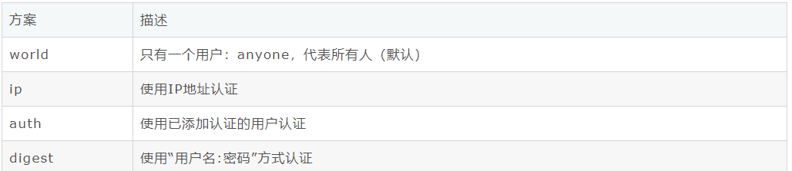
权限
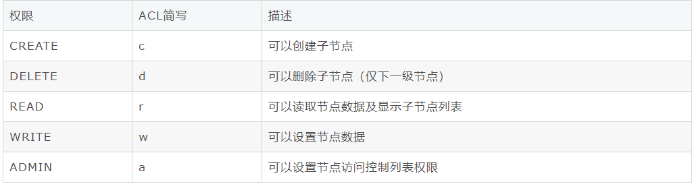
3、Auth方案  
1）设置方式  
addauth digest user:password #添加认证用户  
setAcl path auth:user:acl  
示例  
[zk: localhost:2181(CONNECTED) 1] addauth digest yoonper:123456 #添加认证用户  
[zk: localhost:2181(CONNECTED) 2] setAcl /node3 auth:yoonper:cdrwa  
4、Digest方案    
1）设置方式  
setAcl path digest:user:password:acl 
这里的密码是经过SHA1及BASE64处理的密文，在SHELL中可以通过以下命令计算：  
echo -n user:password | openssl dgst -binary -sha1 | openssl base64 
先来计算一个密文  
echo -n yoonper:123456 | openssl dgst -binary -sha1 | openssl base64  
UvJWhBril5yzpEiA2eV7bwwhfLs=  
示例  
[zk: localhost:2181(CONNECTED) 1] setAcl /node4 digest:yoonper:UvJWhBril5yzpEiA2eV7bwwhfLs=:cdrwa  
#### Zookeeper锁
客户端调用create()方法创建名为“_locknode_/guid-lock-”的节点，需要注意的是，这里节点的创建类型需要设置为EPHEMERAL_SEQUENTIAL。

客户端调用getChildren(“_locknode_”)方法来获取所有已经创建的子节点，注意，这里不注册任何Watcher。

客户端获取到所有子节点path之后，如果发现自己在步骤1中创建的节点序号最小，那么就认为这个客户端获得了锁。

如果在步骤3中发现自己并非所有子节点中最小的，说明自己还没有获取到锁。此时客户端需要找到比自己小的那个节点，然后对其调用exist()方法，同时注册事件监听。

之后当这个被关注的节点被移除了，客户端会收到相应的通知。这个时候客户端需要再次调用getChildren(“_locknode_”)方法来获取所有已经创建的子节点，确保自己确实是最小的节点了，然后进入步骤3。
#### ZAB 协议 & Paxos 算法
#### Zookeeper数据存储
https://blog.csdn.net/varyall/article/details/79564418  
https://www.cnblogs.com/leesf456/p/6179118.html

配置dataLogDir，那么Zookeeper在运行过程中会在该目录下建立一个名字为version-2的子目录，该目录确定了当前Zookeeper使用的事务日志格式版本号，当下次某个Zookeeper版本对事务日志格式进行变更时，此目录也会变更，即在version-2子目录下会生成一系列文件大小一致(64MB)的文件。指定dataDir为/home/admin/zkData/zk_data，则在运行过程中会在该目录下创建version-2的目录，该目录确定了当前Zookeeper使用的快照数据格式版本号  

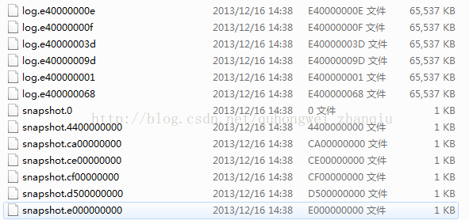

1. 数据分类  
* 内存数据
- 磁盘数据
  + 快照
  + 事务日志    

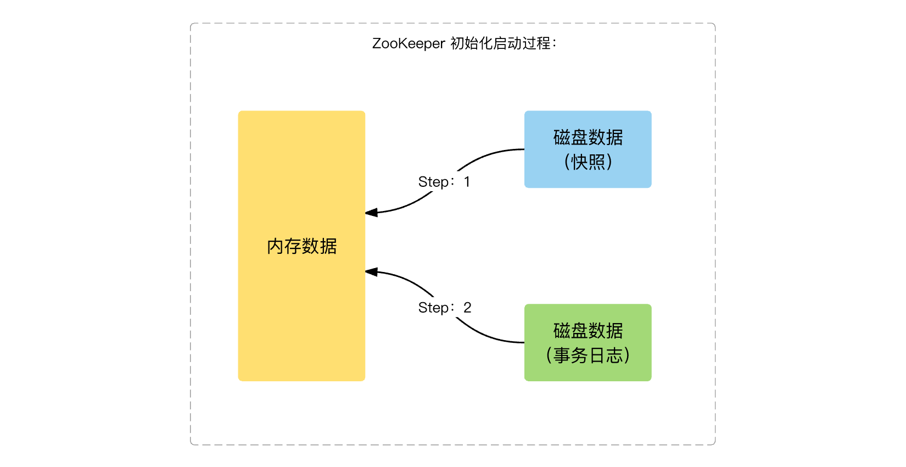 

2. 事务日志生成  
事务日志频繁 flush 到磁盘，消耗大量磁盘 IO  
磁盘空间预分配：事务日志剩余空间 < 4KB 时，将文件大小增加 64 MB  
磁盘预分配的目标：减少磁盘 seek 次数  
建议：事务日志，采用独立磁盘单独存放  

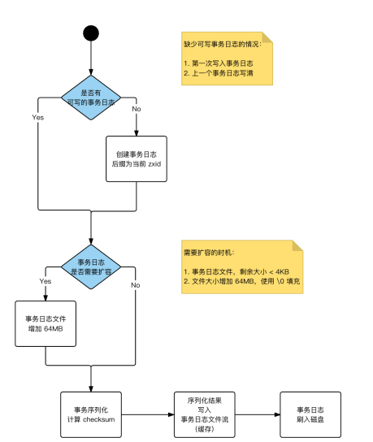

3.数据初始化  
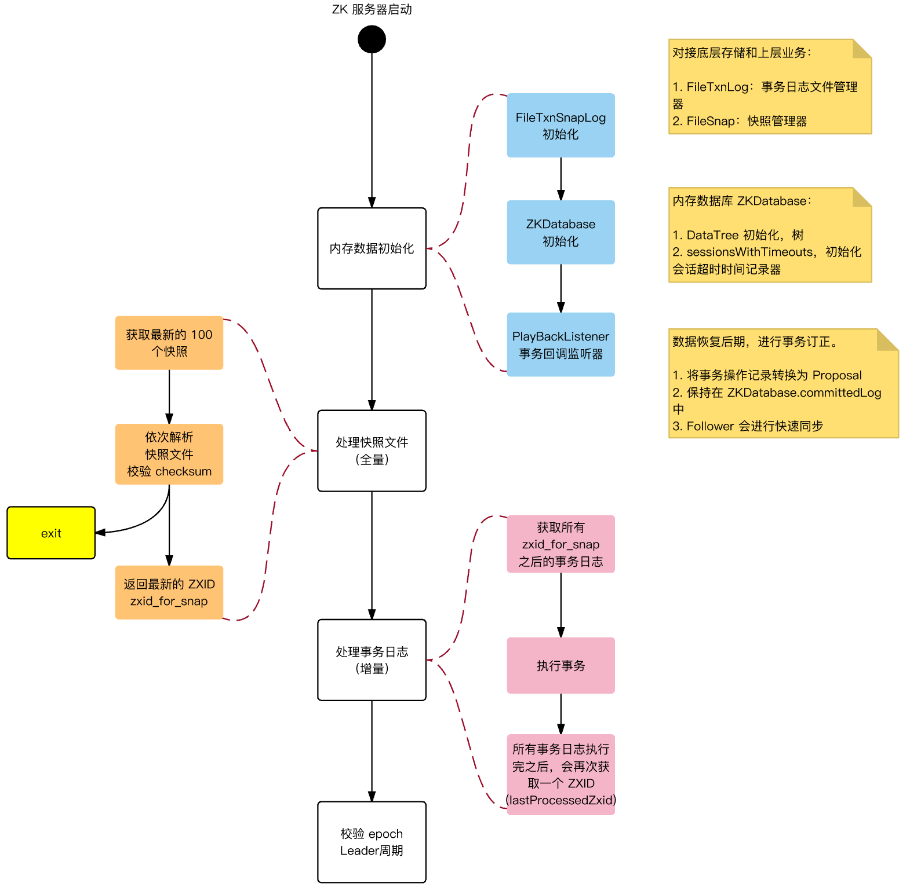
#### Zookeeper角色
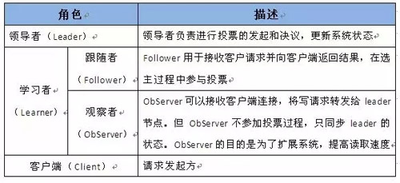
