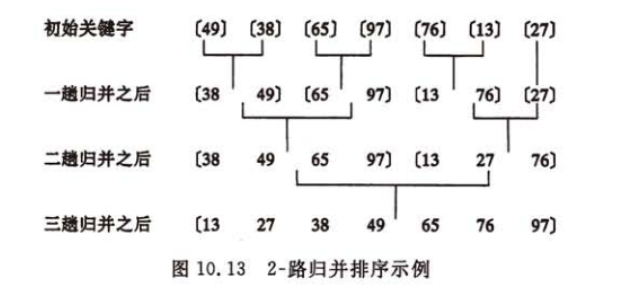
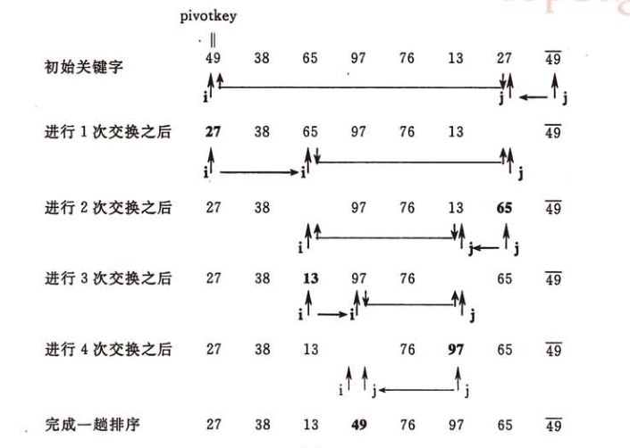
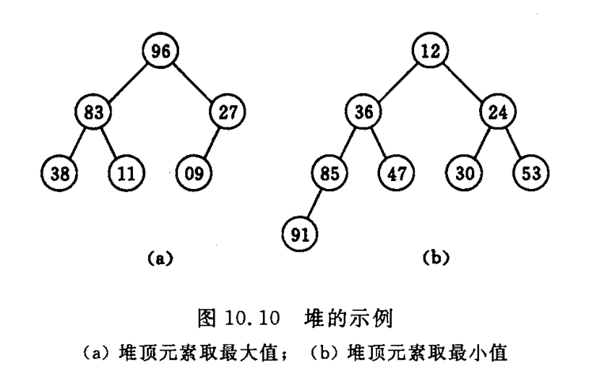
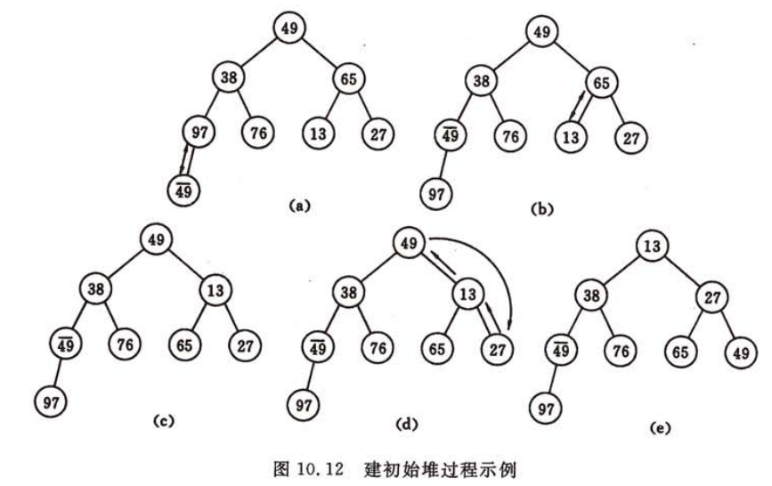
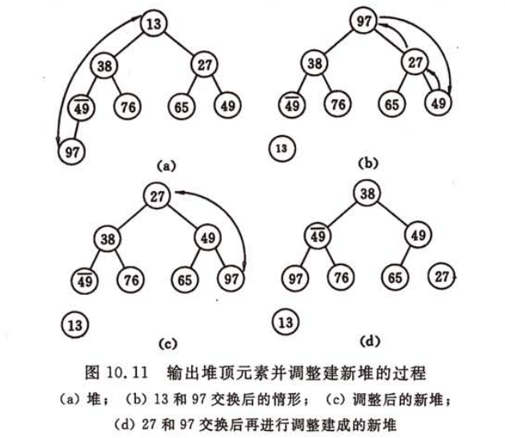
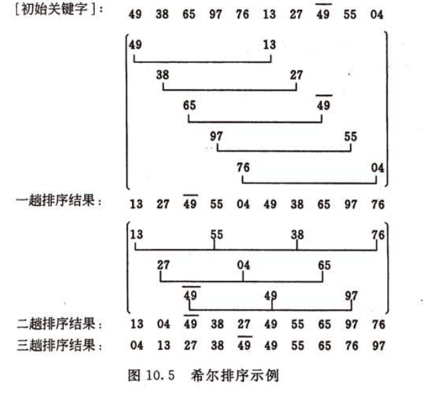

# 排序
## 选择排序
&emsp;&emsp;对于给定的一组记录，经过第一次排序得到最小的记录，然后和第一个记录交换位置；接着从第二个记录开始排序得到最小的记录，然后和第二个记录交换位置，以此类推：以
{38，65，97，76，13，27，49} 为例：  
第一遍：13[65，97，76，38，27，49]    
第二遍：13，27[97，76，38，65，49]  
第三遍：13，27，38[76，97，65，49]  
第四遍：13，27，38，49[97，65，76]  
... ...
```java
public void chooseSort(Integer[] a){
        for(int i=0;i<a.length;i++){
            int k = i;
            for(int j=i+1;j<a.length;j++){
                if(a[j] < a[k]){
                    k = j;
                }
            }
            if(k!=i){
                int tmp = a[k];
                a[k] = a[i];
                a[i] = tmp;
            }
        }
    }
```
## 插入排序
&emsp;&emsp;给定一组记录，初始第一个自成有序序列，其余为无序序列。接着从第二个记录开始，按照记录的大小依次插入之前的有序序列。仍以{38，65，97，76，13，27，49} 为例  
第一遍：[38] 65，97，76，13，27，49  
第二遍：[38，65] 97，76，13，27，49  
第三遍：[38，65，97] 76，13，27，49  
第四遍：[38，65，76，97] 13，27，49  
第五遍：[13，38，65，76，97] 27，49  
第六遍：[13，27，38，65，76，97] 49  
第七遍：[13，27，38，49，65，76，97]  
```java
public void insertSort(Integer[] a){
        for(int i=1;i<a.length;i++){
            int k = a[i];
            for(int j=i-1;j>=0;j--){
                if(a[j] > k){
                    int t = a[j+1];
                    a[j+1] = a[j];
                    a[j] = t;
                }else{
                    break;
                }
            }
        }
    }
```
## 冒泡排序
&emsp;&emsp;对于给定n个记录，从第一位开始相邻两两比较，比较大的和后面交换位置，则第一遍排序后最大的位于第n位置；以此类推进行n-1次排序。
```java
public void pubbleSort(Integer[] a){
        for(int i=0;i<a.length-1;i++){
            for(int j=0;j<a.length-1-i;j++){
                if(a[j]>a[j+1]){
                    int t = a[j];
                    a[j] = a[j+1];
                    a[j+1] = t;
                }
            }
        }
    }
```
## 归并排序
&emsp;&emsp;对于给定记录，首先将相邻的长度为1子序列进行归并，得到n/2个长度为2或1的有序子序列，接着相邻的子序列在进行归并以此重复执行，当记录只有一个子序列时排序结束。  


```java
public void mergeSort(Integer[] a) {
        stackMerge(a, 0, a.length - 1);
    }

    private void stackMerge(Integer[] a, int p, int r) {
        if (p < r) {
            int q = (r + p) / 2;
            stackMerge(a, p, q);
            stackMerge(a, q + 1, r);
            merge(a, p, q, r);
        }
    }

    private void merge(Integer[] a, int p, int q, int r) {
        int n = q - p + 1;
        int m = r - q;
        int[] L = new int[n];
        int[] R = new int[m];
        for (int i = p, k = 0; k < n; k++) {
            L[k] = a[i++];
        }
        for (int i = q + 1, k = 0; k <m; k++) {
            R[k] = a[i++];
        }
        int i = 0, j = 0;
        int k = p;
        for (; i < n && j < m; k++) {
            if (L[i] < R[j]) {
                a[k] = L[i++];
            } else {
                a[k] = R[j++];
            }
        }
        if (i < n) {
            for (; i < n; i++) {
                a[k++] = L[i];
            }
        }
        if (j < m) {
            for (; j < m; j++) {
                a[k++] = R[j];
            }
        }
    }
```
## 快速排序
&emsp;&emsp;对于给定记录通过一趟排序后，将记录分成两部分，其中前一部分的所有数据都小于后一部分，递归该过程直到序列中所有的记录均为有序序列为止.具体做法是设两个下标low和high,设枢轴为low下标的值pivotkey，然后从high所在的元素开始搜索，查找到第一个小于pivotkey然后互换位置，然后从low向后搜索找到第一个大于pivotkey的值和high交换位置，直到low=high时第一趟排序结束，依次再对pivotket左右两个序列进行递归排序。



```java
public void quickSort(Integer[] a) {
        quickStackSort(a, 0, a.length - 1);
    }

    private void quickStackSort(Integer[] a, int low, int high) {
        if (low < high) {
            int p = partition(a, low, high);
            quickStackSort(a, low, p - 1);
            quickStackSort(a, p + 1, high);
        }
    }

    private int partition(Integer[] a, int low, int high) {
        int tmp = a[low];
        while (low < high) {
            while (low < high && a[high] >= tmp) high--;
            if (low < high) {
                a[low++] = a[high];
            }
            while (low < high && a[low] <= tmp) low++;
            if (low < high) {
                a[high++] = a[low];
            }
        }
        a[low] = tmp;
        return low;
    }
```
## 堆排序
&emsp;&emsp;堆是一种数型结构，当r(i)>=r(i)且r(i)>=r(i+1)，而且它的子节点也满足相同的条件，那么此树为大顶堆，此时根节点最大。反之称之为小顶堆，此时根节点最小。



实现堆排序需两个步骤
* 把一个无序列构建成一个堆


- 最后一个元素和堆顶元素交换位置后调整成一个新的堆




```java
public void heapSort(Integer[] a){
        for(int i=a.length/2-1;i>=0;i--){
            heapAdjust(a,i,a.length-1);//构造堆
        }
        for(int i=a.length-1;i>0;--i){
            int t = a[i];
            a[i] = a[0];
            a[0] = t;
            heapAdjust(a,0,i-1);//筛选
        }
    }

    private void heapAdjust(Integer[] a,int s,int m){//筛选
        int tmp = a[s];
        for(int i=2*s+1;i<=m;i=2*i+1){
            if(i<m && a[i] < a[i+1]) i++;//i指向大的节点下标
            if(tmp > a[i]) break;
            a[s] = a[i]; s=i;
        }
        a[s] = tmp;
    }
```
## 希尔排序
&emsp;&emsp;希尔排序是一种特殊的插入排序，基本原理为：先将待排序的数组元素分成多个子序列，使得每个子序列元素相对较小，然后对各个子序列分别直接插入排序，待整个序列基本有序之后进行最后一次直接插入排序。步骤如下：
* 选择一个步长序列t<sub>1</sub>,t<sub>2</sub>,...,t<sub>k</sub>,满足t<sub>i</sub>>t<sub>j</sub>(i<j),t<sub>k</sub>=1
* 按照步长个数k进行k趟排序
* 每趟排序根据对应的步长t<sub>i</sub>将带排序分割成t<sub>i</sub>个子序列，分别对各个子序列进行插入排序。

下图步长为{5，3，1}的希尔排序过程


```java
public void shellSort(Integer[] a){
        Integer[] dk = new Integer[]{5,3,1};
        for(int i=0;i<dk.length;i++){
            shellInsert(a,dk[i]);
        }
    }

    private void shellInsert(Integer[] a,int dk){
        for(int i=dk;i<a.length;i++){
            if(a[i] < a[i-dk]){//但后面的元素小于前面的元素才需要进行插入排序
                int t = a[i];
                int k = i-dk;
                for (int j = i - dk; j >= 0 && t < a[j]; j -= dk) {
                    a[j+dk] = a[j];
                    k = j;
                }
                a[k] = t;
            }
        }
    }
```
## 排序比较

| 排序算法|最好时间|平均时间|最坏时间|辅助存储|稳定性|备注|
| -------- | ------- | ------- | ------- | ------- | ------- | ------- |
| 选择排序 | O(n<sup>2</sup>) | O(n<sup>2</sup>) | O(n<sup>2</sup>) | O(1)     | 不稳定 | n小时比较好 |
| 插入排序 |O(n) | O(n<sup>2</sup>) | O(n<sup>2</sup>) | O(1) | 稳定 | 大部分已有序比较好|
|冒泡排序|O(n)|O(n<sup>2</sup>)|O(n<sup>2</sup>)|O(1)|稳定|n小时比较好|
|希尔排序|O(n)|O(nlogn)|O(n<sup>2</sup>)<s<2|O(1)|不稳定|s是所选分组|
|快速排序|O(nlogn)|O(nlogn)|O(n<sup>2</sup>)|O(logn)|不稳定|n大时比较好|
|堆排序|O(nlogn)|O(nlogn)|O(nlogn)|O(1)|不稳定|n大时比较好|
|归并排序|O(nlogn)|O(nlogn)|O(nlogn)|O(n)|稳定|n大时比较好|

除了以上这几种排序算法外还有位图排序、桶排序、基数排序等。每种排序算法都有其最佳适用场合，例如当排序数据规模比较大而对内存大小比较没有限制时，位图排序是最高效的选择。
