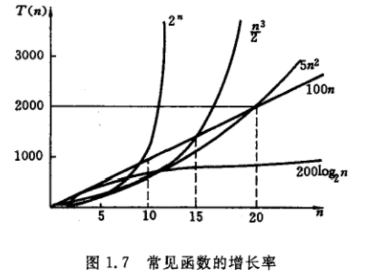

&emsp;&emsp;一个算法由控制结构（顺序、分支和循环）和原操作构成。原操作是指对于算法研究的内容而言是最基本的操作。例如研究两个矩阵相乘的算法，那么”相乘”这个操作就是矩阵相乘算法的原操作。以原操作执行的次数所谓算法的时间度量。
例如两个N * N矩阵相乘中，整个执行时间与原操作执行的次数成正比，记做T(n)=O(n3)
```java
for(i=1;i<=n;i++){
  for(j=1;j<=n;j++){
    c[i][j]=0;
    for(k=1;k<=n;++k){
      c[i][j] += a[i][k] * b[k][j]
    }
  }
}
```
上述n可称为问题规模，一般情况下原操作的执行次数是问题规模n的某个函数，例如上述矩阵相乘的次数n3次，算法的时间复杂度可以用  
<center>T(n) = O(f(n))</center>   

来表示。随着n的增长，f(n)增长越小说明时间复杂度越小，说明算法效率越高，常见的数学函数增长率如下图.



从上图可知f(n)最好不要是2n这种指数型的函数，因为随着n的增大f(n)会爆炸型增加。
类似时间复杂度，空间复杂度作为算法所需存储空间的量度记做是s(n)=O(f(n))。若额外的空间相对于数据来说是常数，则称此算法为原地工作。
