## 图

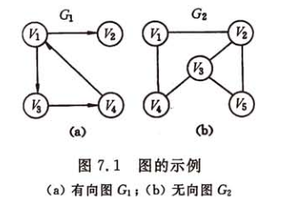

图分为有向图和无向图，若<v,w>表示从v到w的一条弧，且称v为弧尾或初始点，w为弧头或终端点。若为无向图，<v,w>称为边。
n个结点的图如果是无向图最多有n(n-1)/2,对于有向图而言具有n(n-1)个结点
顶点v是和v相关联的边的数目。对于有向图以v为尾的弧的数目称为v的出度，以v为头的弧的数目称为入度。如果图中任意两个节点都是连通的，则称为连通图。连通分量是指无向图中极大的连通子图。如果为有向图，则对应称为强连通图和强连通分量。

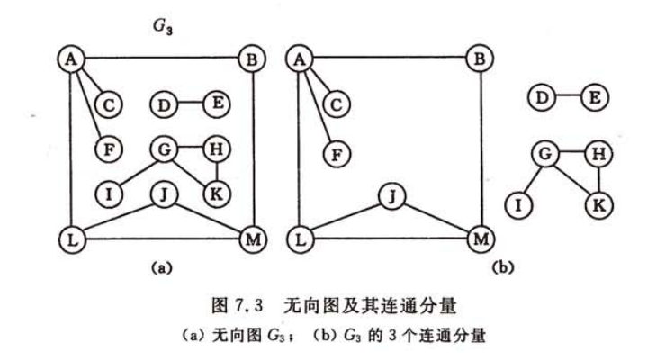

一个连通图的生成树是一个极小连通子图，它包含图中所有顶点但只有n-1条边

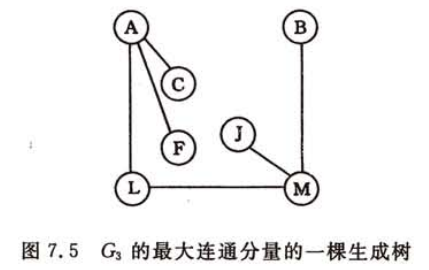
### 图的存储结构
#### 邻接表  
在邻接表中为每一个顶点建立一个单链表，第i个单链表表示依赖于顶点vi的边。每个结点由三个域组成，adjvex表示与顶点vi邻接的点在图中的位置，nextarc表示下一条边或弧的加点，数据域表示存储和边相关的信息。每个

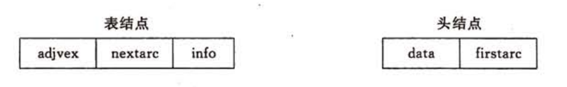

```java
#define MAX_VERTEX_NUM 20

typedef struct ArcNode{
  int adjvex;
  struct ArcNode *nextarc;
  Infotype *info;
}ArcNode;//弧结点

typedef struct VNode{
  Vertextype data;//顶点信息
  ArcNode *firstarc;//指向第一个顶点
}VNode,AdjList[MAX_VERTEX_NUM];

typedef struct{
  AdjList vertices;
  int verxnum,arcnum;
  int kind;
}ALGraph;//图
```
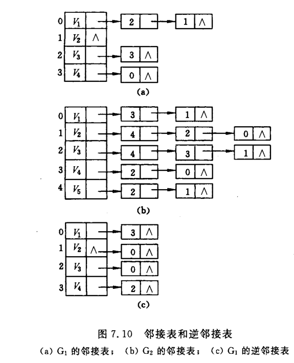
在无向图邻接表中，顶点vi的度恰为第i个链表中的结点树；而在有向图中第i个链表中的节点数只是vi结点的出度，为求入度必须便利整个邻接表。有时为了便于确定顶点的入度，对每个vi顶点建立一个连接以vi为头的弧的表，称之为逆邻接点。

### 十字链表


弧结点有5个域，其中尾域和头域分别指向弧尾和弧头的顶点在图中的位置，hlink指向弧头相同的下一条弧，tlink指向弧尾相同的下一条弧。头结点由3个域组成，其中data域存储节点信息，firstin和firstout为两个链域分别指向以该顶点为弧头或弧尾的第一个弧结点。

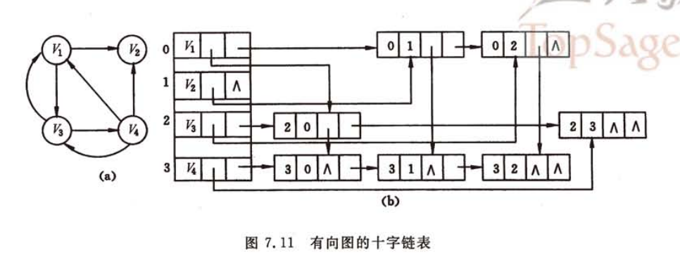

```java
#define MAX_VERTEX_NUM 20

typedef struct ArcBox{
  int tailvex,headvex;
  struct ArcBox *hlnk,*tlink;
  Infotype *info;
}ArcBox;

typedef struct VexNode{
  VertexType data;
  ArcBox *firstin,*firstout;
}VexNode;

typedef struct {
  VexMpde xlist[MAX_VERTEX_NUM];//表头向量
  int vexnum,arcnum;//顶点树和弧树
}OLGraph;
```
十字链表构造图

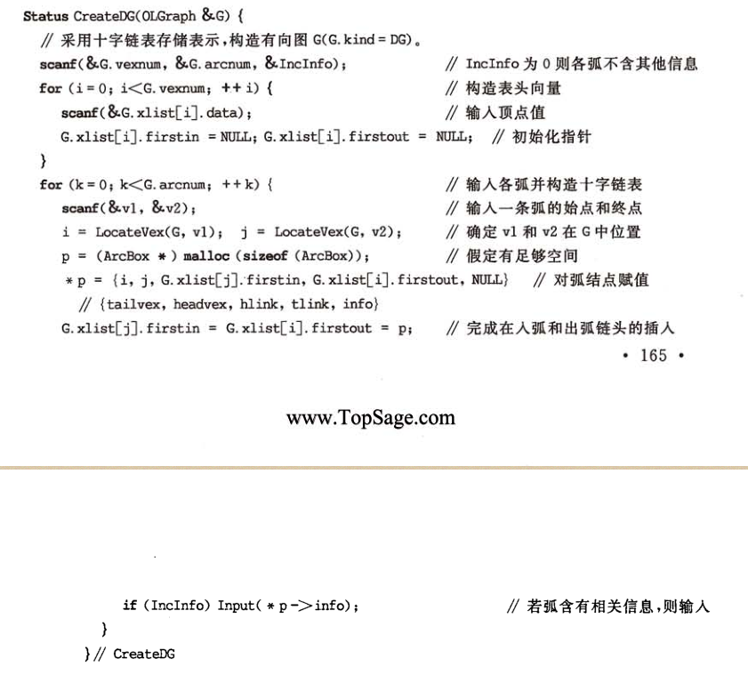
### 深度优先搜索
类似于树的先根遍历，是一个递归过程。

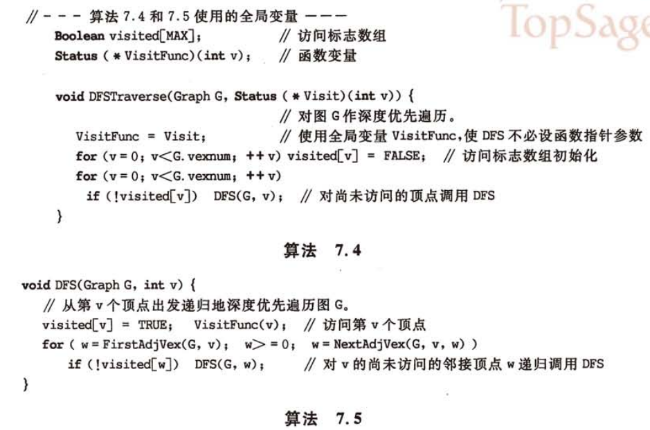
### 广度优先搜索
类似于树的层次遍历，需要用到队列。

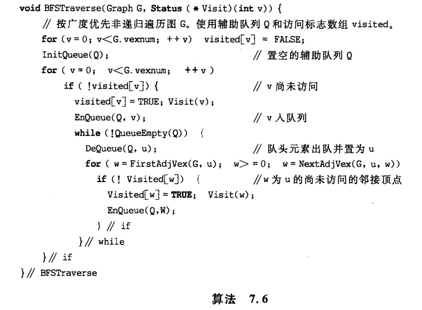

### 最小生成树
一个结点树为n的连通图其生成树有n-1个结点，如果图的边有权值，那么在众多生成树里面权值最小的生成树即为最小生成树。构造生成树的算法通常都是利用其MST性质：若<u,v>是一条具有最小权值的边，其中u属于U,v属于V-U，则比存在一颗包含边(u,v)的最小生成树。代表算法有普里姆(Prim)算法和克鲁斯卡尔(Kruskal)算法。  
普里姆算法：

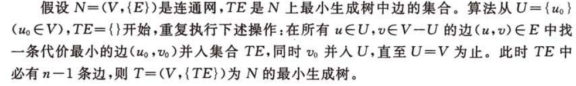

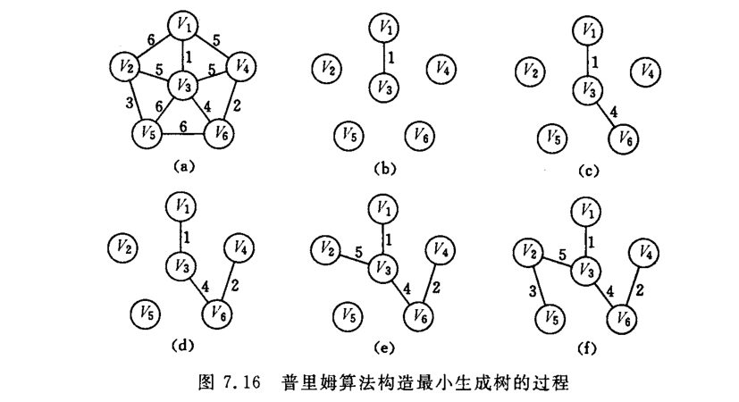
普里姆算法：
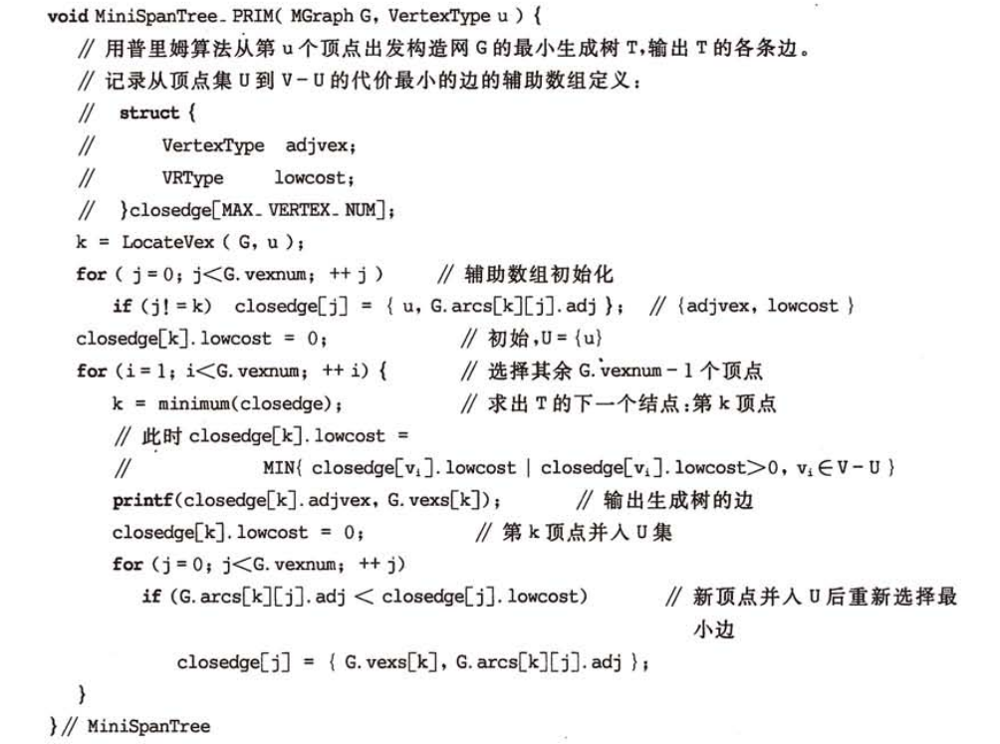

### 最短路径
顶点A到顶点B边数最少只需要做广度优先搜索，遇到顶点B结束，则从根结点A到B节点的边数及为最少的边数。如果边是有权值的，那么就要考虑最短路径问题。  

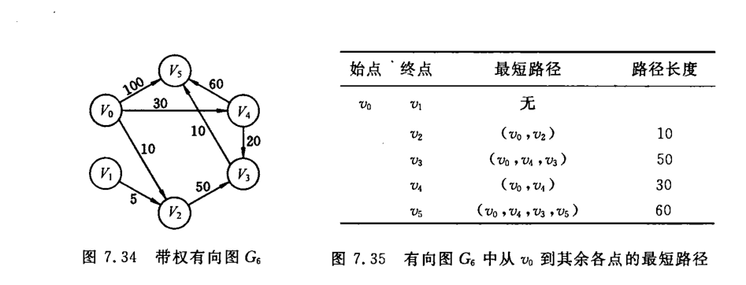

迪杰斯特拉算法： 
 
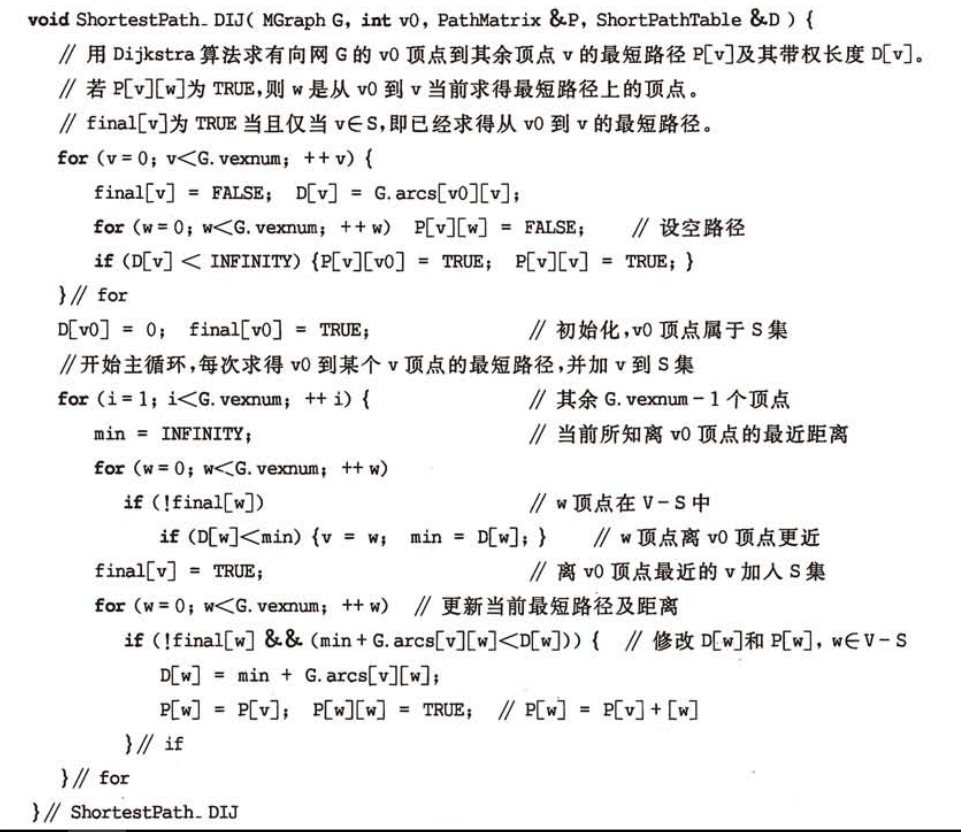

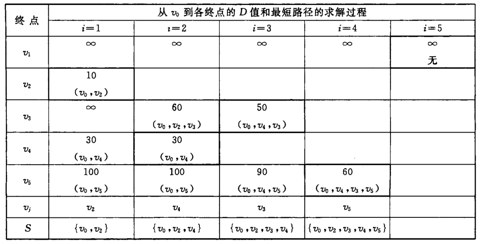
