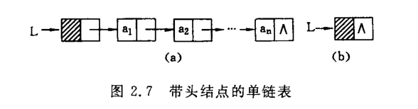
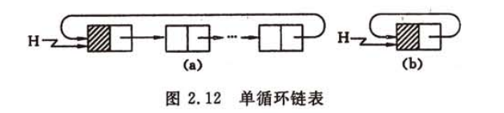
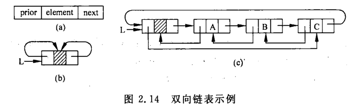
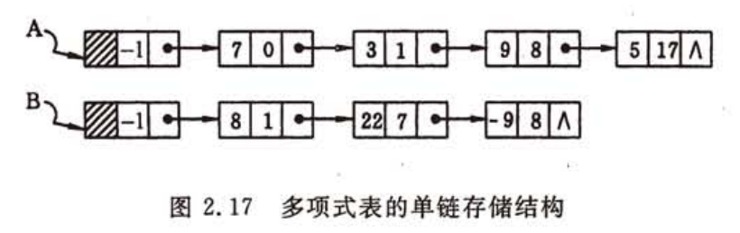
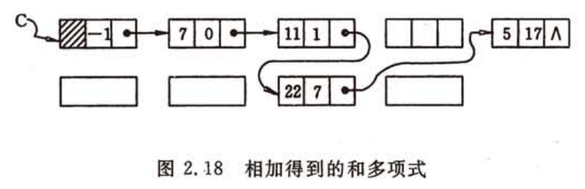
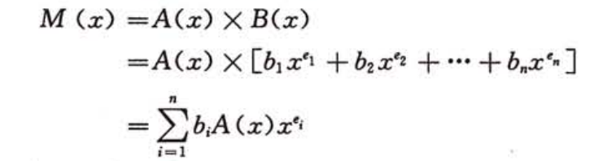

# 线性表
线性表时最常用的一种数据结构。简而言之，一个线性表是n个数据元素的有限序列。可以简单分为
* 顺序线性表
* 链式线性表
## 顺序线性表
线性表的顺序表示是指用一组连续地址的存储单元存储线性表的数据元素。假设每个数据元素存储空间为m字节，那么第一个元素和第i个元素位置满足如下：
<center>LOC(a<sub>i</sub>)=LOC(a<sub>1</sub>)+(i-1)*m</center>  

## 链表
链表的结构如下图所示，下图的链表是带有头节点的链表，及头节点不含数据域只含有next域



在java语言中链表的节点可以定义如下结构：
```java
class Node{
  int data;
  Node next = null;
  public Node(int data){
    this.data = data;
  }
}
```java
class linkList{
  Node head == null;
  
}
```
### 循环链表
循环链表是另一种形式的链式存储结构，最后一个节点的指针域指向头节点



### 双向链表
双向链表的节点不仅有next指针域也有pre指针域指向它的前驱。



```java
class Node{
  int data;
  Node next = null;
  Node pre = null;
  public Node(int data){
    this.data = data;
  }
}
```
## 一元多项式
数学中的一元多项式可以采用链式存储结构表示，例如：
A(x)=7+3x+9x<sup>8</sup>+5x<sup>17</sup>
B(x)=8x+22x<sup>7</sup>-9x<sup>8</sup>


上面两个一元多项式相加需让指数相同的做运算处理，入下图所示



两个一元多项式的乘法可以利用一元多项式的加法来实现


