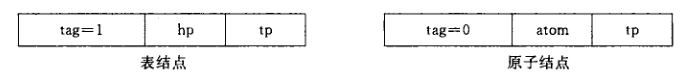
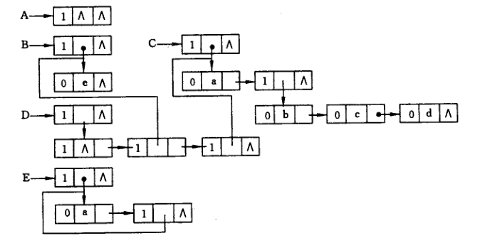
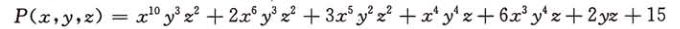
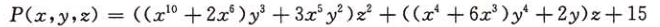
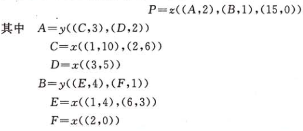
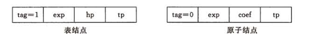
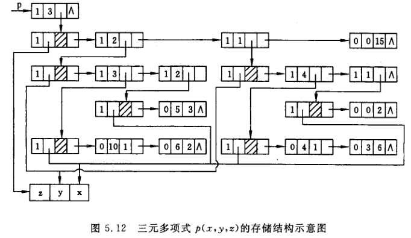

## 广义表
广义表记作
LS = (a1,a2,a3,...,an)
其中n为广义表的长度。在广义表定义中，ai可以是单个元素也可以是广义表，分别称为广义表LS的原子和字表。当广义表非空时称第一个元素a1为LS的表头，称其余元素组成的表（a2,a3,...,an）是LS的表尾。例如：
* A=()  //A是空表，长度为0
* B=(e) //B只有一个原子，长度为1
* C=(a,(b,c,d))  //长度为2，两个元素分别为原子a和子表（b,c,d）
* D=(A,B,C)//长度为3，3个元素都是子表
* E=(a,E)//这是一个递归表，长度为2，等效于（a,(a,(a,...))）

广义表的链式存储表示：



```java
typedef enum {ATOM,LIST} ElemTag;//AtOM=0:原子，LIST=1:子表
typedef struct GLNode{
  ElemTag tag;//公共部分，用于区分原子和和子表
  union{//原子结点和表结点的联合部分
    AtomType atom;//原子结点的值域
    struct GLNode *hp;//表节点的表头指针
  };
  struct GLNode *tp;//相当于链表的next指针
}
```


m元多项式的表示：  
例如三元多项式：

可以改写成

则可以表示成
P(x,y,z) = Az<sup>2</sup>+Bz+15z<sup>0</sup>
其中A和B又是关于(x,y)的多项式
所以上式用广义表来表示为：

m元多项式的广义表的存储结构为：

```java
typedef enum {ATOM,LIST} ElemTag;//AtOM=0:原子，LIST=1:子表
typedef struct GLNode{
  ElemTag tag;//公共部分，用于区分原子和和子表
  int exp;//指数域
  union{//原子结点和表结点的联合部分
    float coef;//系数
    struct GLNode *hp;//表节点的表头指针
  };
  struct GLNode *tp;//相当于链表的next指针
}
```

