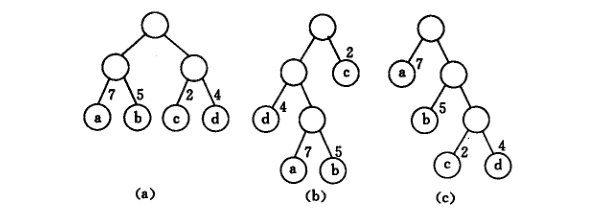
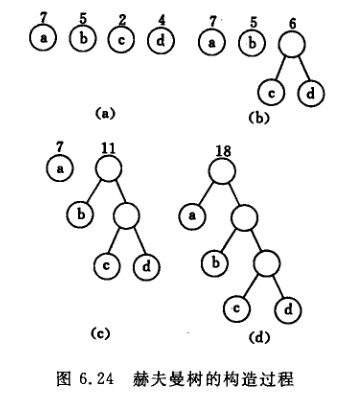
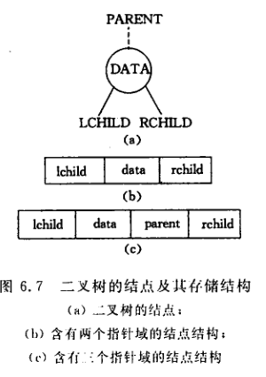

## 赫夫曼树 
假设有n个权值{w1,w2,w3,...,wn},试构造一棵有n个节点的二叉树，每个叶子节点带权为wi，则其中带权路径长度WPL最小的树称作最优二叉树或赫夫曼树。下图c即为赫夫曼树.



那么如何构造赫夫曼树？需要4个步骤：  
(1)根据给定的n个权值{w1,w2,...,wn}构成n棵二叉树的集合F={T1,T2,...,Tn}其中每棵二叉树Ti中只有wi作为根节点，左右子树为空。  
(2)在F中选取两棵根节点最小的树作为左右子树构造一棵新的二叉树，且新的二叉树根节点为左右子树根节点之和。  
(3)在F中删除这两棵树，同时将新得到的二叉树加入F。  
(4)重复(2)和(3)直到F只包含一棵树为止。



### 赫夫曼树java实现
```java
public class Node<T> implements Comparable<Node<T>> {
    private T data;
    private int weight;
    private Node<T> left;
    private Node<T> right;

    public Node(T data, int weight) {
        this.data = data;
        this.weight = weight;
    }

    @Override
    public String toString() {
        // TODO Auto-generated method stub
        return "data:" + this.data + ",weight:" + this.weight + ";   ";
    }

    @Override
    public int compareTo(Node<T> o) {
        // TODO Auto-generated method stub
        if (o.weight > this.weight) {
            return 1;
        } else if (o.weight < this.weight) {
            return -1;
        }
        return 0;
    }

    public T getData() {
        return data;
    }

    public void setData(T data) {
        this.data = data;
    }

    public int getWeight() {
        return weight;
    }

    public void setWeight(int weight) {
        this.weight = weight;
    }

    public Node<T> getLeft() {
        return left;
    }

    public void setLeft(Node<T> left) {
        this.left = left;
    }

    public Node<T> getRight() {
        return right;
    }

    public void setRight(Node<T> right) {
        this.right = right;
    }

}

import java.util.ArrayList;
import java.util.Collections;
import java.util.LinkedList;
import java.util.List;
import java.util.Queue;

public class HuffmanTree<T> {

    public static <T> Node<T> createTree(List<Node<T>> nodes) {
        while (nodes.size() > 1) {
            Collections.sort(nodes);
            Node<T> left = nodes.get(nodes.size() - 1);
            Node<T> right = nodes.get(nodes.size() - 2);
            Node<T> parent = new Node<T>(null, left.getWeight()
                    + right.getWeight());
            parent.setLeft(left);
            parent.setRight(right);
            nodes.remove(left);
            nodes.remove(right);
            nodes.add(parent);
        }
        return nodes.get(0);
    }

    public static <T> List<Node<T>> breath(Node<T> root) {
        List<Node<T>> list = new ArrayList<Node<T>>();
        Queue<Node<T>> queue = new LinkedList<>();
        queue.add(root);
        while (!queue.isEmpty()) {
            Node<T> pNode = queue.poll();
            list.add(pNode);
            if (pNode.getLeft() != null) {
                queue.add(pNode.getLeft());
            }
            if (pNode.getRight() != null) {
                queue.add(pNode.getRight());
            }
        }
        return list;
    }

}

import java.util.ArrayList;
import java.util.List;

public class HuffmanTreeTest {

    public static void main(String[] args) {
        // TODO Auto-generated method stub
        List<Node<String>> nodes = new ArrayList<Node<String>>();
        nodes.add(new Node<String>("b", 5));
        nodes.add(new Node<String>("a", 7));
        nodes.add(new Node<String>("d", 2));
        nodes.add(new Node<String>("c", 4));
        Node<String> root = HuffmanTree.createTree(nodes);
        System.out.println(HuffmanTree.breath(root));
    }

}
```
## 二叉树
每个结点至多只有两棵子树并且二叉树有左右之分。二叉树具有几个重要性质：
* 在二叉树第i层上至多有2<sup>i-1</sup>个结点(i>=1)
* 深度为k的二叉树至多有2<sup>k</sup>-1个节点(k>=1)
* 对任何二叉树中其终端阶段个数为n<sub>0</sub>,度为2的结点树为n<sub>2</sub>，则n0=n2+1
* 具有n个节点的完全二叉树深度为[log<sub>2</sub>n]+1
* 对二叉树按照层序进行编号有  
(1)如果i=1，则结点i是二叉树的根。如果i>1,则其双亲编号为[i/2]  
(2)如果2i>n，则结点i无左孩子结点；否则左孩子结点编号为2i  
(3)如果2i+1>n，则结点i无右孩子结点，否则右孩子结点编号为2i+1

### 二叉树存储结构
链式存储结构



```java 
typedef struct BiTnode{
  T data;
  strict BitNode * lchild,rchild;//左右孩子结点
}
```
